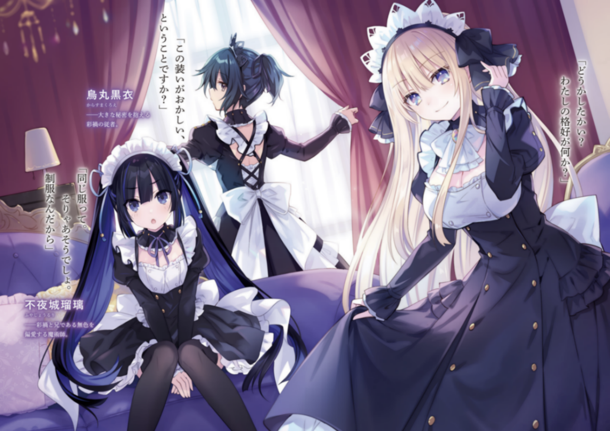
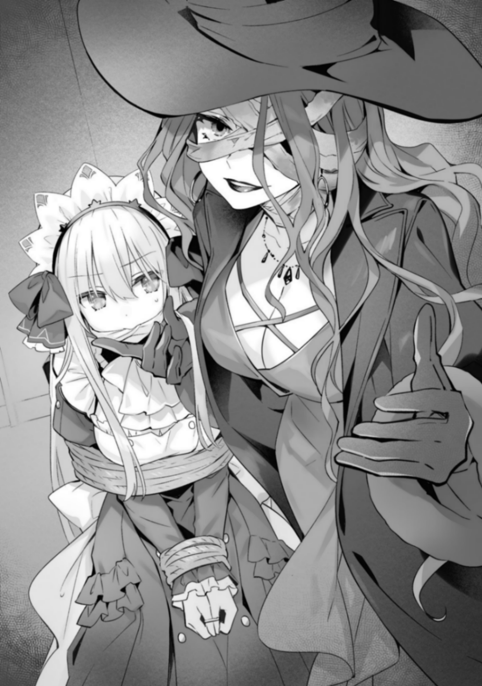

# 国王的求婚4 黄金的神子

橘公司

## 制作信息

作者：橘公司

插图：tsunako

翻译：DATE、起源星风谷、白夜天依、丛雨酱拌饭、Merv、Maftyerin

校对：DATE、起源星风谷

考据：七尺旋光

润色：雾雨の影灯、菠萝鼎

图源：起源星风谷

————————————————

转载请注明制作信息

起源星风谷：这次好多人一起合作完成的，感谢大家的辛苦付出！

## 插图

“无论过去还是未来，我爱的只有你，安”

“难道说，想带苏去嘘嘘吗？”

苏莉亚——称呼安布埃特为父亲的谜之少女。

“老子不是说了你不是我女儿了吗!”

安布埃特·斯布鲁纳——有着有一私生子的传言的空隙之庭园教师兼S级魔术师

“啊……早上好，无色。真是个美好的早晨”

久远崎彩祸——世界最强的魔女，本应该是在和无色融合状态中可是……

“怎么样?我这一身如何?”

“你是说这身装扮很奇怪吗?”

乌丸黑衣——抱有着重大秘密的彩祸的随从。

“一模一样的衣服，这是理所当然的吧？毕竟是制服”

不夜城瑠璃——偏爱着彩祸和哥哥无色的魔术师。

“——妈妈，苏来帮助你啦——”

健康时也好，生病时也好

喜悦时也好，悲伤时也好

富裕时也好，贫穷时也好

爸爸和妈妈，都想共度一生对吧？

所以，苏，会加油的

## 序章　觉得是梦吗？

“啊……早上好，无色。真是个美好的早晨。”

假设

只是做一个假设

假设你有一个憧憬向往的人，令你魂飞目断。

只要一想到那个人，就雀跃不已，心潮澎湃，连世界都变得五彩缤纷极彩起来。你有着这样的一个人。

只要她温柔地对你微笑，大脑就会洋溢着从未有过的快感，只要指尖碰触到，就会浑身荡然心醉神迷地颤抖。呜呼，有种自己就是为了这一瞬间而诞生的——这样的一句话都不再是玩笑了的实感。

不，我并不是在说非法药物的事。我真没有。

回到话题上来。接下来才是正题。

如果你，有这样憧憬的人——

如果有一天早上醒来的时候，那个人躺在你身边，你会怎么做呢?

而且，一丝不挂，如同刚出生时的样子。

“………”

玖珂无色的情况是

只能瞪大眼睛，一动不动地僵住了。

大量的信息从视网膜、鼓膜、鼻腔源源不断地涌入。

沐浴在从窗户射进来的阳光里闪闪发光的阳色长发。

仿佛得到了神之宠爱般的美貌，和居于其上的极彩双眸。

还有，从颈部延伸出来的平滑肌线——

“啊———”

对。没错。绝不可能搞错。

在那里的，是无色向往着的，憧憬着的，不断追求，却理应无法相见的少女的模样。

——最强的魔术师，久远崎彩祸。

那日清晨，无色与那时遇见的少女，再度相会。

## 第一章　在等着苏吗？

人会有注意力瞬间集中的时候。

比如，沉迷在喜欢事物的时候。

比如，向着目标心无旁骛前进的时候。

比如——自己遇到危险的时候。

“………………”

在让人觉得一秒即永恒的紧迫感中，玖珂无色紧握着透明之剑，断断续续地喘着气。

不是置身实地的话，是无法体会到这种笔墨言语难以表达出的与手持武器的对手对峙时的紧张感。

更不用说，对手是<空隙之庭园>中，名列前茅的魔术师了。

“——————”

在<庭园>西部区域的练武场中央。

无色所面对的，是绑着双马尾、一脸好胜的少女——不夜城瑠璃。

她是无色的妹妹兼同班同学，同时还是<庭园>的骑士之一。

她的头部，出现了让人联想到鬼角一般的双纹，手里拿着如火焰一般的长柄武器。

界纹，第二显现。是现代魔术师的临战姿势。

“呼——”

下个瞬间，瑠璃动了。

速度虽然比起平时要慢，但那份气魄却让人不可小觑。无色用力握紧手中的剑，想着之前所得到的建议，开始了行动。

“哈啊啊啊！”

与裂帛的气势一同，无色挥下了【零至剑】。

消灭一切显现体的无色的第二显现。透明的刀身与压迫而来的【燐煌刃】碰撞在一起，其存在——没有消失。

“欸——？”

瑠璃发出了感到意外的声音。

知道无色术式的瑠璃，是以第二显现会消失为前提行动的。

但是无色并没有发动【零至剑】的术式，仅仅只是把瑠璃的薙刀弹开了。

无色没有放过这个机会，继续朝惊愕的瑠璃进行攻击。

“原来如此——这样啊。”

瑠璃露出无畏的笑容，瞬间重整态势，将无色的攻击全部防御了下来。

但这也是在无色的预料之内。

“噢噢噢噢——！”

下个瞬间，无色发动了【零至剑】的术式。

“切……！”

瑠璃皱起眉头。虽然这对她来说是预料之内，但她也没有办法预见无色发动术式的时机。就在这细微之差，瑠璃的姿势出现了破绽。

“就是现在……！”

好机会。无色往瑠璃的肩膀挥下剑。

“哼——”

但站在这里的，可是骑士·不夜城瑠璃。瑠璃以不自然的姿势用力踏了一下地面，靠着脚法躲开了无色的剑击，并瞬间发动了第二显现。一套洗练流畅的动作。

“挺不错的嘛。不过，这就结束了”

“……！”

无色马上远离瑠璃的身边，架起【零至剑】加强防御。

但是。

“什……？！”

下个瞬间，瑠璃发出了狼狈的声音。

理由很简单。【零至剑】与【燐煌刃】交接的瞬间，无色解除了第二显现，【零至剑】消失了。

“咕……！”

【燐煌刃】掠过了手腕，要不是穿着结实的<庭园>制服，肯定就会流血了吧。

但是以此为代价换来的，是今天最好的机会。

无色再次集中意识，让第二显现出现，对着瑠璃发出必杀一击——

“痛。”

但在这瞬间，伴随着【砰】的小小声音，无色倒下了。

看来比起无色显现的再发动，瑠璃的攻击更快。

“——到此为止。胜者，瑠璃小姐。”

配合着无色的倒下，现场响起了冷清的声音。

这是一位黑发黑眼的少女。她高举着右手——是担任着这场比赛裁判的乌丸黑衣。

无色摸着疼痛的后脑勺，不甘心地往地面砸了一拳。

“咕……要是赢了就可以让彩祸小姐摸头了……”

“你到底在说什么。”

黑衣半睁着眼睛看着无色。无色“啊”的一声抬起了头。

“抱歉。我是想象着可以获得这样的奖励而战斗的。”

“想象。”

黑衣重复了这句话，瑠璃叹了一口气。

“级别太低了无色。我是想象着可以膝枕掏耳的。”

“什……？！不愧是瑠璃……这就是骑士的实力吗——”

“跟是不是骑士没有关系。请不要说出让人误解的话。而且，瑠璃小姐您也没有跟本人约好吧？”

“肯，肯定的啊！你在说什么啊黑衣！”

“那样实在是不胜惶恐……！”

黑衣带着一脸无法理解的表情看着两人慌张的样子。

“……嘛啊，好吧。总之，无色先生，刚才那一招很漂亮。”

黑衣定了定神，对着无色说道。无色点了点头。

“瑠璃果然很厉害啊。我毫无办法。”

“……也不用这么悲观啊。”

瑠璃调整着呼吸，耸了耸肩。

“『让对手的显现体消失』『承受攻击』『让自己的显现体暂且消失』——是这么打算的吧？仅仅是让行动的选择增加，就挺棘手的。是目前为止最好的行动了。要是最后你的显现再快一点的话，结果就不同了。”

“真，真的吗。”

“诶诶。”

回答的是黑衣。虽然脸上毫无表情，但看得出来她很开心。

“消去显现体，对魔术师来说可以算是天敌般的威胁。估计谁都不想承受这一击吧。预见不到这一击什么时候会来的话，就得一直紧绷神经，那时，对手必然会露出破绽。”

黑衣举起了手。

“增加行动时的选择，在战斗中是非常重要的。就算对手看穿了自己所有的手段，让他得以用最佳方式回击每种出招，自己也不一定会处于不利。

打比方的话，就是『石头剪刀布』。对手无论有着怎样的强力一击，他只会出『石头』的话都可以轻松应对。但要是对手会出『剪刀』和『布』的话，游戏就有着高度的战略性了。”

黑衣说着，手里重复着『石头』『剪刀』『布』。

“原……原来如此。”

“而且在实战中，你可不止三招。狐、枪、庄屋。或者蛙、蛇、蛞蝓——无论出什么都可以。”

（DATE：庄屋—江户时期处理村级行政事务的人。）

嘛啊，黑衣继续着话语。

“首先重要的是，提高每一个行动的完成度。现在的无色先生，是连出剪刀都很花时间的困难状态。”

“……非常抱歉。”

无色低头道歉，瑠璃惊讶地皱着眉。

“……怎么感觉黑衣，像无色的师傅一样？之前就这么教的吗？”

“没有这回事。我只是传达彩祸大人的教导而已。”

“呣呣……”

听到黑衣这利落的回答，瑠璃咯吱咯吱地挠了挠脸。

从瑠璃的表情可以看出，她的脸上有着对黑衣是何人的怀疑，和“嘛，是魔女大人的话就会这么做呢……毕竟是魔女大人呢”的表情。

“嘛无所谓吧。要是无色不变强的话，我也很困扰啊。”

瑠璃叹了一口气，随后想起了什么似的皱起了眉头。

“啊，对了无色。魔女大人的意识现在是在你的体内沉睡着吧？要是有什么想跟魔女大人说时，要怎么办？”

“欸？”

听到这意料之外的问题，无色瞪大了眼睛。

“……？刚才的话有什么让你吃惊的因素吗？”

“啊，抱歉。我只是在想着一些别的事。”

“——有想传达给彩祸大人的话时，就请告诉我吧。就是这样对吧？无色先生。”

“啊……是的。”

无色回应了黑衣的话，瑠璃“嘛啊，这样的吗”地点了点头。

“………”

黑衣用不满的目光看向无色。

无色流着汗，回想起刚才的对话。

◇

“——皮肤的纹理超细腻”

“每一个动作都很讲究”

“坐在椅子上时，背挺得很直”

“字写的很漂亮。”

“打喷嚏的时候会‘呼啾！’地叫”

“诶，那怎么回事。那不是超可爱的吗……”

“呼、使用这张魔法卡，将我场上的魔女大人的尊贵度提高到4500”

“啊…不愧是你啊，瑠璃。但是现在才是开始哟。——反转卡发动！‘以为加了糖而喝了黑咖啡时的惊讶和忍耐的表情’！”

“什么！？魔女大人应该是红茶派的！这么稀有的卡到底是在哪里……！？”

“…………你们在做什么呢？”

<庭园>中央教学楼的学园长室里。

无色和瑠璃战斗正白热化的时候，不知何时出现的黑衣半睁着眼睛问道。

“那当然是”

“魔女大人卡牌游戏”

两人拿着手工制作的卡片，一脸理所当然地回答道。黑衣更加困惑地皱起眉头。

“……到底是什么啊？这个谜之游戏”

“呼，好吧。我来讲解一下吧”

“啊，不，不必了。”

似乎觉得会花费很长时间，黑衣断然拒绝了。

瑠璃“你不听我讲解的吗－”，不满地噘起嘴。

“……难道，你说有话要说，就是关于这事的？”

听到黑衣这么说，瑠璃好像想起了什么重要的事情，肩膀猛地一震。

“对了。——无色，胜负暂且保留吧。黑衣也坐下吧”

说着，瑠璃收拾了桌子上的卡片。

然后做了个深呼吸，再次看向无色和黑衣。

“让你们两个抽出时间不是因为别的。

——只是为了让你们再好好解释一下那件事。”

『………』

听到瑠璃的话，无色和黑衣对视了一眼。

但他们并不惊讶。不如说这在某种程度上是预料之中。

“……嗯，我会告诉你的。我也认为瑠璃有知情的权利。但，这不仅对我，对<庭园>来说也是重大的秘密。希望你能答应我，绝对不外传。”

“…当然，我明白。我发誓不对任何人说。”

瑠璃老老实实地点点头。无色见状，把手放在胸口处。

“——我的身体，现在正处于和彩祸小姐合体的状态”

接着，平静但又果断地说出这个事实。

没错。这正是无色所背负的秘密。

<空隙之庭园>学园长，有着极彩之魔女这一称呼的世界最强的魔术师。

久远崎彩祸此刻，正与无色的身体融为一体。

“虽然现在表面是我的身体，但是满足一定的条件后，彩祸小姐的身体要素就会强烈地表现出来。所以在外人看来，可能看上去就像是我变身成了彩祸小姐一样”

“………”

听到这一冲击的事实，瑠璃既没有表现出惊愕，也没有显露出慌张，而是深深地皱起了眉头。

不过这也是当然的。毕竟无色前几天刚在瑠璃的眼前，从无色的身体变成了彩祸的身体。

“合体……这是魔女大人使用了融合术式的意思？确实这样的话那个现象就可以解释了……不过究竟是为了什么？”

瑠璃一脸难解地摸了摸下巴。

“融合术式是具有极高危险性的术式。特别是在人类之间进行的时候，双方的自我人格会碰撞，说不定会引起崩坏。即使是魔女大人，也不会那么轻易使用吧……”

“那是因为——”

“因为彩祸大人，遇到了危险状况”

“危险状况？”

“是的。你还记得彩祸大人遭某人袭击的事件吗？”

“嗯嗯，当然，就是例会上说的那个。——唔，难道说”

“正如你所想，当时彩祸大人和碰巧在场的无色先生都受到了致命伤。

为了延续两人的生命，彩祸大人在明知危险的情况下使用了融合术式”

“………！”

瑠璃睁大了眼睛，将身体从桌子上向前探出。

“无色，你没、没事吧！？”

“啊、嗯……如你所见”

无色像是被瑠璃的气势所压倒一样，向后仰着身子回答道。看着他的样子，瑠璃“呼”的一声吐了口气。

“不愧是魔女大人，高难度的术式做得这么漂亮。……不过，魔女大人和哥哥大人融合在一起，这种妄想般的贪心设定真的能被允许吗……？一加一等于无限大……”

瑠璃小声嘟囔着，不久眉毛微微一摇。

“那么——现在魔女大人的意识是怎样的状态呢？和身体的要素一起隐藏在内侧吗？如果两种意识同时存在的话，除非它们能很好地共存，否则就很难正常活动身体吧”

“诶哆，那个……”

“是的，彩祸大人的意识在无色先生的体内沉睡着。对吧，无色先生？”

面对黑衣不容分说的语气，无色被气势所压倒，点了点头。

“嗯、嗯。嘛啊、是……这样吧”

“也就是说，变成魔女大人的身体的时候，无色的意识就隐藏在内侧了，对吧？”

“………”

“…？怎么了？我说了什么奇怪的话吗？”

“啊、没有”

“正如瑠璃小姐所说”

无色正不知该如何回答时，黑衣再次插话进来。

瑠璃没有表现出怀疑的样子，继续发问道。

“还有……两个人什么时候能分离？不会一直这样下去吧——”

“当然，肯定不会的。”

像是要消去瑠璃那不安的表情，黑衣摇了摇头。

“但是，要想把已经融合的东西重新分成两部分，必须要做相应的准备。如果瑠璃小姐也能提供帮助的话就太好了”

“当然啦。这是为了魔女大人……和无色……。有什么事尽管告诉我。”

“十分感谢。那么，我有件事想立刻拜托你。”

“好啊。是什么？”

“请帮助我训练无色先生。”

黑衣说完，瑠璃瞪大了眼睛。

“训练……让我来吗？”

“是的，如你所知，无色先生是魔术师初学者。如果无色先生有个万一的话，合体了的彩祸大人也会有危险。”

“……的确呢。”

瑠璃一脸艰涩地点点头。黑衣继续说道。

“因此，以<庭园>的角度来说，希望无色先生能变强得,越快越好。——所以，能拜托的，就只有在<庭园>内拥有最高峰力量、且了解了情况的瑠璃小姐了”

“那是……”

听了黑衣的话，瑠璃一脸苦涩。情况她可以理解，但是她一直以来都是站在想让无色远离战斗的立场上，所以现在只能露出一副无法轻易接受的表情。

“瑠璃……”

“拜托了，我能理解你不想让你最最最喜欢的无色先生遇到危险的心情——”

“才、才没有担心这件事呢！？”

黑衣这么一说，瑠璃满脸通红地叫了起来。顺便说一下，她并没有否定最最最喜欢无色这件事。

瑠璃露出一副烦恼的样子，过了一会后叹了一口气。

“我知道了。魔女大人出了什么事的话我也会很困挠的。”

“——！谢谢你，瑠璃。”

无色高兴地说道，瑠璃不好意思地移开了视线。

“谢谢你的同意。——那就麻烦你马上开始吧。”

“诶？”

“已经取得练武场的使用许可了。”

黑衣若无其事地说。瑠璃流着汗半睁着眼睛。

“……准备得真周到呢，简直就像是预料到我会答应你一样”

“不不，没有那种事”

瑠璃露出怀疑的眼神，但又马上无可奈何地叹气道。

“……嘛啊好吧，我会做的。这份郁愤就用无色发泄出来吧”

“务必这样。不过我们还需要有点准备，您可以先走一步吗？”

“好，好，那回头见”

说着，瑠璃轻轻挥了挥手，走出了学园长室。

几十秒后。在完全听不见瑠璃的脚步声后，无色转身面向黑衣。

“……这样真的好吗？”

“你说的什么事？”

“说身体处于彩祸状态时的意识的事。还有——黑衣的事。”

听到无色的话，黑衣轻轻叹了口气。

“——没关系，全部都说出来不一定是最好的。”

她用和之前完全不同的语气说道。

不，不仅仅是语气。连表情和动作都和刚才判若两人。

这也是理所当然的。因为乌丸黑衣是久远崎彩祸的意识所寄宿的义骸的名字。

“可是”

“并不是说瑠璃是不值得信任的人。只是，冷静想想，如果她知道了到现在为止接触到的『我』的体内，在这几个月时间里，都是自己的哥哥的话，瑠璃会怎样想呢？”

“……啊—……”

听她这么一说，无色露出苦涩的表情。——确实，那可太讨厌了。

最敬爱的人物的体内，已经被无色替换掉了。也就是说，迄今为止在彩祸面前的言行举止都被自己的哥哥知道了。光是想想，羞耻心就快要爆炸了。

“还有，你之前用我的身体混在女生里换衣服、洗澡的事，你打算怎么解释？”

“唔——”

无色不禁支支吾吾起来。混入女生里换衣服是不可抗力，入浴是借黑衣之手，已经想办法尽可能不伤害彩祸的尊严了……至于瑠璃听到这个事实的时候会怎么想，则是另一回事了。

“……我明白了，谢谢你的关心。”

“不，没关系”

“对了”黑衣看着桌上无色留下的卡片继续说道。

“……这个纸牌游戏哪里好玩吗？”

“啊，有兴趣吗？”

无色眼睛闪着光说道，黑衣苦笑着“不，瑠璃在等着呢，以后再说吧”地说道。

◇

“——不是说好，对瑠璃小姐隐瞒彩祸大人意识的事了吗？”

“……对、对不起。实在是太突然了……”

在练武场上，黑衣小声问道，无色诚惶诚恐地缩了缩并耸了耸肩。

“喂，你们两人为什么在说悄悄话？”

这时，站在稍远处的瑠璃对着两人身后发出了不满的声音。

悄悄话拖得太长也不好。无色和黑衣回到瑠璃那里。

“抱歉。我是鉴于刚才的战斗，给无色先生一些建议。”

“哼嗯……对我保密，也就是说你们打算从我这里扳回一城？有趣。”

瑠璃半睁着眼，挥了挥【燐煌刃】。无色脸上流下了汗水。

“请、请手下留情……”

“打退堂鼓了呢，无色先生。实战训练的目的不仅仅在于熟悉战斗技巧，还在于习惯对手的杀气。战斗之前就被对方的气势压倒的话，能赢也赢不了——而这一点，在鸨岛喰良身上也适用。”

“……啧——”

“……也是呢”

听到黑衣说出的名字，无色和瑠璃都露出严肃的表情。

鸨岛喰良，是原魔术师养成机关<影之楼阁>所属的魔术师，也是与神话级灭亡因子<乌洛波洛斯>融合了的少女。

这位说是人类公敌也不为过的少女，与无色他们有着不浅的因缘。

“——鸨岛喰良又得到了四块<乌洛波洛斯>的身体，力量得到了实实在在的增长。现在绝不是能够大意的状况。”

“你说什么？”

听了黑衣的话，瑠璃挑起眉头。

“又得到了四块……给我等一下。怎么突然有这么多的封印被解开了，封印设施的戒备应该已经被强化过了吧？”

“是的。但是，最近发生的事件破坏了设施外壳——主要是，海里和沿海位置的设施。”

“———！”

她说着，无色和瑠璃的眼睛都睁大了。

黑衣所说的『事件』，他们都心里有数。

“难道是……<利维坦>那事？那个说起来确实是喰良术式的产物——”

“是的。虽然不知道为什么在那个时间，把不完全的神话级灭亡因子给复活了，但是鸨岛喰良趁乱驱使眷族袭击数个封印设施是板上钉钉的事实。说不定，这才是她真正的目的。”

“……那个女的”

瑠璃咬着牙发出了恨恨的声音。

但也不是不能理解瑠璃的心情。

无色他们之前，在魔术师养成机关<虚之方舟>和复活的神话级灭亡因子<利维坦>进行了战斗。经过了决死之战，艰难地把它打败了。

那场战斗只是喰良为了达成目的的副产物兼烟雾弹，让人不得不想骂两声。

但是，那副样子并不适合瑠璃，无色微微地摇了摇头。

“可是，因为我们打倒了<利维坦>，解除了不夜城一族的诅咒。所以，那场战斗绝不是无用的。”

“无色……”

瑠璃看着无色的眼睛，小声说道。

无色不认为万事都会如意，所以喰良的威胁度增加了也无可奈何。

可是，比起为失去而叹息，还是要为获得而高兴更好。至少，魔术师应该是这样的——如果是彩祸的话一定会这么说的。

瑠璃也察觉到无色这样的想法了吧，她垂下眼睑，微微地点了点头。

“……是呢，重要的是，要用现有的手牌做什么。”

“没错”

黑衣点头表示对瑠璃的赞同。

“也就是说，场上的魔女大人明明穿着制服，手里却只有私服类的道具卡，但只要组合得当也能发挥搭配作用这种感觉呢。”

“没CU……什么?”

被瑠璃搞懵的黑衣歪起头，而无色则是夸张地点头。

“原来如此，是这样啊。”

“为什么能懂啊。”

黑衣无奈地叹了口气，继续道。

“总之，现在请集中在训练上。再一次……”

然后，就在这个时候。

“——喂，在这里干什么呢，你们几个”

后方传来了，好像正很烦着的男人的声音。

“啊……”

顺着声音看过去，是不知何时出现在那里的，抱胸而立的高个男性。

年龄在二十五岁左右，头发编成三股，褐色肌肤，五官端正却一直给人一种表情凶恶的印象。

他穿着精致的衬衫和西装裤（白夜天依：Slack，尤指与上衣不成套的裤子，也可指女裤，也不知道安布有没有什么特别的兴趣），外面套着马甲，脖子和手上戴着金光闪闪的首饰。不知道是不是因为他的样貌和气质，这身稍有偏差就让人感觉没品的装扮，在他身上奇迹般地没有那种问题。

安布埃特•斯布鲁纳，是<庭园>的教师，也和瑠璃一样，是<骑士团>中数一数二的魔术师。

“你好，辛苦了，骑士安布埃特。”

黑衣对突然的闯入毫不惊慌，并对他垂目恭敬行礼。

“正在请骑士不夜城对新生玖珂无色进行训练。”

“玖珂的训练？不夜城来？”

安布埃特皱着眉，边说边向无色这边走过来。

“……知道医疗大楼的位置吗？受伤了就赶快跑过去，时间不太久的话，断掉的胳膊是接得回来的。”

安布埃特压低声音对无色说道。虽然眼神和语言也很粗野，但是内容却是替无色考虑的。

没错，虽然因为外表和举止而被人误解，但是这位名为安布埃特•斯布鲁纳的男人，是<庭园>屈指可数的良知派。

“为什么是以我对无色下重手为前提啊！”

瑠璃好像听到了这边的对话，忍不住大喊起来。

然后，安布埃特翻起了白眼。

“你说为什么，你这家伙第一节课的时候就想和他打模拟战吧。而且一有机会就疯狂对他说不要当魔术师，不要当魔术师。所以难道不是就算砍飞他一条胳膊，也要断绝他的魔术师之路这样吗。”

“这个……虽然是想过这样做！”

“这样啊……”

“这样想过呢。”

听到无色和黑衣的话，瑠璃肩膀一震。

“这，这是之前的想法了！而且，那也只是迫不得已时候的最终手段……我是打算马上给他接回去的！”

“迫不得已的时候就打算干啊……”

“迫不得已的时候就打算干呢。”

“所以说，虽然并不是……不想这样做。但现在已经不会了！不会了！”

瑠璃胡乱地抓起头发，忽然抬起头来。

“总之！已经不会这么做了！不如说，我现在是认真地想要锻炼无色！OK！？”

“不，OK！？就算你这么说”

安布埃特脸上有汗流出，他轻轻叹了口气。

“嘛，心境变化了的话也行啦。在本人已经接受的情况下，老子也说不了什么。而且久远崎的侍从也在的话，你应该也不会乱来吧。”

安布埃特耸耸肩，瑠璃则是不服的撇起嘴（へ形）。

“说起来，安布埃特先生为什么会来练武场。”

“嗯？啊啊……”

为了改变现场的气氛，无色问道。安布埃特像是想起什么，点了点头，依次看向无色她们的脸。

“你们的话，嘛——够用了。现在有时间吗？老子去『外面』有点事，在找人手。”

“去『外面』吗？”

这里说的『外面』，就是<庭园>以外的地方。

“啊啊，艾露露卡的委托，她拜托我去取订购的魔导药用的触媒。好像是很特别的东西，得在A级以上的魔术师的监督下，才能取货。”

听了安布埃特的话，瑠璃露出了感到不可思议的神情。

“艾露露卡大人的？那些的话不是每个月都会定期供给进<庭园>吗？”

“据说那位物流唯一的A级魔术师在暗地倒卖那些货。”

“……这个，又来。”

“现在应该有在找其他人代替，但是她目前急用，所以就不得不去实地自取了。”

真麻烦，安布埃特不满地说着这种感觉的话，耸了耸肩。

就算说着恶狠狠的话，最后也还是会把事情接下，这就是他的风格。

“原来如此，事情已经了解了。这样的话我们也一起去——无色、黑衣，可以吧？”

瑠璃看着无色他们，黑衣点点头。

“好的，我和无色先生抱着去见识学习的态度同行可以吗？”

“随你，但是有条件。”

“条件……吗？”

无色紧张地问道，安布埃特眯起眼睛。

“还用说吗——先写园外活动申请书。”

无论在哪都是严守规矩的男人呢。

◇

把城市称为【混凝土森林】的人很有品味。

穿梭在郁郁葱葱的建筑物之间，少女茫然地这样想着。

“哈……哈……——”

柏油马路比泥泞的地面要好走一些，但对她来说，街道和林地的区别，也不过如此。无论是大楼还是树木，映入眼帘的东西都相差不远。两边都有许多危险的动物。数量上可能多少有区别，但少女现在正被执着的追踪者追逐着。

“——这里——”

“——在那边——”

“——追！如果让她跑了的话——”

从后方拥挤的人群中传来微弱的声音。

少女踩上柏油路，走进一条狭窄的小巷。

“哈啊……哈啊……、哈啊、哈啊……。”

她一头金发，脏兮兮的衣角散乱着，全神贯注地在巷子里奔跑。途中，她一脚踢飞了堆在路上的塑料篮子和垃圾袋，却连去在意的时间也没有。

每踏出一步，肺就强烈地绞痛着，喉咙处断断续续地呼出灼热的气息。与此同时，手脚不同步，胸口发麻，头也痛着。

感觉每呼吸一次，生命都在一点点地流逝。

但是，无法停下来。不能停下来。如果现在停下脚步，身体就无法动弹了。

追踪者肯定不会杀了她，也不会吃了她。

如果他们发现了她，应该会在温暖的房间里准备上等的衣服和饭菜，热情周到地招待她吧。

但是，作为代价，她再也不会看到外面的景色了。追踪者们的目的，不开玩笑的说，就是把她『关进笼子里』。事实上，这是她几个月以来，第一次看到天空。

说这次逃亡是最后的机会也不为过。如果被捕，这次幽禁的场所很可能是地下或孤岛了。

“哈——哈——”

穿过小巷，来到一条大马路。路上的行人似乎注意到了少女，纷纷投来感到奇怪的视线。

但少女并没有抱住谁向谁求救。

并不是出于矜持不允许，也不是不愿意把陌生人卷入危险之中。她单纯是认为那没有意义。

追踪者们不是普通的人类。他们都是些会使用魔术的人。行人自不必说，就算是带枪的警察，她也不认为能与他们为敌。

所以，少女跑着。

听从心里的声音——

为了到达心爱的人的身边。

◇

出了<庭园>，坐上安布埃特开的车摇晃了大约三十分钟。

到行人稀疏的市郊时，安布埃特在合适的地方停下车，关掉引擎。

“——接下来是步行了。快下来。”

说着，安布埃特解开安全带，从驾驶座上下来。无色、瑠璃和黑衣也模仿着从车里出来。

无色他们乘坐的<庭园>公用车，是一辆全日本随处可见的白色混合动力车。如果把车停在宽敞的停车场，估计找起来会很费劲。

话虽如此，实际上这正是真正的目的吧。魔术师重视隐秘性，这种没有多余亮点的设计，无疑就是现代魔术师的隐身衣。

顺便一提，停在<庭园>停车场边上的是安布埃特的私用车，那是一辆被改造得非常华丽的敞篷车。私人生活嘛，很自由。

“在这边。”

安布埃特带着大家往前走。

无色等人追着他的身影跟上。

“这种地方有卖魔导药触媒的店吗?”

一路上，无色一边眺望着周围的风景，一边喃喃自语。这里是极为普通的街道。熟悉的便利店、连锁餐饮、书店等鳞次栉比，看不出任何可疑之处。

“老子不是说过了吗?稍微再走一点。不过，外观不是你们期待的样子。因为辨识障碍，从外面看就像普通的景色。”

安布埃特边说边走进狭窄的小巷。听着他毫不犹豫的语气，无色再次说道。

“你真是习惯啊。以前也有过这样的事吗?”

“嗯?啊……嗯，因为艾露露卡那家伙一直把老子当便利屋什么的。真是的，老子也并不闲啊。”（DATE：便利屋-替人传话、帮人送货的人 ）

那可能是因为安布埃特什么事都答应吧，无色这样想到。不过无色还是没把这话说出来。

“……话说回来，魔术师倒卖商品还是第一次呢。身为A级的话，待遇应该还不错吧，干这事真蠢死了。”

“倒卖……也就是说，有着买入的地方对吧？”

这正是无色从刚才开始就在意的事情。虽然不知道魔导药的触媒是什么样的东西，但是如果没有修习魔术的话就不能发挥出其真正的价值吧。

“具体情况老子也不太清楚……硬要说的话，应该是那伙异端魔术师吧。”

“异端魔术师?”

无色歪了歪头，走在旁边的瑠璃这样回答他。

“在养成机关学习魔术却落伍的人，在养成机关以外的地方学习魔术的人，在与灭亡因子的战斗中逃离的人——虽然出身各不相同，但都有一个共同之处，就是虽然身为魔术师，却不与灭亡因子战斗，又不变回普通人，而是为了私利私欲使用魔术的人。”

瑠璃毫不掩饰自己满溢的忿恨，继续说道。

“在传统派的魔术师中，也有真正为了追求真理、探求魔道而活动的人……除了这种例外，基本上都是渣滓。在地下社会从事违法行为的人也不在少数。对我们来说可真是让人头痛的家伙。”

说着，她烦躁地抱着胳膊，哼了一声。真是生性耿直的瑠璃。拥有超越人智的力量，却不背负起责任，还参与做恶事，这种事在瑠璃看来是不能原谅的吧。

“嗯，这种说法多少带些恶意，不过大致就是这么回事。虽然不是优先要讨伐的目标，但姑且也算是被列为讨伐对象了。如果遇到的话——”

说到这里，安布埃特突然停住了。

无色还觉得奇怪，但马上就知道了原因。

安布埃特走到拐角处时，一个小小的影子冲了出来，撞到了他。

“啊……！”

发出一声短促的惨叫，人影一屁股坐在地上。

那是个小女孩。年纪大概十岁左右。金色的长发沐浴在阳光下闪闪发光。

“……唔，抱歉。没事吧?”

安布埃特屈膝向少女伸出手。但少女惊讶地睁大眼睛，抬头看着安布埃特的脸，肩膀上下抖动着。

“她是不是有点害怕啊，安布埃特?”

“把别人撞飞，然后再狠狠地瞪着她，这可太邪道了吧。”

“你们这帮家伙……”

听到瑠璃和黑衣的话，安布埃特流出了汗水。

但安布埃特立刻皱起眉头，眯起眼睛。

他大概也注意到了，少女的样子并不寻常。

美丽的金发像是被风吹了一般凌乱，脸上和手上都有擦伤可见。身上穿的衣服看起来很昂贵，但被尘土弄脏了，而且到处都是像被什么东西割开的洞。

仔细一看，她肩膀颤抖的样子似乎并不是因为害怕安布埃特。只是单纯的呼吸急促而已。之所以从刚才开始一句话也没说，似乎是在竭尽全力调整紊乱的呼吸。

更重要的是脚上。少女没有穿鞋，光着脚。洁白的脚底沾满泥土，还渗着血。就像在逃离可怕的什么东西一样——

“………！”

下一个瞬间，少女跑过来的方向出现了人影，无色的身体紧张起来。

是一群穿着黑色西装的男人。人数是五人。他们似乎注意到了无色他们的身影，停下脚步，互相使了个眼色。

几秒钟后，一个像是代表的男人慢慢走了出来。

“——大小姐，我们回宅邸去吧。老爷也很担心的哦。”

然后，用柔和的举止和沉着的语气这样说着，做出了向少女伸出手的动作。看到这意料之外的反应，无色吃了一惊。

“……啊?什么玩意啊，你们?”

但是安布埃特仍然保持着怀疑的视线，轻轻晃动地站了起来。代表的男人恭敬地行了个礼以回应。

“很抱歉打扰到阁下，我等是被某位客人雇用的佣人……在追回从宅邸出走的大小姐。——大小姐，如果有什么不满的话，我等也会去找老爷商量一下，请您稍稍平复些情绪吧。”

男人面露难色，诉苦似的说道。

安布埃特的视线落在少女身上，似乎在确认男人的回答。

少女激烈地摇晃着肩膀，发出沙哑的声音。

“救，救……命……”

听到这个声音的安布埃特，将视线移回男人们身上，向前踏出了一步。

那仿佛就像，在保护少女一样。

“不夜城，那个女孩子就拜托你了。”

“我知道了，但是，出手不要太重了哦。”

瑠璃像是全都明白了似的说道，说完便在少女旁边跪了下来。瑠璃和安布埃特，都是<庭园>的骑士。想必没有必要再多说什么了吧。

“……哼……”

看到安布埃特一行人的举动，男人不由得叹了口气。

然后，和刚才的形象完全不同，男人吐出阴险的话语。

“小哥，别让你那廉价的正义感驱使你行动了。受伤了可不关我们的事。我们的目标就只有那个孩子。你当作什么都没看到，速速离开就好。”

“哈，要不你们把实情说出来？小孩出走要派一群人来追就算了，还让大人来追，不是只能让人感到害怕吗～对吧”

“……你说什么?”

听了安布埃特的话，男人皱了皱眉。空气中充满了火药味。

“看来，不吃点苦头是认不清事实的啊……”

率先行动的是那个男人。他使出浑身解数，将搭在腰间的手伸向前方。

“哈啊——！”

男人呐喊的瞬间。

手的周围出现了闪闪发光的纹样一样的东西——从那里放出的不可见的冲击波，炸裂了建筑物的墙壁。水泥墙面被剜出一个洞，碎片四散而去。

“啊……？”

安布埃特疑惑地注视着破坏痕迹。无色见状也皱起眉头。

“黑衣，难道说刚才的是……！”

黑衣用极其冷静的语气回答。

“嗯嗯，是魔术——第一显现呢。”

男人并没有听见，还得意扬扬地大笑起来。

“哈哈哈哈！怎么样？在这个世界上，有些事情是你无法用常识理解的。下一发我可不会打偏了，把刚才那招往你脑袋上来一发。明白了就乖乖——”

“哦……?难道说，你们这群混球是异端吗”

安布埃特抬起了下巴，打断了男人的话语。

“那就省事了。”

“什么——”

听了安布埃特的话，男人露出不解的表情，正在这时。

一道好似闪光的东西划过他的视野，男人当场倒在地上。

“……什么？！”

“究竟，是怎么回事……”

过了一拍后，在男人后面站着的黑衣男们也发出了狼狈的声音。

几秒后，他们终于注意到了『那个』。其中一人指着安布埃特喊着。

“界纹……！是魔术师！？”

没错。此刻他的背后，闪耀着宛若辉煌耀眼的金色光轮一般的一道界纹。

与此同时，另一个男人似乎注意到了什么，战栗着双手。

“等，等等。那背上的光环……难道是<雷帝>安布埃特·斯布鲁纳!？”

“什……!？”

听到这个名字，男人们开始动摇。看来安布埃特的名字在“外面”也人尽皆知。

但与此同时，无色又听到了令人非常在意的话。他在恍惚之中朝着安布埃特看去。

“<雷帝>。”

“真帅啊。”

“不会是你自己起的吧？”

“闭嘴，怎么可能。”

被无色、瑠璃、黑衣这么一说，安布埃特就显得有些不耐烦，但又有些不好意思地瞪着他们。

男人们仍面露惧色，发出颤抖的声音。

“怎，怎么办……这可是<庭园>的S级，根本没有胜算……”

“但是，如果让『幸运之子』逃走的话，老板会杀了我们的……”

“可、可恶……我先跑了！趁这个机会——”

“啊，不用了，睡吧。”

安布埃特郁闷地说着，打了个响指。

下一个瞬间，他的指尖闪过一道电光，男人们一齐昏倒。

确认完之后，安布埃特抹去了界纹。

“应该暂时不会醒过来。乌丸，联络<庭园>把这些人带走。”

“好的。”

黑衣简短地回答后，开始在智能手机上操作。

安布埃特一边斜眼看着，一边走近少女。

“……那么，小姑娘，被那些异端追着的你，是什么人？”

“莫非……”

听到安布埃特的发问，少女小声回答道。

“你想要，抱抱苏吗…?”

“……什么?”

突如其来的发言，让安布埃特瞪大了眼睛。

少女当场站起来，抱住了安布埃特的身体。

“干，干什么啊喂。”

安布埃特疑惑地皱着眉。小女孩铆足了劲，伸出手，像是感慨万千的样子，结结巴巴地喊了起来。

“一直……一直，都想见到苏吧……？

——父亲——”

听到这段话。

“欸？”

“哈？”

“什么？”

“哈啊啊啊啊啊啊啊啊啊啊!？”

在场的四人，各自发出了惊讶的声音。

## 第二章　想见魔女小姐的呢？
“……”
安布埃特·斯布鲁纳，正一脸不高兴地走在<庭园>的路面上。
理由很简单。因为擦身而过的学生和老师们，都饶有兴趣地看向安布埃特，亦或是小声交谈。
“呐，那个……”
“嗯。果然和传闻的一样……”
“欸……真是令人震惊。”
“还以为安布老师，会在这方面很认真呢……”
诸如此类，女学生们都在窃窃私语。虽然她们都想压低声音，但安布埃特听得一清二楚。
“啊啊!？”
他皱起眉头，狠狠地瞪着女生们。
“哇……”
“糟了……”
女生们的肩膀微微颤抖着，匆匆忙忙地离开了。周围的其他学生也怕引火烧身，纷纷快步逃走。
“切——”
安布埃特凝视着他们的身后，焦躁地咂了咂嘴。
安布埃特也不会追赶他们，做出逼问他们的事情，毕竟他知道学生们并无恶意。如果不消除掉『原因』，即使那么做，也只会把同样的事情越抹越黑。
“……”
安布埃特停下脚步，回过头来看向『原因』。
在那里，一个女孩紧紧地贴在他的身后。
娇小的身体，稚气未脱的脸庞。衣服和鞋子都崭新如初，头发也打理得整整齐齐，毫无疑问，那就是前几天安布埃特他们在『外面』所救的少女。
而且——
“咦？咦咦咦……”
少女,完全不怕生的样子,看着安布埃特的脸。
“……干啥”
“爸爸是不是,想摸苏的头…？”
“啊…？”
“不要勉强也可以的喔…想要疼爱难得才见到的女儿也是理所当然的感情嘛…嗯,苏懂的,苏知道喔,所谓亲子之间的共鸣呢。”
“所以说！老子！才不知道有你这样的一个女儿！”
安布埃特,无法忍受少女的话语而叫了起来。
没错,这正是这数日中安布埃特染上恶评的原因。
然而少女对安布埃特的反应并没有惊慌,只是一直做着发愣的表情。
与此相对的，四周再次响起了悄悄话。
“真差劲……”
“女儿真可怜……”
“一定还有很多像这样的孩子吧……”
“就说了老子TMD能听到！”
安布埃特怒吼起来,学生们便又四处逃跑了。
看到如此场景,少女担心着什么似的说道：
“没事吧……？”
“不是,你以为是谁的错啊…”
“要摸苏的头吗…？”
少女猛地把自己的头伸向安布埃特的手
“……”
安布埃特一边抚摸着她的头,想起了前几天的事。
---
一瞬间打倒了异端魔术师之后。
“你说,爸爸？”
对着眼前的少女突然的说话,安布埃特皱起了眉头。
并非不悦,只是纯粹摸不着头脑。
安布埃特并没有孩子。首先就是,眼前的少女和安布埃特的身体特征差异实在太大。在遗传学上很难想像有血缘关系。
……话虽如此
“咦,安布埃特先生原来有孩子的吗”
“为什么要扔在『外面』？留守儿童？”
“我认为做这些事是不好的呢…”
同行的无色,瑠璃和黑衣异口同声地说着。
“你们TMD…”
“开玩笑的。”
安布埃特这样说着,代表着三人的瑠璃如此回答。
之后,瑠璃蹲下身子,对齐少女目光的高度。
“你好,已经没事了。我叫不夜城瑠璃,你叫什么名字？”
“…、苏莉亚”
少女小声回答着瑠璃的问题。瑠璃夸张地点头后继续问道：
“苏莉亚，你知道追赶着你的人的事情吗？”
少女---苏莉亚，看了一眼那些倒下了的男人之后，摇了摇头。
“不知道…可是，我一直被监禁着。”
“被监禁着…？”
瑠璃惊讶地说着，苏莉亚稍稍点了点头。
“今天…说是要搬家。所以久违的被放了出来。然后，趁他们不留意的时候逃了出来…”
“…是这样吗，真努力呢。”
瑠璃摸着苏莉亚的头，望向黑衣。
“你怎么看？”
“虽然单凭这些无法说明什么…但也有不少以组织形式活动的异端魔术师进行非法活动。应该不是抱着什么好的目的吧”
“嘛，我想也是……”
面对黑衣那暧昧不清的回答，瑠璃叹了口气。
“诶哆，苏莉亚。你知道自己家在哪里吗？爸爸妈妈呢？”
“家的话…不知道。爸爸的话…”
苏莉亚一边说着，一边望向了安布埃特。
“所以，就说不是啊。我可完全没有印象。”
“…是指这个人很像爸爸吗？”
瑠璃这样问到，苏莉亚摇了摇头。
“不是像不像的问题…。我的名字是，苏莉亚•斯布鲁纳。安布埃特·斯布鲁纳是，我的爸爸。一直…一直，都想见到您。”
“哈…哈啊！？”
被真诚的目光凝视着，安布埃特下意识发出了奇怪的声音。
不像在说谎，也不像是开着玩笑。似乎是打从心底里，确信着安布埃特是自己的父亲。
无色他们也这样想着吧。再次望向安布埃特。
“安布埃特先生…”
“真的忘记了吗？”
“是不是喝太多酒了？”
“就说没有了！”
被用比刚才更加怀疑的目光凝视着，安布埃特忍不住大叫起来。
“但是，名字…”
“你也听到刚才那些家伙说的了吧！说起来，她哪里像和我有血缘关系啊！”
“可能是像妈妈。”
“啊---”
“金发美女吗…嫌疑加重了呢”
“你们这些家伙…！”
安布埃特的额头上青筋暴露，黑衣轻轻吐了口气后拍一拍手。
“总之，一直这样下去不是办法。这里就让处理组收拾好，我们先回去<庭园>吧。虽然要花两次功夫，骑士艾露露卡的委托，就在援助完苏莉亚之后进行吧。”
“啊啊……喂，等一下。难道要带上这家伙吗？”
安布埃特这样说着，黑衣理所当然地点了头。
“只是在弄清身份前的暂时保护。只要做好记忆处理的话就没有问题吧。还是说，难道要放她在这里不管吗？”
“切…”
安布埃特表情扭曲地咂了咂舌。
“随便你们吧。老子可是反对的”
这样地说着，转身打算回去。
正在这时候，衣服的下摆被紧紧抓住了------一看，苏莉亚的视线正在直直的望着他的脸。
“难道………”
“啊？”
“爸爸，想抱抱苏吗…？”
“…………哈？”
听到这过于唐突的话，安布埃特发出了奇怪的声音。
可是苏莉亚，并没有移开视线和难为情，而是直直地看着安布埃特。
看到了这个样子，黑衣和瑠璃异口同声地说。
“什么嘛，原来想这样吗。”
“明明只要直接说就可以的。”
“啊！？什么胡说八道的！谁要做这些------”
“……这样吗。对不起”
听到安布埃特这样说，苏莉亚抱歉似地垂下了肩膀。
无法忍受这种奇妙的气氛，安布埃特支支吾吾地说着
“不是，所以说这样…”
但是。
“不是抱抱，要…背背吗？”
苏莉亚害羞一般地说着。
“……”
被这样清澈的目光注视着，会下意识地踌躇起来。
安布埃特叹了口气，为了背上苏莉亚而蹲下了身。
---
——然后，一直到了现在。
为了确认她的身份，以及她与那些异端魔术师之间的关系，黑衣她们采取了临时性措施，让苏莉亚在<庭园>里生活。
<庭园>里原本就设有灭亡因子受害者的保护设施。
如果在可逆剿灭期间内讨伐了灭亡因子，其出现所造成的损失就会变成『不存在』，反过来说，超过这个期间的灭亡因子所引起的现象，就会作为『结果』被记录在世界上。也就是说，可能会出现用一般治疗手段无法治愈的受伤者，以及孤儿等。
对这些人进行保护、治疗，在最后进行记忆处理后回归『外部』，就是保护设施的主要任务。其中也有着发现被保护者拥有天赋，直接成为<庭园>魔术师的情况。
现在，被带到<庭园>的苏莉亚，也暂时在那里接受照顾。
——但是
“咦……难道爸爸想夸夸苏?”
究竟是怎么溜出来的呢?注意到时，苏莉亚就已经出现在安布埃特身边，跟在他后面。一开始，安布埃特还会联系保护设施，把她带回去，但不管带回去多少次，她都会在安布埃特不注意时出现在他身边。久而久之，保护设施的工作人员也放弃了，选择拜托让安布埃特负责照看。
因为苏莉亚一直在喊他“爸爸，爸爸”，所以他们就怀疑苏莉亚真的是安布埃特的女儿。每次把苏莉亚交给工作人员的时候，工作人员都会说“明明是这么崇拜你的孩子……”“却不负任何责任……”“真不是人……”安布埃特感觉自己被这样看待了。
结果，带着娃的教师在<庭院>闪亮登场了。
话虽如此，在这种状态下也不可能做好工作。<庭园>上课铃声响起的同时，安布埃特将视线投向苏莉亚。
“表扬你什么?表扬什么?……不回保护中心随你便，但不要妨碍老子的工作。”
“嗯。”
听到安布埃特这么说，苏莉亚点了点头。
“……啧。”
虽然自己应该没有任何过错，但总觉得自己做了坏事，安布埃特咂了咂嘴。
但不能一直在这里这样下去。为了去备课，安布埃特在柏油路上走了起来。
苏莉亚理所当然地跟在了后面。
“——不，老子的意思是不要跟我去上课!”
安布埃特猛地向后一转身，忍不住叫了起来。

◇

“——对了，魔女大人，请允许我再确认一件事。”
瑠璃用微妙的语气说道，这时第五节课就要开始了。
今天第五节课是发动修炼。也就是魔术的实习。学生们已经换上运动服，在练武场集合。瑠璃和无色也不例外。
而且，正如瑠璃的称呼所示，现在的无色是久远崎彩祸的形态。虽然没有明确规定变换的期限，但还是会定期进行存在变换。
理由很简单，无色和彩祸，无论是哪边长期不见姿态，都不是大家所希望的。而且据黑衣所说，有必要用两具不同的身体来学习东西。
“嗯，怎么了，瑠璃?”
无色用彩祸式的动作和语气回答。
    因为瑠璃认为，当身体处于彩祸模式时，意识也是彩祸的。所以不能让她注意到现在彩祸的身体里仍然是无色的意识。
到目前为止都没有被发现，应该没问题吧——无色可没有这么想。毕竟对方是久远崎彩祸粉丝俱乐部（非正式）会员号码〇〇〇〇〇一·不夜城瑠璃。而且她知道，彩祸和无色现在是合体的状态。无色稍有疏忽就会有致命的危险。
瑠璃像是看穿了无色的担心，压低声音继续说。
“现在魔女大人的内部也是魔女大人，无色的意识是完全休眠的对吧?”
“……为什么要问这个呢?”
无色吓了一跳，但还是努力抑制住内心的动摇，反问道。
瑠璃慌慌张张地摇着头。
“不、不，对不起。我并没有怀疑魔女大人，只是……”
“只是?”
“如果万一，无色的意识有一点点醒着的话……那就说明他能在自己是魔女大人的姿态时，尽情目睹魔女大人换衣服、洗澡的情景，总觉得羡慕得不得了又不可原谅。”
“...........”
听着瑠璃的话，无色不由得流出汗水。
此时，有人代替无色，进行了回答。
“您不必担心。作为彩祸大人的侍从，我保证无色先生是无意识的。”
进行回答的，毫无疑问是黑衣。她也和无色他们一样，穿着运动服。
“是、是么，那就好。”
“是的。如果无法确认的话，我也不会这么冷静。虽然我认为无色先生是个明智的男性，但他也是个健全的高中男生。这是他人生中对女性身体最感兴趣的时期。这样的无色先生得到了彩祸大人的身体的话……”
“得到了的话……？”
“嘛啊，起码肯定是会去揉胸部吧。”
“无——色——！”
瑠璃发出充满愤怒的声音。稍远一点的同学们都被吓得肩膀发抖。
“不，那个……”
即使很想立刻否定，但无色现在却只能支支吾吾地说不出话。
莫名其妙地去袒护无色肯定会被瑠璃怀疑，更重要的是，在刚和彩祸合体时，确实有过稀里糊涂揉胸的前科。所以要是发声的话，声音里说不定会带上罪恶感，无色这样想到。
顺便一提，那是最后一次在必要之外触及彩祸的胸部。自从意识到自己和彩祸合为一体后，无色便尽可能地照顾她的尊严……睡相的话就请不要计算在内。
“请冷静一点，瑠璃小姐。这只是说如果无色先生现在还有着意识的话。但那种事是不可能的，因此请放心。——是吧，彩祸大人”
说着，黑衣看向无色的方向。
“……啊，当然。”
看上去黑衣在提醒无色……但是，无色没有看漏，在那平静的眼神深处，正散发着愉悦的色彩。
这看上去有戏弄无色的意思。说实话无色心跳得有点快。
这时——上课的铃声在练武场上响起。
“哎呀，到时间了吗?”
说着，黑衣端正了姿势。其他学生也排起队，准备迎接老师的到来。
紧接着，一个高大的人影从练武场的入口走了进来。
但。
“…………嗯?”
无色看到他的样子，不由得瞪大了眼睛。
不，不只是无色。瑠璃和其他的学生，此时都差不多是同样的表情。
但这也是理所当然的。因为出现在那里的，是右肩挂着可爱背包，牵着小女孩手的安布埃特。
“安布埃特老师，那孩子到底是……”
“啊，莫非是传闻中的……”
“传闻?”
“你不知道吗?那个，安布老师有个私生子——”
“——嗯？”
为了防止学生们讨论起来，安布埃特故意大声清了清嗓子，瞪了大家一眼。
“是谁……敢在老子的课上窃窃私语。既然你们那么有精神，那就给你们准备一份特别课程吧?啊?”
用着鬼气逼人的语调，安布埃特威吓道。
平时就言行粗鲁的他，今天威压感更是格外强烈。打个比方，就像一只受伤的野兽一样，充满了无论如何都不会让别人提起有关自己话题的气魄。
面对S级魔术师认真的威吓，普通学生是不可能会顶嘴的。尽管大家都非常在意那个女孩，却也只能噤口不言。
“——不，先不说窃窃私语的事，你怎么带着女儿来上课？”
但是，同样是S级魔术师的瑠璃却不会在意这些。她把大家都想吐槽的事情，半睁着眼睛爽快地吐槽出来。
“咕……老子不是说了不是我女儿吗！”
“那为什么要带她来呢？”
“老子没带她来！ 是她自己趁机跟来的！”
“诶，但是你们牵着手来的吧……？”
“不这样的话这家伙一不留神就会摔倒！”
“那这个背包……”
“总不能让小鬼自己一个人在练武场待一个多小时吧！”
安布埃特焦躁地叫着，从肩上的背包里拿出了画着可爱图案的塑料布，铺在阴凉的地面上。
然后让苏莉亚坐在上面，让她戴上从背包里取出的帽子，旁边放上水壶和装着分成小块的点心的袋子。
接着，安布埃特恶狠狠地瞪着苏莉亚。
“听好了，你这丫头可别妨碍老子啊？”
“嗯”
“要多喝水！”
“嗯”
“刚才刚吃过午饭，点心记得等一会儿再吃！”
“嗯”
听着安布埃特的话， 苏莉亚老实地点了点头，看不出特别害怕的样子。不仅如此，看上去还很高兴。
“……不是你女儿吗？”
“老子都说过了！”
面对瑠璃的怀疑，安布埃特气势汹汹地回答道。虽然魄力十足，但毫无说服力。苏莉亚像是要跟着一起穷追猛打似的，扯了扯他的衣角。
“爸爸，爸爸。”
“……啊？ 什么啊。老子不是说别打扰我上课吗？”
“难道说，你想带苏去尿尿？”
“………”
安布埃特露出了一瞬的犹豫，然后瞪向学生们。
“……两个人一组，做柔软训练！结束后，绕跑道三圈！”
他发出指示后，把苏利娅夹在腋下，朝练武场入口的方向跑去。

“………”
“………”
“彩祸大人”
“啊、啊啊”
在一群呆住了的学生们中，无色和黑衣一起按照指示开始做柔软训练。
◇
——又过了三天。
苏莉亚在那之后也跟在安布埃特身后，每次都喊着“爸爸，爸爸”。
然后，虽然嘴上很恶劣，但本性很认真，处处照顾人的安布埃特也没法无视这样的苏莉亚，只好继续照顾她。
因为<庭园>到处都能看到这样的景象，所以原本只不过是传闻程度的私生女说法，现在已经被当作既成事实来对待了。
有一天放学后。
“打扰了——哇”
和黑衣一起来到中央教学楼教职员室的无色不禁瞪大了眼睛，短促地叫了一声。
<庭园>里的教师办公室比普通学校的空间更大，每个房间都用隔板隔开……位于其中一处的安布埃特·斯布鲁纳教师的隔间，看起来有些令人不安的样子。
桌子中央放着电脑，旁边放着各种资料和安布埃特爱用的马克杯，可爱的吉祥物和小玩偶填补其中空隙，电脑和鼠标上贴着闪闪发光的贴纸，隔板的墙面上贴着小孩子画的一张疑似安布埃特的肖像画。
“啊……玖珂和乌丸吗？嗯，有什么事吗？”
大概是刚才的声音，让他注意到了无色和黑衣的来访吧。疲惫地操作着电脑的安布埃特不耐烦地看向他们。仔细看的话，两眼下方隐约可见到黑眼圈。
顺便一提，安布埃特的座位旁边放着儿童椅和小桌子，在那里苏莉亚正嘶呀嘶呀地打着呼噜。她手里拿着彩色铅笔，脸颊下铺着画了一半的画，看来是正在着手下一部作品。
“啊，是的。”
无色简短地回答后，视线转向黑衣。
黑衣像是得到了无色的同意，轻轻点了点头。
“关于苏莉亚小姐，有了几个调查结果，特此报告。”
“……！能知道什么了吗？ ！”
安布埃特猛地坐起来叫了一声，随即又捂住嘴，望向熟睡中的苏莉亚。发现苏莉亚还在睡梦中后，他安心地松了一口气，接着用比刚才小的声音继续道。
“……好险。好不容易睡着了可别被吓醒了。”
“已经完全是监护人了呢。”
“烦死了，那调查结果呢？”
安布埃特催促她继续说下去。
黑衣取出一个小小的平板电脑，继续说道。
“首先是追捕苏莉亚小姐的异端魔术师们，已得知他们是<萨利克斯>的成员。”
“……吼？”
“诶哆，不好意思，<萨利克斯>是指……”
无色问道，黑衣低头看着平板电脑的画面回答。
“这是异端魔术师组成的组织之一。规模上属于中等。代表是原A级魔术师道格·威洛斯。主要活动内容是向暴力组织和非法组织派遣人员——主要从事地下社会的保镖工作。即使是最初级的魔术，在『外面』的人看来也无异于奇迹……当然，这对我们来说是难以容忍的行为，但事实上我们根本没有办法应对得过来。”
“原来如此……”
无色面露难色地低语道，安布埃特像是催促她继续说下去般低了低下巴。于是黑衣继续说道。
“我们对被捕的成员进行了盘问，但他们好像无法回答为什么要追捕苏莉亚。不，更准确地说，他们好像不知道我们这边在说什么。”
“啊？ 这是什么情况？”
“恐怕是为了不让情报泄露，在被敌人抓住的时候进行了删除相关记忆的处理吧”
“记忆处理啊……？异端这么想隐瞒追捕这家伙的理由吗？ 这家伙到底是什么人啊？”
看着静静发出鼾声的苏莉亚，安布埃特说道。
“关于这件事，我们正在调查中，她的身份也还不清楚，只是——”
“只是？”
“基因检查的结果表明，她和骑士安布埃特有血缘关系的可能性非常低。”
“……嘛啊，当然的啊。”
听到黑衣的话，安布埃特抱着胳膊回答。
对于刚开始就否定了亲子关系的安布埃特来说，这结果和他预想的一样吧。他并没有表现出惊讶的样子。
但是——这是为什么呢？ 他的表情似乎浮现出了平时看不到的神色。
“安布埃特先生，莫非——”
“如果你要说出『感到寂寞了吗？』，老子就把你从头电到脚。”
“……肚子饿了吧？去买点什么吧？”
先下手为强，无色为了敷衍过去，改变了话题的朝向。
安布埃特显然注意到了其中的不自然，但也不想再多说什么了，轻轻吐了一口气。
“……嗯，了解很多了。如果再发现了什么的话就来告诉我。”
“好的，那我们就告辞了。”
“啊啊——，等一下。”
无色他们交代完事情正要离开时，安布埃特出声道。
“不好意思，老子现在还有工作要做。到回去的时候老子会去接她，所以你们带她去值班室里睡吧。”
“欸？啊，好的。那倒是可以……不过在这里也可以睡吧？”
“啊？！趴在桌子上睡觉不是对身体不好吗？容易得血栓吧？别轻视经济舱综合征啊，你们也要注意啊。”（经济舱综合症：通常是因为在狭小的空间没有活动，导致血液中的血小板凝结成血栓。简介经济舱综合症通常是因为在狭小的空间没有活动，导致血液中的血小板凝结成血栓，严重的话可以致命。 ）
“好……好的”
听到这无法反驳的正论，无色只能流着汗点点头。
“那个……那么，黑衣。”
“在”
黑衣似乎察觉到了无色的意图，把手伸进苏莉雅的腋下，慢慢抬起她的身体。然后，就那样放在屈膝着的无色的背上。
“嘿咻……”
无色背起苏莉雅，脚一用力，便站了起来。
“那我先告辞了。”
“哦”
安布埃特轻轻摆了摆手。无色微微低下头，和黑衣一起走出教职员室。
值班室应该在中央教学楼一楼的尽头。为了注意不弄醒苏利雅，无色放缓了步伐走在走廊上。
时间是下午六点。因为下课已经有一段时间了，所以很少能看到人影。从一字排开的窗户射进来的夕阳将走廊染成了橙色，形成了相当梦幻的景象。
“没问题吧？无色先生”
路上，走在旁边的黑衣突然冒出了一句话。
“诶？”
“虽说是孩子，但没有意识的人的身体比一般人感觉起来要重。”
“啊啊——”
听到她这么说，无色轻轻摇晃起身体，将苏利雅的身体摆正并点点头。
“这点程度，没问题的。也许经过<庭园>的训练，我可能也多少长了些肌肉。”
无色半开玩笑地说道，黑衣垂下眼睑回答道:“也许吧。”
“想起来时间还真是快呢。无色先生来到<庭园>已经快三个月了——这段时光实在是瞬息万变，让人没有实感。”
“是这样呢——”
无色感慨颇深地叹了口气。
确实，与彩祸融合在一起后，来到<庭园>的这段时间里，发生了太多的事情，连好好喘息的时间都没有。从袭击彩祸的神秘袭击者开始，与<楼阁>的对抗赛和鸨岛喰良的暗中活动，瑠璃的婚约骚动和<方舟>事件。毫不夸张的说，无色曾多次被卷入左右世界命运的事件中。
“可是魔术师在世界的背侧，不是一直过着这样的日子吗？”
“话虽如此，但这几个月发生的事件，在<庭园>的历史上也是史无前例的。毕竟神话级灭亡因子接连不断地出现。” 
“啊—……”
说起来或许是这样。无色再一次觉得，自己是在不得了的时机来到了<庭园>。
“毫不夸张地说，这些都是如果没有彩祸大人的话就无法解决的糟糕局面。——我再次向你表达感谢”
“不，不必。”
无色说道，“而且”黑衣继续道。
“对我来说，这三个月，全都是第一次经历的事。尤其是第一次作为学生去<庭园>上课。实在是很新鲜……很开心。我想这样的生活再持续一段时间也不错。”
“黑衣……”
无色想要说些什么时，黑衣摇了摇头。
“请放心，我并没有忘记我的目的，无色先生也是同样的吧？”
听了黑衣的话，无色点了点头:“是。”
“我的目标也不会改变，我——想让我和彩祸小姐的身体分离，然后再一次与彩祸小姐相遇。不是透过镜子，也不是透过别的身体，而是作为两个人面对面相见”
“———”
无色话音刚落。黑衣的眉毛微微一摇，环顾了一下四周。
“啊——”
看着她的动作，无色轻轻屏住了呼吸。
虽说是空无一人的放学时间，但这里是中央教学楼。说不定哪里隔墙有耳。当然，即使听到了，恐怕也没有人会当真，但也不能因此就随便说出来吧。
“对不起，我太轻率了。”
“……不，不是那个意思。你刚才听到什么了吗？”
“诶？”
听她这么一说，无色眨了眨眼。
“不，我什么都……”
“是这样吗？”
黑衣又看了看四周，轻轻地叹了口气。
“对不起，我可能有点神经过敏了。”
说完，为了打起精神，黑衣清了清嗓子。
“——好，今天也发生了很多事呢，越是这种时候越不能忘记每天该做的事。把苏利亚小姐安置在值班室后，我们继续昨天的内容吧。”
“好的。其实那之后我和瑠璃刚刚做了新的卡牌。”
“谁在说彩祸大人卡片游戏的事了？”
“啊…对不起。”
无色道了歉，黑衣呼地叹了口气。
“……只能打一局哟，之后就是训练了。”
“诶？啊——好的！”
无色惊喜地大声回答道，走在夕阳染红的走廊上。

◇

第二天早上。
比平时稍早醒来的无色——因为轻微的违和感而皱起眉头。
“…………”
在刚睡醒的朦胧意识中，脑海里浮现出了问号。
话虽如此，并不是做了不好的梦，也不是从窗户照进来的朝阳比平时更强烈，也不是宿舍楼旁边的工程伴随着轰鸣声开工。具体有什么奇怪的，无色自己也不知道。
随着时间的流逝，意识渐渐清醒。
——最先注意到的是气味。
像花一样，像肥皂一样的……一点点微微的甜香。一股与男生宿舍房间不相称的芳香，在无色的鼻腔里搔痒。
“嗯……”
无色像被花蜜引诱的蜜蜂一样，慢慢睁开眼睛。
然后
“……………诶？”
下一个瞬间。无色僵在了床上。
但这也不无道理。
毕竟，在无色的眼前，此刻展开了双重意义上的令人难以置信的景象。
在这狭小的床上，无色的旁边躺着一名少女，此刻正在发出寝息声。
光是这一点，对无色来说就是几乎要让心脏从嘴里飞出来的冲击。
面对突如其来的事态，刚睡醒时正在跳动的心脏猛然开始剧烈搏动。
但是——不对。不仅如此。这确实是令人惊愕的事态，但仅凭这一点，无色也不会混乱到这种程度。
问题在于，那个少女到底是谁。
无色用与心跳一起微微颤动的视线，再次看向那位少女的容貌。
朝阳从窗户照射进来，那闪闪发光的阳色长发沐浴其中。
那是集众神宠爱于一身的端庄容貌。
闭上的双眼，让人无法窥探到那眼睑后的双眸——但无色十分清楚，那隐藏在眼睑后的双眸是何颜色。
理由很简单，因为无色差不多每天都能见到这位少女的容貌。
没错。也就是说——
“……唔，唔……”
在无色大脑得出结论的时候，少女缓缓睁开了眼睛。
与无色的想象丝毫不差的，一双梦幻般的极彩双眸，在能感受到她呼吸的极近距离里，看着无色。
“啊啊……早上好，无色。真是个美好的早晨呢。”
接着，少女——久远崎彩祸，微笑着说道。
“………”
无色瞪大了眼睛，连声音都发不出来了，就这样往后方慢慢地倒了下来——从床上掉了下去。
“啊咕……！”
“哦呀”
厚重声响起的同时，无色感到背后传来疼痛。
看来不是梦呢。扬起的尘埃被阳光照耀得闪闪发光，无色一脸呆滞地抬起头望着天花板。
“没事吧，无色。”
床上的彩祸蓦地露出脸来。
这从天空的方向向下俯瞰的样子，犹如天使一般。
“彩祸……小姐？为，为什么——”
看着这让人没有现实感的光景，无色发出呆呆的声音。
不过有这样的疑问也是理所当然的。
“为什么——你会存在！？”
无色望着那极彩的双眸，问出了这个问题。
无色也知道这是个很蠢的问题。但，除此之外也没有别的方式可以表达了。
听到无色的问题，彩祸仿佛才刚想到这点一样，眨了几下眼睛。
“啊啊……说起来的确是呢。现在这个状况，很不可思议。”
“彩，彩祸小姐也不知道发生了什么吗……？”
“很抱歉，不中用呢。而且……我的意识，有些许浑浊的样子。记忆中有些地方不太清晰。”
说着，彩祸用手轻轻按了按自己的额头。但样子看起来并不是很沉重。看来与其说是觉得头痛，不如说只是在用适当的动作表达自己记忆不清这一点。
“——没，没事吧？！”
但无色还是一副被吓到的样子跳了起来。
随后，无色为自己的无能感到了羞愧。自己只是单纯地被与彩祸分离开来的状况惊呆了，完全没想到过这会不会对彩祸造成什么影响。
与彩祸分离，让无色和彩祸成为并列的存在。这是无色的悲愿、夙愿。不管原因是什么，只要能实现这一点的话，都是值得欢喜，无需悲叹的。
但前提是，在两人的分离是毫无问题的情况下。
“总，总之，先来确认一下身体状况吧。意识浑浊有多严重？！手和脚都能好好活动吗？！有没有哪里感到疼痛——”
这时，滔滔不绝讲着的无色突然停了下来。
并不是注意到了自己和彩祸的身体有什么异常。
而是更为单纯，更为深远，更为根本的理由。
没错。无色刚刚才注意到。
——在床上起身的彩祸，什么衣服都没有穿。
“啊，啊，啊……”
无色把眼睛睁到最大，喉咙震动着，发出不成话语的声音。
大概自己已经满脸通红了吧，估计头顶也冒烟了的样子。
细奢的脖颈，妖艳的锁骨，华美的肩膀——
不知是幸还是不幸，因为身体缠着被子，无色所看到的就只有这些了。但这对他来说，已经是过分的刺激了。仅仅裹着一层布所展现出来的身体曲线，让无色成功发挥了在至今为止的人生中最大的想象力。
而且，这样的想象还无法停下。
“嗯？有什么奇怪的地方吗？”
彩祸看到无色的样子感到不可思议，开始仔细端详自己的身体。
这时，彩祸举起了双臂，然后事情变得不得了了起来。那好不容易缠在彩祸身体上的毛巾开始脱落，白嫩的肌肤暴露在空气中。

“啊”
“——————”
在大脑确认到的瞬间，无色的身体下意识地往后仰——
就这样脑袋后部遭到了强烈的冲击，暂时晕了过去。

◇

“——瑠璃璃璃璃璃璃璃璃！！！！！！！！”
经过早上的骚动的一小时后。
取回了意识，总算整理好仪容仪表的无色，悲鸣着在<庭园>里奔跑。
宿舍所在的南部区域有一条大道直通中央校舍。此时时间尚早，周围的学生们也只是三三两两的。看着无色那咆哮狂奔的样子，有的感到搞笑，有的则用可疑的眼神看着他。
但现在无色可毫不在意学生们奇怪的目光。更准确的说，是没有那个余裕去在意。他求助地叫喊着，寻找着目标人物。
随后，仿佛无色的祈祷实现了一般。前方终于出现了熟悉的人影。——不用说也知道，那是无色的妹妹·不夜城瑠璃。
“……为什么一大早就喊别人的名字啊。很羞耻的能不能停下？”
“瑠璃！”
无色一看到她，就飞奔到她身边，用力抓住了她的肩膀。
“太好了！终于找到你了！我一直都想见你啊！”
“什，什么啊……”
瑠璃被无色的气势所压倒，却又带着几分喜悦回答道。
“真是的……要是想一起上学的话，早点说不就好了。”
“不、不是这个！”
“不是这个那是什么事。”
瑠璃马上不爽起来。但现在也没有细心哄她的余裕了。无色慌张地继续说。
“抱歉！但出大事了！我不知道该怎么办……”
“……？发生什么了？”
瑠璃怀疑地皱起了眉头。
但无色没有对此进行说明。
理由很简单。因为从下个瞬间起就没有说明的必要了。
“——呀啊，瑠璃。早上好，今天也很早呢，佩服佩服。”
没错。彩祸突然在无色的背后出现，向瑠璃挥了挥手。
当然她现在早已不是刚起来的样子了，而是换上了<庭园>的制服——以防万一在房间里放了预备的制服真是太好了，无色这么想道。
“啊！魔女大人，早上好。”
瑠璃注意到了彩祸，礼貌地打了个招呼。
“……………………嗯？”
但，中途就察觉到了违和感，一脸不可思议地来回看着无色和彩祸。
然后。
“——唔哇啊啊啊啊啊啊！魔，魔女大人？！”
犹如见到幽灵般的瑠璃大叫起来。
但这也是理所当然的。毕竟本应处于合体中的无色和彩祸，这时候正站在一起。
路过的学生们带着一副看热闹的表情，围观这不寻常的样子。
“咦，什么？发生什么事了？”
“好像是不夜城”
“什么嘛是不夜城吗”
“是魔女大人整理过发梢了？”
“呀啊，这个反应……应该是看到发饰和平时不一样了”
不知为何很快大家就露出一副可以接受的样子，向彩祸行过一礼后再踏上上学路。似乎已经成为了习惯一般。
嘛，但现在想尽可能不引人注目，所以这也是个值得庆幸的反应。三人从大道移动到旁边的树阴处。
随后，稍微冷静下来一点的瑠璃，浮现出困惑的表情，再次望向无色的脸。
“请别这样吓我啊……那么，到底发生什么事了，无色和魔女大人分离了到底是……”
“不，我也不知道发生什么事，一起床便变成这样了……”
“咦，就像重开机之后漏洞BUG修理好了这样吗？”
瑠璃脸上流下汗水，挑了下眉。不过，也不是不能理解她的感受。毕竟作为当事人的无色和彩祸，也无法理解到底发生了什么。瑠璃有困惑也是理所当然的。
彩祸抱歉似地摇了摇头。
“吓到你们真是抱歉呢。本来应该是我来说明情况的——但我的记忆实在是很模糊。当我察觉到的时候已经变成这样了。”
“——！不，不是！魔女大人才没有什么错！先不管什么原因，返回原状不是很好吗！”
瑠璃慌张地回答道。
的确如她所言。分离身体，原本就是无色和彩祸最大的目的。
但是，明明已经实现了这个愿望，无色却没法打从心底里高兴。
——已经融合了的存在，可不是随随便便就能分开的。
这是，对着已经融合在一起的无色，彩祸自己所说过的话。
并不是说完全不可能分开。但，那即便是以最强的魔女——彩祸的知识和力量也无法轻松做到，必须符合几个条件才行。
正因如此，无色，在彩祸做好准备之前，发誓了要作为『久远崎彩祸』，为守护世界和她的身体而战斗。
但却以这样的形式，连原因都不知道地达成了——
“怎么了无色。好不容易恢复原状了，却一副无法释怀的表情”
但是。无色这样的悬念和思考，一瞬间烟消云散了。
彩祸做着调皮的微笑，犹如挑逗小狗一般伸出手来，抚摸着无色的下巴。
“啊啊啊啊”
如此甘甜的触感，无色不禁脸红了起来，发出声音。
这是在这几个月，每天都隔着镜子看着的身影。
但是像这样面对面，听着她的声音，还被触碰着，却是别样的刺激。
顺带一提，瑠璃则是被眼前这突然的展开——憧憬之人和兄长的唯美对话——弄得满脸通红，同时还“哈，哈哇哇……”地按住嘴角。
“虽然有许多令人在意的事情，但现在先为再会而喜悦吧。——还是说，热切期待着这样见面的只有我吗？”
“怎，怎么会……我也，一直期待着啊……”
“呼呼，这可真是光荣。一直以来承蒙你关照了。如果有想让我实现的愿望的话，就让我来实现如何？”
“我，我……”
无色一脸不知所措的表情，正要继续把话说下去。
就在这时。
“一大早在户外做什么呢，无色先生。”
从后方传出来的声音，把无色那仿佛要沉入沼泽的意识拉出来了。
“………！”
无色肩膀猛地一震，站好姿势。
并非被突然传来的声音所吓到。而是因为这个声音对无色来说，也是非常重要的存在。
无色慌张地转过头来，一如无色所料，黑衣正半睁着眼站在那里。
“不，不是的黑衣，这是——”
说到这里时，无色停了下来。
并非是没有辩驳的馀地，也并非无法再说下去。
而是因为更简单的理由。现在的无色，注意到了自己正看着明显非常奇怪的光景。
“……黑，黑衣！？为什么你会在这里……！？”
无色把眼睛睁到最大，声音犹如完全翻转了一般，大声叫了起来。
“要说‘为什么’。因为我也是<庭园>的学生，上学什么的---”
黑衣一如既往平淡地说着，但在说的过程中，注意到了无色身后的人影。黑衣肩膀猛地颤抖，陷入了沉默。
彩祸也注意到了黑衣，“呀啊”地微笑着挥手。
“黑衣……怎么了？”
看见黑衣的样子，瑠璃疑惑地问道。
这也是理所当然的，因为瑠璃以为黑衣和彩祸是两个人。
“………”
黑衣一副‘这可不行’的样子。无言地盯着彩祸，不一会儿慢慢地举高双手，开始啪嗒啪嗒地触摸彩祸的脸。
“黑衣。好痒哦。黑衣……”
“………”
不对。并非是触摸的程度。黑衣逐渐加强力度，最终犹如乌冬师傅一般揉捏着彩祸的脸。就好像动画里常见的想要暴露对方变装的剧情一样。
“咕姆。姆Q……”
“黑，黑衣！在干什么呢！”
“魔女大人的脸都要掉下来了！”
说着乍听之下像是在吃着极品料理的话，瑠璃阻止了黑衣。
可是就算被倒剪双臂了，黑衣仍然在咕尼咕尼地摸着空气。
“无色先生，瑠璃小姐。”
“是，是”
“什么事……”
“这次又是什么花样？在用和彩祸大人很像的人偶玩过家家吗？”
“在说什么呢黑衣，是真人啦！”
“从刚才开始就在干什么啦！？”
看着平时冷静的黑衣做出了无法想像的言行举止，无色和瑠璃不假思索的提高了音量……仔细看的话，虽然黑衣的表情没有变化，但她的瞳孔却完全睁开了。有点恐怖。
但她这种反应也不是毫无理由的。
没错。现在这里，同时有着黑衣和彩祸。
各自做着独立的行动，说着独立的话。
乍看理所当然的场景，但站在无色和彩祸是共同存在这一点上的话，却是十分怪异的场景。
这是因为，乌丸黑衣是寄宿了彩祸意识的义骸之名。
即是说现在的情况是，同时存在着两个彩祸。
“…………呼姆”
几分钟后，终于冷静下来的黑衣，从瑠璃的拘束中解放了出来，向着彩祸恭敬地行了一礼。
“早安，彩祸大人。还是第一次见到你和无色先生这样两个人在一起。”
“啊啊。早安，黑衣。你也很辛苦了呢。谢谢你。”
面对黑衣的问候，彩祸回以慰劳的话。
一眼看过去毫无问题的光景。实际上不知道黑衣真实身份的瑠璃，也为黑衣恢复了正常样子而松了一口气。
但无色从刚才开始就处于混乱状态。 
就两个彩祸见面一事而言就已经是异常的事态了，她们还都以独立的人格互相问候。
果然这是梦吗？无色为了再次确认，用力捏了捏脸颊。好痛啊。
“——那么，无色先生，到底发生了什么事呢？融合术式的解除应该不是那么轻而易举的事。”
“欸？啊……是的。其实——”
被黑衣这么一问，无色就简洁地说明了今天早上发生的事。 
嘛啊，不知道用说明这个词是否合适。毕竟概括来说，就是早上起床后无色与彩祸就分离开了。所谓原因也不甚了了。诸如此类，简单的三言两语就结束了。
“……原来如此。” 
黑衣听完后，用手抚住下巴，轻声嘀咕着。
“大概情况我已经了解了。总之在上课之前，我们先去找骑士艾露露卡吧。”
“为什么要找艾露露卡大人呢？”
瑠璃歪着头。黑衣“欸欸”地点点头继续说道。
“彩祸大人能和无色先生分离本来是值得高兴的，但是融合术式不可能自然解除。虽然两人可能都没有注意到，但毫无疑问，这肯定是被施加了某种力量所达成的结果。既然不知道这会对两人产生怎么样的影响，所以至少应该去医疗部检查一下身体——当然，骑士艾露露卡不知道彩祸大人他们融合在一起的事，所以有必要考虑适当的理由。”
“……的确如此呢。”
瑠璃面露难色地说。对于突然出现的无色和彩祸太过惊讶了，以至于自己没能迅速思考到这点，瑠璃对此感到羞愧。
“我也赞成黑衣。怎么样，魔女大人？”
“啊，嗯。现在感觉身体没有什么异常，但既然你们都这么说，那就这么做吧。”
彩祸点了点头，对瑠璃的话表示同意。 
黑衣见状，深深地鞠了一躬。 
“万分感谢您——那么在此之前，请让我确认一下现在能够确认的事情。”
“确认？”
“是的。”
黑衣简短地应了一声，走向无色。
“欸？”
黑衣用流畅的动作环绕住无色的头部，就这样把她的朱唇凑了过来。
“唔，哇啊啊啊啊啊啊啊啊啊啊啊啊啊啊啊啊啊啊啊啊啊啊啊啊啊啊啊啊啊啊啊啊——！？”
瑠璃高声尖叫着插进两人中间。
“等……你突然、突然想干什么? ！”
“你问我想干什么，这只是为了给存在变换提供魔力的行为而已。”
黑衣理所当然地继续说道。
“目的是为了确认彩祸大人和无色先生是否完全分离。如果什么都没发生就再好不过了，但若无色先生的形态发生了某些变化，那也许就能成为解决问题的线索。”
“虽……虽然的确可能是这样没错！”
瑠璃一边大声喊着，一边觉得黑衣的主张也很有道理。所以她苦恼着，心烦意乱地挠着头。
几秒后，她像是下定了决心似地抬起头。
“……知，知道了啦，我来做！”
“除我以外的人供给魔力，必须赋予术式才行。我想特意让瑠璃来做的意义不是很大。”
“别，别管啦！这该在乎的不是效率！”
这时，彩祸满脸兴致地出声道。
“那我来试试看可以吗？”
“那可不行！”
黑衣，瑠璃，无色异口同声地说道。
虽然三人说的话相同，但是，
“状态不明的两个人进行魔力交换，不知道会发生什么事。”
以理服人的黑衣，
“魔女的嘴唇可不能轻易让出去！”
与暗含深意的瑠璃，
“请让我做好心理准备！”
和与她们想法大相径庭的无色。
面对三人剑拔弩张的气势，彩祸露出了感到有趣的笑容。
这时，<庭园>各处设置的扩音器，开始播放广播。
『——寻人广播。学园长大人，请马上到中央司令部来。艾露露卡·弗雷埃拉大人在等候着您。重复一遍——』
“嗯…？”
听到这恰逢时机的呼叫，无色他们面面相觑。
“啊，不好意思把汝叫来，彩祸。”
无色等人踏进中央司令部，迎接他们的，是穿着一身轻便的内衣裤和白大褂，打扮奇特的娇小少女。 
乍一看，她的年龄应该是十三四岁——但她外表和她的实际年龄并不相符，是<庭园>人人皆知的人物。 
艾露露卡·弗雷埃拉。作为<骑士团>的一员，她是仅次于彩祸的资深魔术师。
“不，没关系，我们正好也打算去找你。”
“呼呣，找吾有什么事吗？”
“是有点。不过，还是先听听你那边的事吧。到底发生了什么？”
“啊啊——”
彩祸催促道，艾露露卡环视着无色一行人，无奈地苦笑到。
“话虽如此，真搞了个大阵仗啊。”
说着，她微微耸了耸肩。无色等人惶恐地颤着肩膀。
“啊……对不起。因为我们一起去上学。”
“如果有打扰到的话，我们就先行离开。”
艾露露卡抱住胳膊，轻轻地叹了口气。
“不，没关系。反正很快就会被人知道的。这是想隐瞒也纸包不住火的大事。”
无色等人从她的样子中感觉到一股不寻常的气息，于是纷纷屏住了呼吸。
“嗯，还是直接亲眼看看比较快吧——姐姐。”
艾露露卡抬高视线，对着虚空呼唤。
『好—的—！』
就在这时，司令部的大桌子上出现了一个少女的身影。
银白的长发，雪白的皮肤。大得惊人的胸部被法衣式的衣服盖住了。
“希露贝尔——姐姐。”
听无色这么说，少女在空中轻轻扭过身子，露出满意的微笑。
『Good！做得很好呢无君。我是大家的姐姐，希露贝尔！』
说罢再次在空中旋转，降落到大家身边。 
<庭院>管理AI『希露贝尔』。正确地说，这是人际交流用的互动界面。在之前的喰良事件中受损后，修复工作持续了很长一段时间，而在前几天终于复活了。 
虽然是掌管<庭园>保安及管理的超高性能人工智能，但不知为何却是“姐姐”的设定。
如果不叫她姐姐的话，她就不会做出回应。无色始终怀抱着「这就是AI吗」这样的想法。
“姐姐，放那段录像。”
“明白了，小艾露！”
听到艾露露卡这么说，希露贝尔高高地举起双手。
于是，周围出现了闪闪亮亮的光效，在桌子上生成了立体影像。
那是『外面』的景色。不知怎地那里的地面上似乎有一个类似坑洞的痕迹在不断向外蚕食着。
“……这是？”
彩祸感到不可思议地发问。艾露露卡盯着画面回答她。
“那里是美国的一个城市，从位置上来说，在巴尔的摩和费城之间。”
“…………欸？” 
无色不明白艾露露卡的意思，不由得地发出声音。
这也是理所当然的。毕竟那场景，不是能够用‘都市’一词能表示出来的景色。
这种反应在艾露露卡的预料之中，她继续平静地说道。
“凌晨四点三十分，在美国东海岸的一个城市出现了一个神秘的魔力反应。这是在那一时间点所拍摄的。”
“哈？”
“这是怎么回事……”
面对困惑的无色等人，艾露露卡再次说道。
“——一个城市，瞬间消失了。”

## 第三章 想见女仆小姐吗？
“我是个温柔宽厚的人……在这个世界上，只有三件事让我无法忍受。”
魔术师达古·威洛斯弓着背坐在椅子上，像把玩玩具一样，打开了手中金属制打火机的盖子。
他穿着看起来很高级的深色西装是个大约三十五岁的男子。锐利的双眸和消瘦的面颊，给人营造出一种神经质的印象。
“………！……！”
他的前方现在正有着一个男人。手脚被绑在椅子上，嘴巴上还塞着堵嘴的东西。眼睛流着泪，时不时像是要诉求什么似的嘎当嘎当地摇着椅子，拼命地发着声。
但威洛斯丝毫没有理会他的意思。
听取调查已经结束了。他没有给出令人满意的答案，所以他才会在这里。而事到如今，也已经没有什么话可问了。
“一个是人造黄油吐司，另一个是香水味的女人，还有一个——”
威洛斯那如刀的眼睛更加锐利了起来，咔嚓一声盖上了打火机的盖子。
“是连个孩子都带不好，连保姆都不如的无能下属。”
瞬间，他的指尖处出现了一道界纹。同时，从他的手指伸出了细长丝线般的光。被绑在椅子上的男人的身体立马猛地颤抖了一下。
“———————！！ ”
堵住了嘴的闷声绝叫响彻了整个房间。伴随着身体的抖动，椅子腿发出了激烈的旋律，“咣当咣当”的噪音搅扰四周。
威洛斯的第一显现，直接刺痛了用魔力路径连接的对象的神经。打个比方，就像是带刺的棒子突然刺进体内一样。那种剧痛即使竭尽笔墨也难以言说。
话虽如此，威洛斯却并不想杀他。
他确实造成了能想到的最严重的失态，威洛斯也是怒不可遏。
但是，威洛斯比起是一个魔术师更是一个商人。无论大脑如何血气上涌，也不能忘记计算得失。让他付出代价是必要的，但意气用事杀死部下的话，就得不偿失了。为了一时满足而夺去生命，还不如让他拼命工作，这样还能获得一些收益。
“………！————”
过了一会儿，男人脱力地低下了头。看样子是昏过去了。
虽然比死还痛苦，但只要把握好分寸就不会致死。威洛斯真是喜欢得不能再喜欢自己的术式了。
疼痛会滋生恐惧，恐惧则成为项圈。为了驾驭组织，最重要的是让手下恐惧自己，威洛斯这样相信着。
但是——光这样还不行。光这样还不够。威洛斯慢慢抬起头，把视线转向站在房间墙壁旁的部下们。
“——『幸运之子』还下落不明吗？”
“是……但是现在正在全力搜索中”
回答着的部下声音中能微微听出一丝恐惧。
但这也是理所当然的。毕竟，这可是让对威洛斯， 乃至整个组织来说都是最重要的『幸运之子』在移送中逃脱了。
而且，就连负责追踪的部下也全都音讯全无。
是被什么人袭击了吗？是遭遇了神隐吗？或者，他的部下们合谋劫走了『幸运之子』吗？不管怎样，这都是最糟糕的状况了。他压低声音以增强威压，向部下们发出指示。
“快去找！人类是不可能凭空消失的。无论用什么手段都要找到『幸运之子』。夺走我幸运的无礼者也是如此”
『是……是的！』
听到威洛斯的话，在场的部下都面色紧张地回应着
这时——
房间的门突然打开了，一个年轻部下慌慌张张地跑了进来。
“头、头儿！不得了了！”
“怎么了？”
威洛斯用极其平静的声音这样回答道。要说没被惊到是骗人的，但他如果将惊讶表现出来的话，就会慢慢削弱自己的威严。他有这样的自觉。
“我们知道『幸运之子』的位置了！还有袭击杰夫他们的家伙……！”
“吼哦，这太好了。那么，『幸运之子』到底在哪里？”
威洛斯这么一问，部下一时间语塞了一会儿，然后接着说。
“——<庭园>——”
“什么？”
“<空隙之庭园>！『幸运之子』好像是被<庭园>骑士安布埃特·斯布鲁纳带走了……！”
“————”
那句话过后，房间里顿时鸦雀无声。
打火机从威洛斯手中滑落，发出干涩的声音。
“<庭园>……吗？”
魔术师培养机关<空隙之庭园>。如果把威洛斯等人异端魔术师当作流氓的话，<庭园>就是有着正规军队地位的武斗派集团。『骑士』，则是标志其身为其中最高级的魔术师的名号。
而且最重要的是，如果『庭园』和这件事有关的话，那肯定也和『那个女人』有关吧。
<空隙之庭园>学园长。世界最强的魔术师。极彩之魔女·久远崎彩祸——
“………唔————”
意识到这个名字的时候，喉咙深处不经意间漏出了嘶哑的气息。
与此同时，部下们之间也吵吵嚷嚷起来。
这可不是什么好事。威洛斯为了平静心情深深地呼吸着，用力清了清嗓子吸引着部下们的注意力。部下们微微摇了摇肩膀，端正了姿势。
对手是『庭园』。老实说，是不想扯上关系的对象。
但是，不管对方是谁，都不能让部下看到自己害怕的样子，更何况现在可绝不能失去『幸运之子』。
威洛斯垂下眼帘思索着，不久，他慢吞吞吐出了一个名字。
“——联系朱殷shuan吧”
“……找朱殷……是吗？”
（起源星风谷：这里朱殷的读音可以说是日语读法，也可以说是粤语读法。原文是用片假名注音，按惯例来讲这部作品里日本名字都是用平假名注音的，所以更倾向于这是粤语。顺带一提，朱殷zhūyān（中）しゅあん（日），时间久了的血的颜色，赤黑色）
听到威洛斯的指示，部下瞪大了眼睛。
但这也是理所当然的。威洛斯说出的，是在异端魔术师中也恶名昭著的『仕事屋』 的名字。
“对，不用问她怎么办事，就说只要把『幸运之子』平安带回来，报酬她说多少是多少。”
“但是，那家伙——”
“你要让我再说一遍吗？”
威洛斯用锐利的视线看着部下说道，部下“不，不……”地用几乎要消失似的声音回答后，走出了房间。

◇

“——我们来整理一下情况吧”
位于<庭园> 中央教学楼顶层的学园长室里，黑衣静静地说道。
现在屋里只有无色、彩祸和黑衣三人。无色与彩祸相对着坐在休息区的沙发上，而黑衣则侍立在旁边。
距离被艾露露卡叫过去已经过了几个小时。现在学生们应该都在上课。
但由于眼前的状况，无色和黑衣今天缺席了。
当然，无色也十分清楚，每天的课程积累是很重要的。但是现在，要尽快确定的事情太多了。
顺便一提，只有瑠璃现在应该在教室上课。因为彩祸，黑衣，无色的对话中，不能让瑠璃听到的东西太多了。……无色一想象发现了他们不在的瑠璃现在在以什么样的表情上着课，就觉得背脊发凉。
“早上起来一看，彩祸大人就在身边了。——没错吧，无色先生。”
“是、是的。”
无色回答后，黑衣将视线转向彩祸。
“彩祸大人也，没什么不一样吧？”
“啊啊，醒来的时候，我就躺在无色房间的床上了。至于睡觉的时候发生了什么，很抱歉记不住了。”
“原来如此”
黑衣用手摸着下巴，陷入了沉思。看样子即使以她的知识，好像也无法马上确定原因。
学园长室里沉默了几秒。无色微微感到一丝紧张，总觉得有些尴尬，缓缓地环顾四周。
“哦呀”
就在这时，他正好和彩祸四目相对了。彩祸调皮地冲他微笑，对他做了个wink～
“————”
心脏“咚”地一跳。
无色半无意识地站起身，跪在了彩祸面前。
“那，那那那那那个，彩祸小姐。”
“怎么了？一本正经的”
“请、请务必和我——”
“到此为止！”
无色话还没说完，脖子就被紧紧地抓住了。
“咕诶”
突如其来的冲击使他的喉咙里传出了凄惨的声音。无色皱起八字眉，转身面向黑衣。
“你要干什么啊，黑衣……”
“这是我这边的台词吧。你到底想做什么？”
“那当然……是想实现约定啊”
无色一副像是被掐着脖子的猫的样子说道。
没错。两人的身体由于融合术式合体之后，无色向彩祸提出了一个愿望。
——如果身体分离成功，两人各自恢复了原来的身体的话，那时候，就给他向彩祸求婚的权利。
彩祸那时，无畏地微笑着答应了。
从那瞬间起，这变成了无色最大的目标。
“…………”
黑衣不出所料地叹了口气，以一副受不了你的样子继续说道。
“我当然记得那个约定，这种情况也可以说是符合条件的。但是，分离的原因还没有弄清楚，现在又发生了不得不处理的事件。 不是得先解决这些事吗？”
“……唔！”
听她这么一说，无色就说不出话了。
她说得没错。无色和彩祸之间的约定，只是彩祸给予了无色求婚的权力，至于对方是否答应那又是另一回事了。不考虑彩祸的心情就贸然突击是没有意义的。
“是这样啊，黑衣说得没错，是我考虑不周……”
“您明白了吗？”
“是的。连个戒指都没准备就求婚什么的，对彩祸小姐很失礼的吧……”
“您还是不明白吗？”
黑衣呼地轻轻叹了口气。
“无色先生”
“在，什么事——”
黑衣简短地说完，轻快地抬起无色的下巴，就这样吻了上去。
“…………！？”
她的动作自然得令人吃惊，因而无色在嘴唇感觉到柔软的触感后，才猛然屏住气息，瞪大了眼睛。
在视角的边缘处，无色看到了彩祸的身影。彩祸正饶有兴味地“哦～～……”地望着无色和黑衣的吻。嘛啊，在她看来，就像是以第三者的视角看着自己和无色接吻一样。世上没有比这还不可思议的景象了吧。
但要说不可思议的感觉的话，无色这边也毫不逊色。被憧憬之人注视着的接吻，真是背德的体验。可是接吻的对象也是那位憧憬之人。头脑中困惑、慌张和快感交织在一起，已经搞不清楚是怎么回事了。
“...... 呼姆”
不过，这一切不一会儿就结束了。黑衣小声哼哼着分开了嘴唇。
“喵，喵干森么（要，要干什么）……”
无色语调含混不清地说道，黑衣淡淡地回答。
“当然是，魔力的供给。没发生存在变换的话，那意味着你们两人的身体确实分离了……嘛啊，多说一句的话就是——”
说着，黑衣窣地眯起眼睛。
“现在已经满足了当初约定的条件，你打算向我和我之中的哪一位求婚呢？”
接着说话的不是乌丸黑衣，而是久远崎彩祸。
“……唔———”
这句话，让无色不由得屏住了呼吸。
确实如她所说。自己看到分离开来的彩祸身姿时，思考能力都下降了，差点忘了，这里同时存在着两个久远崎彩祸。
“——真是，不可思议的状况啊”
说这话的是彩祸。她为难地抱着胳膊，继续说道。
“能想到的可能性是，无色和我分离的时候，寄宿在义骸里的我的意识分成了两部分——这样的情况吗。但是我没什么自觉呢。”
“啊啊，也有可能是，分离出来的身体，亦或是乌丸黑衣这个义骸里，萌生出了新的自我。”
“是这样呢。当然，我认为自己肯定是久远崎彩祸，但就像世界五分前假说那样，如果说是在『有着久远崎彩祸的记忆』的状态下诞生的话，要证明自己是真货极其困难。”
（起源星风谷：世界五分前假说，Five-minute hypothesis，罗素的哲学实验，假设世界是五分钟前创造的假想实验，虽然荒谬但无法被证伪。即便以“自己有五分前的记忆”作辩，仍可以以“你的记忆是在这五分钟内安上去的”反驳。考据咨询了七尺旋光大佬）
“我也一样，证明自己是真身的证据，也只有自己的记忆。”
这时，彩祸和黑衣同时把视线投向无色。
“——无色。我也想听听你的意见。”
“你怎么看这种状况？”
“怎么、看——”
被这么一问，无色反复看着彩祸和黑衣。
在那里的是，久远崎彩祸和久远崎彩祸。一个就已经十分绝妙的彩祸，竟然有两个。面对两个人的提问，无色再次强烈地意识到这是个奇迹。
“我、我……无论哪一边的彩祸，都会试着平等去爱的……”
『…………』
彩祸和黑衣沉默了片刻后，同时轻笑。
“真是拿你没办法，还是老样子啊”
“你还是像平常一样运转，反而让人安心了”
两人一副受不了的样子耸了耸肩，再次视线相交。
“嘛啊，这件事，目前线索太少了。”
“等艾露露卡的检查结果出来后再说吧。”
“——现在该说的，是美国城市消失了这件事。”
“啊啊”
两人说完这句话的瞬间，原本有些缓和的气氛再次紧张了起来。
艾露露卡报告的异常事件——城市的消失。这一谜一样的现象，让『外面』的媒体手忙脚乱。无论是电视上还是社交网络上，各种各样的猜测纷至沓来。有说是地壳变动引起的地裂，有说是大国实验武器的暴走，还有说是外星人的侵略——
话虽如此，这也是没办法的情况。『外面』的人极少看到这种异常情况……嘛啊，准确地说，谁都不记得发生过的异常情况。
“果然是，灭亡因子——对吧？”
无色带着微妙的表情说道，彩祸和黑衣同时点了点头。
“那是肯定的。灭亡因子是『能毁灭世界的存在』的总称，并不只指怪物。”
“没错。不管是怎样的现象，既然产生了如此大的影响，就没有理由不被认定为灭亡因子。实际上，世界的『系统』已经显示出可逆讨灭期限了”
“可逆讨灭期限——”
无色反复回味似地念叨着这句话。
黑衣微微点头，补充道。
“当发生重大异常时，世界会保存它临近时的状态，只要在一段时间内找出异常的原因并解决了的话，在此期间内发生的损害就会变得『没有发生过』。——这就是我的<世界>的权能。
既然权能发动了，那就一定出现了足以成为灭亡因子的『什么』。但是——”
“——那是什么，还不清楚”
无色说道，两人垂下眼睑，点了点头。
没错。这就是这次事件的不可思议之处。通常情况下，发生那么大规模的灾害，应该很快就能确定灭亡因子。
但是，这次却没有。
足以让都市消失的『什么』，连影子都找不到。
“可逆讨灭期限为240小时。也就是说，如果不能在大约10天的时间里，找出造成这一异常的灭亡因子，并将其消灭的话，那光景就会作为『结果』留在世界上。”
“这是绝对要避免的，明白吗？”
“……明白。”
“现在『庭园』的调查小组正在调查原因。一旦查明就会进行报告。根据情况还有可能会有大规模的作战。不要怠慢了准备——”
彩祸刚说到一半，响彻整个『庭园』的铃声响了。看来是下课了。
没过多久，一阵仿佛地鸣的脚步声自走廊里传出。
脚步声的主人在学园长室门前猛地踩了一脚刹车(大概是势头太猛了跑过了吧，还能听到几声往回走的脚步声)，“咚咚”地敲门。
“啊”
无色轻轻地叫了一声。
仅凭音调，就知道了来访者是谁。
“请进”
黑衣简短地回答后，门慢慢地打开了。
“———无————色——————”
接着，从打开的门缝里，传来了冷冽彻骨的声音。和预想的一样——瑠璃露出了脸。
“还真真真真敢把我抛下啊啊啊啊啊啊”
“瑠、瑠璃……不是的，这是……”
面对充满怨愤和愤怒的视线，无色就像在外遇现场被捉奸的花心男一样，用颤抖的语调回答着。
当无色语无伦次时，彩祸苦笑着吐了口气。
“一直在等你哦，瑠璃。来，别站在那里了，来这里坐。”
说着，砰砰地拍了拍自己旁边的座位。
“……呼诶！？”
瑠璃瞪大了眼睛，声音翻转了过来。
一瞬间，她身体周围的“怒之靈炁”就烟消云散了。
（起源星风谷：靈炁，灵气。原文老橘犯中二导致我也被传染了可恶）
“可是、可是……这个，不胜惶恐……”
“哦呀，不喜欢吗？那我就不勉强你了……”
“不、不！绝对没有那种事！我、我很荣幸……”
瑠璃红着脸缩起肩膀，身体开始微微颤抖起来。真不愧是彩祸，现在和刚才的瑠璃完全判若两人。
“那么，来喝喝茶吧。黑衣，麻烦你了。”
“是。”
黑衣漂亮地行了一礼，开始准备。该说不愧是她吗，一瞬间就回到了侍从·乌丸黑衣该有的语气与动作。
随后,彩祸看向了无色。
“——机会难得，无色，能去休息室拿些点心过来吗？”
说着，咔嗒地对着无色做了个wink。
"……好，好的！"
无色察觉到彩祸的意图，端正姿势回道。
点心之类的东西，学园长室肯定有备着。之所以让无色去休息室取，是为了和瑠璃谈话，让瑠璃冷静下来吧。
无色一边在心里对彩祸表示感谢，一边离开了学园长室。
“——那么，瑠璃，坐这边来。”
“是……是的！”
无色离开学园长室后，彩祸对瑠璃招了招手，瑠璃便如发条人偶般走了过去。
“失，失敬。”
接着瑠璃发出兴奋得有些发尖的声音，坐在了彩祸指向的地方。
但，明明是坐在沙发上，瑠璃的身体却十分僵硬地紧张着。身体挺得直直的，还在小幅度颤抖着，而且也没完全坐住，屁股不知怎地稍稍有些悬空。
看见这个样子的瑠璃，彩祸不由得露出了苦笑。
“别那么僵硬。你会让我也紧张起来。”
“十，十分抱歉……”
虽然瑠璃这么道歉了，但身体还是没有放松下来。彩祸每次轻微动弹的时候，都会散发出阵阵花香，那阵花香直冲瑠璃的脑髓，让她的大脑波澜万丈。
彩祸看着这样的瑠璃再次苦笑了一下，随后用平静的语调说道。
“——很抱歉。让无色翘课来这里的是我。因为有着想要确认的事情，所以别太责怪他。”
“是……那自然……”
瑠璃说着，叹了口气。
“……我明白的，我也是魔术师。知道魔女大人有着各种错综复杂的情况，也不是对无色有恶意。但是，该怎么说呢，那个——“
瑠璃无法顺利地将心里那别扭且暧昧模糊的感情说出来，只能颤栗地动着手指。
看着瑠璃这个样子，彩祸流露出女神般的微笑，温柔地抚摸着瑠璃的头。
“……魔！魔女大人……”
“瑠璃，很喜欢无色呢。”
“——”
被仿佛看透一切的目光注视着，瑠璃下意识屏住了呼吸。
“……是的。”
在这句话之后，瑠璃自然地做出了肯定回答，自然得让人吃惊。
“是啊。我就是喜欢他……明明在<方舟>时就下定决心了。但哥哥在眼前时，我却没办法好好说出来。”
瑠璃稍稍叹了一口气。
“——要是，能更坦率一点就好了。”
这么说的瞬间。
响起了“喳拉”的声音。
瑠璃惊讶地抬起头，看到了黑衣。看样子是在摆放着桌子上的茶杯时，不小心手滑了吧。
但，最让人在意的是，黑衣的表情。她也仿佛是听到了什么可疑的声音，在谨慎地四处张望。
“黑衣？怎么了……”
“……没事，应该是我多心了。失礼了”
黑衣说完后，再次开始准备茶水。
瑠璃眨了眨眼，意识再次回到了温柔抚摸着自己头发的手上。
“——没问题的。你的心意，一定会传达到无色那里的。用自己的方式，一步一步地，表现出那份心意就好。”
“好的……”
听到憧憬之人的温柔话语，瑠璃感激至极地浑身颤抖。
“我以后再也不会洗头了……”
“我觉得你还是好好洗头比较好哦。”
待瑠璃说完，彩祸笑着回道。

◇

第二天早晨，无色在男生宿舍的房间醒来后，站在镜子前检查全身，确认自己有无异常，随后记录在手机上。
现在还不知晓无色和彩祸身体分离了的原因。说不定会发生什么异常，所以黑衣叮嘱无色，每天早上都要检查确认自己的身体外观和身体状况有无异常。
无色记录完后，想起了昨天的事情。
——当无色拿着点心回到学园长室时，瑠璃已经恢复了平静。无色不禁对彩祸那高超的手段感到感动。
随后，加上瑠璃，四人再次谈论了谜之灭亡因子的事情后，就解散了。
虽然目前状况很严峻，但不知道原因的话就无法进行应对。在调查班来报告之前，只能过着平时的日常生活和钻研修行，这也是为了增强作为魔术师的实力。
所以，无色一如既往地在男生宿舍迎来早晨。
做好准备，与人互相问候，无色出了宿舍楼。
“唔……”
走到外面的瞬间，无色被耀眼的阳光照耀。
他稍稍眯住眼睛，按照往常一般走了起来。
——仔细想想，有种不可思议的感觉。
来到<庭园>的时候，无色就已经跟彩祸融为一体。像这样纯粹作为『玖珂无色』上学，还是第一次。
这也同时表示着另一件事。
“——噢呀。早安，无色。”
“………！”
走到大道时传来的搭话声，让无色哈地屏住了呼吸。
往声音的方向看去，如同无色所想，彩祸正站在那里。
“彩祸小姐——”
在两人身体分开的现在，这是必然的场景。但是，『与穿学生制服的彩祸一起上学』这个状况，给予了无色大脑超出想象的冲击。
看到彩祸身姿的瞬间，无色下意识就想单膝跪地。
“到此为止！”
在那之前，黑衣停住了无色。
虽说是理所当然不用提醒的事，彩祸现在并不是一个人。
“刚才又想向彩祸大人求婚了？”
“没，没有。那个都被黑衣你禁止了……”
“真的吗？”
“是的。我只是稍微有点想问问手指的尺寸而已。”
“你这不就是在一步一步来吗。”
黑衣半睁着眼睛说道，在她身后，瑠璃和她同班同学叹川绯纯也走了过来。
“啊，早上好，魔女大人，以及玖珂君和乌丸同学。”
“……”
无色他们举了举手作为回应。
但，瑠璃不知为何一言不发地盯着无色。
然后，慢慢地走了过来。
“瑠璃……？”
无色还在对瑠璃不可思议的行动感到纳闷时，瑠璃就像肉食动物确认猎物的味道般，仔细端详着无色的脸。随后——
“今天的脸也非常可爱呢哥哥。是在诱惑我吗？那我要吃咯—”
“……欸？”
听到瑠璃这一脸认真说出来的话语，无色发出了错愕的声音。
不仅是无色。绯纯、彩祸、黑衣，都惊讶地看着瑠璃。
但瑠璃以一副完全不明白这些视线意思的样子，纳闷地皱了皱眉。
“……怎么了？我脸上有什么东西吗？”
“没有，脸上没东西……瑠璃酱，你刚才说了什么？”
绯纯额头流下汗水问道，但瑠璃感到奇怪地歪了歪头。
“说了什么……我只是对我敬爱的哥哥进行问候而已。——啊，是指肌肤相亲得不够吗？的确被你这么一提醒好像是呢。不愧是绯纯，一直都能让我冷静下来多想呢……”
瑠璃一边这么说着，一边靠近无色。随后就这样，蹭了蹭无色的脸，摸了摸无色的头，随后埋头在无色的衣服里开始深呼吸。这岂是冷静,简直就是热情似火。
“瑠，瑠璃……！？你在……干什……！”
“唔噢噢噢噢噢噢噢噢哦哦！哥哥哥哥哥哥哥哥哥哥哥哥哥nisamanisamanisamanisamanisamanisama——！！！！！”
“瑠璃酱！？冷静下来——”
瑠璃兴奋地摩擦着无色的衣服。就好像在用粗目砂纸打薄木材似的。

——这个时候。
『——寻人广播。学园长大人以及各位骑士大人。请火速赶往中央司令部。再重复一遍——』
“……！”
如同是昨日再现一般，<庭园>内再次出现了这一广播。
---
"……啊？"
迎接彩祸无色一众人的，是安布埃特那惊讶的视线。
嘛，这也难怪。因为瑠璃现在正如披风一样挂在无色身上。
这虽然是一个很奇怪的比喻，但实在是没有其他形容了。瑠璃现在双手正绕过无色的双肩，不断嗅着无色脖子的味道，不时露出陶醉的声音。顺带一提，她的双脚此刻正无力地垂在地上，一直在与地面摩擦着。如果这里是沙地的话，无色背后就会出现一道漂亮的电车轨道。
“不夜城你在干什么……没带脑子来吗？”
“真是没礼貌啊。你的嘴生来就是为了诽谤别人的吗？”
安布埃特流着汗说着，瑠璃尖锐地回道。但由于瑠璃保持着这个体势，所以双方离得很远。
顺带一提，听到广播来到司令部的，只有彩祸、黑衣、无色、瑠璃四人。绯纯说自己实在不想打扰会议，便按照往常一般去教室了。
嘛，在这一点上，无色也站在相同的立场，但在没搞清楚与彩祸分离的原因之前，且考虑到还有再融合的危险，无色就按照黑衣的指示跟了过来。……但在这两点之外，还因为瑠璃强行粘着无色不愿意离开。所以无色作为瑠璃的附属品，或者说作为她的栖木过来。
“……在这之前，不要带没叫到的人过来啊。”
安布埃特看着无色。
站在一旁的艾露露卡，半睁着眼睛耸了耸肩。
“汝不也是一样吗。”
“咕……”
安布埃特发出低声呻吟。
这也是无法反驳的，就如同缠着无色的瑠璃一样，苏莉亚正紧紧趴在安布埃特的背上。
“这我没有办法啊！老子跟她说了给我等着，但还是要跟着我！”
“爸爸说了想跟苏待在一起……”
“不是说了老子没说过吗！”
“看来有两只产婆蛙呢。”
艾露露卡叹了口气。
随后，隐藏在房间角落的女性，仿佛要做出反应般，发出了颤颤巍巍的声音。
“……桑巴蛙……呼嘿嘿……那是什么，很好玩的样子……”
说完后便笑了起来，双肩也微微摇晃着。但因为声音太小了，如果不注意去听的话就不会注意到吧。
话虽如此，这绝不是因为她的身姿不起眼。
那仿佛要垂到地面的美丽银发，以及体态修长的身体。但她好像讨厌露出肌肤一般，穿着覆盖全身的黑色礼服，但这样还是无法隐藏那暴力的胸围。
不仅如此。虽然被茂盛的刘海和眼镜遮挡，但这些背后那充满气质的相貌，与希露贝尔一模一样。
骑士希露特嘉尔德·希露贝尔。她也是听到广播召集而来的吧。
艾露露卡抱着胳膊看向她。
“——产婆蛙，指背着卵养育的青蛙。不是那种跟着节奏热情跳舞的青蛙。”（DATE：产婆和桑巴日语发音相同。）
“欸，啊……唔……唔……”
被这么说了后，希露特嘉尔德语无伦次起来。白净的脸泛上红潮，本就弯着的腰弯得更低了。
嘛，对她来说，与其说是因为自己说错了而感到不好意思，更不如说是自己的自言自语被听到了而感到害羞。
“嘛算了。希露特，要开始讨论了，再过来一点。”
“欸……不，我，在这就可以了……”
“好了，汝过来。”
“咿……”
听到艾露露卡不容分说的语气，希露特嘉尔德就一脸放弃了的表情靠了过来。但因为是不想感受到大家的视线吗，希露特嘉尔德躲在了彩祸背后。第三只产婆蛙闪亮登场。
“呀，早上好希露特。”
“早上好彩祸酱……今天的味道也很香呢……”
面对彩祸的问候，希露特嘉尔德露出了僵硬的微笑。虽然本人并没有那个想法，但她的言行和表情真的十分异常。
不过虽然希露特嘉尔德怕生，但只要她认为对方是友好的话，就能放松一点。对于无色等人，虽然目光没有对上，但还是对他们打了招呼。
“瑠璃酱，无色君也早……啊……黑衣酱，今天不是女仆装了呢。”
看到黑衣的装束，希露特嘉尔德有些感到遗憾地说道。
黑衣现在穿着的是<庭园>的制服。虽然臂章上的显现装置与袜子等细节部分有点不同，但服装与彩祸和瑠璃一样。
“我姑且也算是<庭园>的学生。在上课的时候当然要穿制服。”
“这，这样……”
不知为何，希露特嘉尔德垂头丧气般缩了缩肩。
“……？希露特小姐，喜欢女仆装吗？”
面对无色的疑问，希露特嘉尔德视线飘逸着回道。
“……不，也不是所谓的喜欢和讨厌……我只是觉得，明明是工作服，却有一股轻飘飘且可爱的感觉，而且在机能美和样式美这两点上有着绝妙的交点……光看着就感觉心跳加速了……虽然我也很喜欢有着Cosplay风格的样式，但果然还是传统古典的样式最好了……要是<庭园>的女子制服也是女仆服的样式就好了……”
“这不是十分喜欢吗。”
听到希露特嘉尔德突然的热情述说，无色苦笑道。
这时，无色注意到了黑衣，她正紧皱着眉头眯起眼睛。
“黑衣？不用摆出这副脸吧……”
“没有，不是这件事。”
“欸？”
无色眨了眨眼，黑衣最后还是摇了摇头。
“……不。没事了。”
“这，这样吗……”
无色感到不可思议地歪了歪头，艾露露卡咳了一声。
“差不多该开始了。”
“啊”
“抱歉，请。”
艾露露卡叹了口气，面向彩祸。
“抱歉连续几天喊你过来，彩祸。”
“没关系。话说回来，这两天怎么了？今天还把骑士都叫来了。”
“——难道是，明白昨天那个消失现象的原因了？”
黑衣紧跟在彩祸的话语说道。
听到这句话，无色下意识屏住了呼吸。瑠璃仿佛也做出反应似的，埋在无色的脖子里，嘶哈嘶哈的做着深呼吸。脖子渐渐温暖了起来。
“很遗憾并不是这个。——姊上。”
『好的！』
回应艾露露卡的请求，响起了快活的声音，在桌子上出现了AI希露贝尔。
顺带一提，希露特嘉尔德看到与自己长着同一张脸的AI登场时，脸上的表情更为紧绷了。虽说AI希露贝尔是希露特嘉尔德亲手制作的，但界面模型却是AI自己擅自制作的。
『那么，我是为了可爱的弟弟妹妹们而前来的希露贝尔。噢噢，今天安布君和传说中的苏酱也在呢。——啊，希露特嘉尔德小姐也在啊……你好……』
希露贝尔的语调突然变得正经起来，低下了头。希露特嘉尔德眉头皱得更深，粗暴地弄着头发。
“果然只对我这么冷淡……”
『开玩笑的。就算你是我的创造主，在我眼里你也是妹妹。希露特酱一个人的时候，就是想要个姐姐才开始学习AI技术的没错吧？』
“为什么要捏造我的过去……”
希露特嘉尔德的额头开始渗出汗水，但希露贝尔就像没听到似的。在空中轻轻转了个圈，对着大家张开双手。
『那么，时髦姐姐的讨论就到此为止，进入正题吧。请看。』
希露贝尔说完后，在空中展开了立体映象。
“这是——”
看到这个后，在场的众人皱起了眉头。
那里出现的是国外城市的景象，但与昨天的映像一样，其中的一部分完全消失了。
“与昨天的……不是一个地方呢。”
“唔呣。今天黎明，观察到了澳大利亚的南部出现了消失现象。虽然比起昨天规模上小了很多，但肯定是同一种现象。其他养成机关也跟我们打听了……但现在并没有确认到有像灭亡因子的东西。”
“……原来如此。”
彩祸露出一脸复杂的表情，低声念道。艾露露卡则一脸不可思议的表情继续道。
“虽然吾一开始就没有轻视这个现象，但到现在吾也是没有找到任何线索，无法做出对策。现在又出现了相似现象就说明，以后还有发生的可能性，所以吾打算暂且把警戒的级别提高。”
“……真是讽刺啊。虽说是为了查明原因，却需要驻足等待灭亡因子灾害的发生。”
黑衣回答了艾露露卡的话。她的表情和平时一样，但声音里却似乎渗着微微的不甘心。
“没有办法嘛。吾也不想说后面能变成『不存在的事』所以没关系这种话，只是就现状而言能采取的手段非常有限。”
“嗯，我理解。不好意思说了冒犯您的话。”
“不，没关系，吾的心情和汝一样。”
艾露露卡摇着头说，接着抬起了头。
“——那么报告到此为止。接下来还不知道会发生什么。请各位留意。”
“……是。”
听到这句话，无色只能点点头。
彩祸和其他骑士的反应也大同小异。能感受到他们那份面对世界危机却无法有所作为的苦身焦思，但为了应对随时可能到来的危机，应该冷静地伺候时机，从他们的动作与表情中可以感受到这样的想法。
“那么谈话结束，老子就先回去了。”
说这话的是安布埃特。他摇摇摆手，故意打着哈欠离开了司令部。
“爸爸，今天想和苏一起睡午觉吗？” 
“你在说什么啊？老子现在还要去上课。”
——嘛啊，因为苏莉亚紧紧地抱着他的后背，所以他的形象显得不怎么像样。
“我们也去上课吧。每天的修炼也是魔术师的职责。” 
黑衣催促着大家说道。无色微微点头，拉着瑠璃，和彩祸以及黑衣走出了司令部。
希露特嘉尔德则紧紧地黏着彩祸。
“希露特小姐……？”
“请不要黏在后面，骑士希露特嘉尔德”
“啊……嗯、嗯……不过，总觉得这样我能平静下来……”
无色和黑衣说完，希露特嘉尔德露出尴尬的笑容说道。
黑衣无奈地叹了口气。
“没关系，不过彩祸大人也要上课，所以只能跟到教室为止。”
“我、我知道了……不过好棒呢……人的背后什么的……要不要专门雇个人躲在他后面呢……”
“那就请便吧。不过，既然是骑士希露特嘉尔德的话，不是熟人很难藏在后面吧？”
“呜……呜……”
像是被戳中了要害一样，希露特嘉尔德发出支支吾吾的声音。
“彩祸酱……日薪一万日元，能不能成为我的墙壁？”
“请不要劝诱学园长做奇怪的工作。”
听到希露特嘉尔德的话，黑衣半睁着眼睛说道。

◇

然后，次日清晨。 
“嗯……”
将无色的意识从梦中拉出来的，是枕边响起的轻快电子音。
没错。是无色的智能手机。但这不是闹钟，而是——
“…………！”
无色的意识渐渐清醒过来，恍惚间发现是电话铃声。
无色慌忙起身，按下屏幕上的通话键。
“喂、喂……”
『早上好，无色先生。』
电话那头传来黑衣的声音。
“早上好。怎么了，黑衣？……难道我又睡过头了？”
『不是。刚才从骑士艾露露卡接到了联络，要进行报告』
“联络？”
『是的。——刚才，又发生了那个消失现象。』
“…………呼——”
黑衣的话让无色不由得屏住呼吸。
昨天、以及前天在立体影像中看到的景象在无色脑海中闪过。
“是吗……那么这次在哪里？”
听到无色的问题，黑衣以平静却强烈的语气继续说道。
『——东京都樱条市。也就是，这里。』
---
“黑衣！” 
无色跌跌撞撞地冲出男生宿舍，一看到站在约定地点的黑衣，就开始大声呼喊她的名字。
“对不起，我来晚了！”
说罢，无色一边扣好制服的扣子，一边跑到那里，低头道歉。无色在刚才的电话里得知了情况后，就匆忙换好制服。所以现在衣服十分凌乱，头发也没有进行整理，都是睡乱的样子。
“不，你没来晚，是我催得太急了。彩祸大人和瑠璃小姐都还没过来，请你冷静地整理好衣服。急急忙忙也不会使状况好转的。”
“抱、抱歉……”
无色再次道歉，听从她的话语开始整理制服。
“嗯……？”
这时，无色他察觉到一丝违和感，眨了眨眼睛。
黑衣的着装与无色的制服形成了鲜明的对比，穿戴的整整齐齐毫无破绽，但这一身装束，却并非在<庭园>的制服，而是侍奉彩祸的时所穿的侍从服装。
“黑衣，你今天穿这件啊。”
“……？你说，今天？”
黑衣微微歪着头。仿佛不知道无色在说什么一样。
“啊，不，没事。毕竟发生了这么紧急的情况，也不是去上课的时候——”
无色说到这里停了下来。
不，准确地说，并不是无色想要停下，而是被打断了。
理由很简单。一个神秘的人影突然从天而降，紧紧地抱住无色的后背，将热情的脸颊贴了上去。
“哥哥哥哥哥哥哥哥哥哥哥哥哥哥哥哥哥哥哥哥哥哥哥哥——”
“哇，瑠璃！”
无色不由得叫了起来。虽然自己是背后被抱住，看不到人影，但从声音和力度可以看出，毫无疑问就是瑠璃。
“早上好，哥哥，十二个小时都见不到面真的好寂寞啊。哥哥也很寂寞吧？快说『我很寂寞』吧。如果在无法见面的时间里培养爱情的话，那么见面的瞬间，就会犹如满是火药的炸弹爆炸了一样呢。再说只有男生宿舍和女生宿舍不是很荒唐吗？在校园中央应该建一个兄妹宿舍才对。”
瑠璃用与平时一样的语调说着这些话，让人感到更加恐怖。
“啊嘞……？”
这时，无色注意到一件事，微微皱起了眉头。
在无色的视线一端，看到了瑠璃那轻轻飘扬着的衣服。他注意到，那衣服颜色和平时瑠璃所穿的<庭园>制服不一样。
不，更准确地说，那是——
“瑠璃？为什么和黑衣穿一样的衣服……？”
无色感到不可思议，问道。
是的。现在瑠璃穿的是和黑衣很相似的侍从装束——也就是所谓的女仆装。
“诶？”
但是，面对无色的发问，瑠璃以一副吃惊的表情做出反应。
“那是当然的嘛，因为这是制服啊。”
瑠璃做出理所当然的样子回答了之后，好像注意到了什么似的，肩膀突然晃了晃。
“你在想什么呀？难道是不想让我穿现成的衣服吗？想要把我染上自己颜色的意思吗？看不出来你占有欲这么强？那么今天要翘课去买新衣服吗？呀啊！在这里加了这样的新元素吗……这不是神更新吗？感谢官方，我氪金也要氪出来啊。”
“喂，冷静点，瑠璃。脖子、脖子被勒住了。”
“哎哟，不小心太用力了啦。”
无色轻拍她的手腕，瑠璃苦笑着『嘿嘿』了一下，减弱了拥抱的力度。无色确保呼吸道能够把氧气送入肺部，才松了口气。
但是，现在他还有更在意的事。无色调整了一下呼吸，继续说。
“……瑠璃，你刚才说这是制服吗？”
“嗯，有什么问题吗？”
瑠璃满不在乎地回答。她似乎对自己身上的衣服丝毫没抱有疑问。
这时，无色才注意到，刚才黑衣的反应也很奇怪。原本无色以为一定是有什么特殊情况才穿了侍从服，但她似乎并不觉得自己的装束有什么特别。
然后，无色立刻想到了一件事。没错。就在昨天，无色记得有人这样说过——
“——嗨，三位，早上好啊。对不起，我迟到了。”
那一瞬间。从女生宿舍那边传来的声音，打断了无色的思绪。
但是，这也不是没有道理的。毕竟在那里的是。
“彩、彩祸……小姐——”
“嗯？啊，早上好无色。怎么了？我的样子有问题吗？”
“——噫——”
那里站着的，是穿着与黑衣、瑠璃同样女仆装的久远崎彩祸。
当视网膜捕捉到那个身影时，无色像全身心都被吸引着了一样窒息了，差点瘫倒在地。之所以能勉强保持姿势，理由很简单，因为有察觉到他脱力的瑠璃在背后支撑着他。顺便说一下，瑠璃当时兴奋地低声说“喂，怎么了，哥哥，你是想把身心都交给我吗？如果是这样的话，我一定会养你的。”不过兴奋过度的无色已经听不太清楚了。
所谓女仆装，就是佣人的工作服。一般情况下，彩祸这样高贵的人是不会穿这种衣服的。
但现在，这两个不可能相交的存在，创造出了奇迹般的结果。
无色顿时热泪盈眶。
“非常……感谢——！”
“……！为什么要感谢我呢？”
彩祸不解地歪着头问道。
“谁知道呢？”，代替因感激而说不出话的无色，黒衣简短地回答道。 
---
“嘁——这到底，是怎么回事？”
听了艾露露卡的报告，来到<庭园>西侧的安布埃特，看到眼前展开的景象，面露烦躁不安的神色。
这也是当然的。不管怎么说，围着<庭园>的坚固墙壁的一部分，就像被彻底削除了一般消失了，『外面』的景色还透了进来。
不。『外面』的景色，或许这样说还有点语病。在<庭园>外扩展的街道，宛如被橡皮擦擦掉了一样，变成一片荒地。从刚才开始，救护车消防车的警报声和报导直升机的螺旋桨声就络绎不绝此起彼伏。
“………”
安布埃特露出严峻的表情，走到断口处的墙壁。
手指抚摸那崭新的伤痕——那是仿佛能把手指切断般的，光滑截面。
<庭园>的墙壁，是运用了物理和魔法两重手法所构筑的坚固外墙。哪怕是灭亡因子的攻击也不会如此简单地被破坏，就算是被破坏了，也不可能是这样的破坏方式。
虽然看过了美国东部和澳大利亚南部的灾害报告，但亲眼见到时，还是觉得十分异常。
应该是灭亡因子所做的没错。但还没观测到它的情况下，很难认为这只是灭亡因子单纯地想进行破坏。应该看作特殊型比较合适。
“溜滑溜滑”
站在安布埃特后面抚摸着截面的，当然是苏莉亚。今天的苏莉亚也一如往常地待在安布埃特旁边。
因为今天要来现场所以打算早点出门的，但安布埃特在进行准备的时候，苏莉亚就不知什么时候在玄关做好准备等着他了。
“……真是”
安布埃特早已习惯了她跟着自己，也知道事到如今抱怨是没有什么用的。不如说，他已经注意到了，当她在的时候，不管多么紧张的气氛都能因她缓和下来。安布埃特稍稍地叹了口气，无奈地挠着头。
不过现在回想起来，这几天——从救了被异端魔术师们所追捕的苏莉亚后，发生了好几件奇怪的事情。
称自己是安布埃特女儿的苏莉亚，发生在世界各地的谜之消失事件，还有彩祸的样子感觉也很奇怪。以及昨天瑠璃的那副样子……不对，她说不定本来就是那副样子。考虑太多是安布埃特的坏习惯。
“………”
——但，这也实在是太异常了。
安布埃特瞟了一眼后方，紧皱着眉头。
那里站着与安布埃特一样，前来察看现场的，<庭园>的教师与学生们，但是——
女学生全员，都没有穿着<庭园>的制服，而是穿着轻飘飘的围裙。与彩祸随从穿的那件十分相似。
大概是察觉到了安布埃特的视线，附近的女学生走了过来。
“辛苦您了。斯布鲁纳老师。”
“噢……你们来干嘛？”
“来帮盾川老师的忙。为了不让外面的人迷失进来，现在临时在这铺上一层忌避结界。”
“啊啊——”
安布埃特点了点头。
识别阻碍的结界还在起着作用，所以不用担心<庭园>内部被暴露在大众眼前。但也说不定有人会不小心闯进来。多注意一下救助队、帮助重建的建筑业者、媒体记者等人比较好。
不过，他也只能理解到这儿。他半睁着眼睛继续说道。
“……喂，你们这什么蠢打扮？文化祭还早着呢。”
“…………？”
女学生们似乎是感到不可思议般歪着头，将视线落在自己的装束上。
这是结成结界所必要的服装——好像也不是这样。她们的反应就像是不知道安布埃特在说什么一样。
相反，附近的男学生们穿的都是普通的制服，看到她们身上的装束时的样子和安布埃特一样，都是一副感觉奇怪的表情。他们看到安布埃特的反应后就像是放下心来似的，“果然是这样呢…… ”“太好了。不是我们变奇怪了……”地叹了口气。
但安布埃特没有继续追问。并不是觉得介意也没什么用，只是还有其他必须应对的事情。
“啊啦，你是……”
“你从哪里来的？难道是『外面』……”
女学生们发现了摸着墙壁断面的苏莉亚，开始搭话。
“啊啊，那家伙是——”
安布埃特刚要回答，其他女生就抢答了。
“啊啊，是苏莉亚酱吧？ 肯定是她”
“你没听说吗？是斯布鲁纳老师的私生子哟”
“啊……啊—……这孩子就是传闻那个”
“对不起，老师，我不知道”
和苏莉亚搭话的女生们向安布埃特低头行礼。安布埃特皱起眉头眼神锐利了起来。
“都—说—了—她不是私生子！ 老子没有孩子！”
安布埃特虽然已经否定得疲惫不堪了，但他知道如果什么都不说的话，在气氛上就像是承认了一样。他焦躁地抬高了声音。
于是女生们的脸上浮现出了十分痛心的表情。
“怎么这样……就算再怎么不想认她，也不能在本人面前说那种话啊！”
“是啊，说不定只是老师不记得了。”
“啊，老师好像很受欢迎呢” 
“呐，苏莉亚，你知道妈妈的名字吗？”
诸如此类的议论纷纷起来。安布埃特叹了口气，额头上青筋浮现。
“你们这群家伙啊……”
但是，安布埃特并没能继续说下去。
苏莉亚听到女学生的提问后点了点头，像是要打断他似的发声道。
“妈妈的名字是——莎拉”
苏莉亚说出了这个名字。
“——————，什么！？”
安布埃特心里骤然涌起一份痛楚，感觉自己心脏都被压碎了。
---
“这个……好厉害啊。”
总算平静下来的无色，和彩祸、黑衣一起，来到了消失现象的现场——<庭园>的西端。
顺带一提因为这样走路实在是困难，所以瑠璃已经离开无色后背了。虽然瑠璃相当不爽，但是，当无色说“这样的话就看不到瑠璃可爱的脸了”的时候，她还是害羞地把手放开了。取而代之的是，每次四目相对时，她都会做wink或摆出可爱的姿势。
被漂亮地剜了一大块的<庭园>西端墙壁那里， 已经聚集了好几个老师、职员和来帮忙的学生。他们正辛勤地忙于调查和构筑结界等工作。
“——和报告书上的消失痕迹一样。”
“啊啊。果然，看上去肯定和前天开始的连续消失现象是同样一回事”
“是啊。可是，这么近……到底发生了什么事呢？哥哥哥哥，你看，我可爱吗？”
穿着同样衣服的黑衣、彩祸、瑠璃看着现场的惨状，依次吐露观点。大家都一副认真的表情，不过，瑠璃在最后一边看着无色一边摆出可爱的姿势。无色苦笑着回答说“很可爱哟”。
“灭亡因子……这个也是对概念和自然法则产生影响那类的吧。”
黑衣眯起眼睛继续说。
“虽然这类的受害范围比像<龙>和<克拉肯>那样直接施展淫威的那类小，但满足特定的条件时，能展现出很多特殊效果。而且最重要的是，在不明白规则的情况下，连掌握它的实像都做不到。可以说是非常麻烦的灭亡因子了”
说着，视线移向无色的方向。
“已经发展到如此规模的话，可能早已对世界产生了其他影响。——无色先生，有什么不协调的地方吗？即使是很小的事情也没关系”
“嗯，这个……倒是有。”
天色回答了摇着女仆装下摆的黑衣，黑衣感到意外地摇了摇眉毛。
“到底是什么事？有什么奇怪的事情发生吗？”
“就是说，这件衣服啊。为什么大家都穿女仆装呢？”
无色指着黑衣的衣服说道。
刚才因为被女仆装彩祸的破坏力，说不出话来（现在也无法长时间连续直视）的无色，现在能清楚地意识到这件事很奇怪。
毕竟，不只是彩祸和瑠璃，现在聚集在现场的女学生们都穿着同样的衣服。而且穿着它的女生们没有一个对此抱有疑问。
“你是说……这身装扮很奇怪吗？”
“该说是奇怪吗……昨天大家不是还穿着制服吗？怎么突然都换上女仆服了……这不就像希露特小姐昨天说的一样了吗？”
“骑士希露特嘉尔德说的——”
听到无色的话，黑衣微微皱起眉头。
但是，在黑衣说出下一句话之前。
“——久远崎——！”
前方——残垣断壁那边，传来了充满愤怒的喊声。
“安布埃特先生……？”
无色看向声音传来的方向，瞪大了眼睛。
没错。安布埃特在那里以一副不寻常的样子叫着。
就在无色他们因他的样子吃惊之际，安布埃特快步走了过来，毫不犹豫地一把抓起彩祸的衣领。
“你这家伙——到底都知道些什么！”
然后用充满愤怒的双眸瞪着彩祸，发出怒吼般的声音。
“什——”
“安布埃特先生！？”
瑠璃和无色惊愕地从喉咙绞出声来，安布埃特却毫不在意地继续道。
“这是怎么回事……！为什么——为什么这时会出现莎拉的名字！？告诉我！你这家伙到底知道些什么！？”
『————唔』
听到安布埃特悲鸣般的话语。
彩祸和黑衣看上去似乎同时屏住了呼吸。
——但是，那也只是一瞬间的事。彩祸马上恢复了表情，用平静的语气回答道。
“不好意思，我不知道你在说什么，你能放开我吗？”
“开什么玩笑——怎么会有这么巧的事！如果和那个时候的那件事有关的话，除了你以外还有谁——”
安布埃特不但没有松手，反而加大了抓着衣领的力度，逼问道。他们俩本来就有身高差，此时彩祸的身体像被吊起来一样从地面上浮了起来。
不过，安布埃特的喊叫也到此为止了。安布埃特的衣服下摆被从后方紧紧地拉着。
“爸爸……其实你是不想做这种事吧……？”
“……………嘁！”
是苏莉亚。安布埃特看到她的身影就咬紧了牙关，不久便粗暴地放开了彩祸。
“彩祸小姐！”
“……啊啊，谢谢。我没事的。”
无色慌忙扶住彩祸的身体，彩祸轻咳一声后这样回答道。
“……………、可恶—————”
安布埃特瞪了一会彩祸，不爽地说完后，离开了那里。苏莉亚深深地鞠了一躬，小跑着追了上去。
“……到底，怎么了……”
“那家伙到底是怎么回事！对魔女大人那么失礼……
在因突然事态而骚动的现场，无色和瑠璃说出了慌张，或者愤怒的话。
但是与此同时，黑衣和彩祸似乎想到了什么，皱起了眉头。
“……事象的改写，认识的操纵……愿望——莎拉……难道说，那样的事——”
“黑衣……？怎么了？”
无色问道，黑衣一瞬间垂下了眼睑，随后又抬起头来。
“有一件事……我想稍微调查一下，详细情况之后再告诉你。”
“……啊啊，这样啊。我也试着调查一下”
彩祸附和黑衣说道。
无色和瑠璃看着她们那不寻常的样子，不由得面面相觑。
“那个，所谓的莎拉到底是谁……？”
对于这个问题，黑衣缓缓地点头回答道。
“莎拉·斯布鲁纳—。——距今大约一百年前亡故的，骑士安布埃特的夫人”
---
“爸爸——”
“……烦死了。”
离开消失现场的安布埃特，对犹豫着搭话的苏莉亚用粗鲁的语气回答道。并不是想要对她刻薄，也不是想伤害她。但是，他的头脑里一片混乱，没法很好地整理思路。
“可恶，到底是怎么回事……”
他揪着头发，烦闷地说。
然后，安布埃特把视线投向了后方——苏莉亚身上。
“……你啊，到底是什么人？老子 已经确认和你没有血缘关系了。可是——为什么你知道那个名字？”
“莎拉是……苏的妈妈。苏呀，一直和妈妈在一起。之所以知道爸爸的事，是因为妈妈一直都在讲给我听……”
“别开玩笑了，莎拉已经不在了。那个时候……她死了。老子亲眼看到了，还为她举行了葬礼。——还是说，你想说她从另一个世界来了？”
安布埃特用仿佛能杀死她的眼神瞪着她，苏莉亚毫不畏惧地回答道。
“没关系的，爸爸马上就会明白的。因为爸爸……已经『许愿』了”
“『许愿』……？”
他不明白苏莉亚在说什么，皱起了眉头。
下一个瞬间——剧烈的头痛袭击了安布埃特。
“咕.....！？啊.....！？”
突如其来的情况让他捂着头，身体弯成了“く”字形。
不过很快他注意到了违和感——这不是单纯的头痛。没错。这是大量的信息强制地灌进了大脑中——
“……唔———…………啊——”
几分钟后。脸上冒着汗珠蹲在那里的安布埃特慢慢抬起头。
“这是……什么？”
然后，在一片困惑中发声道。
“这是什么啊？这份记忆……！”
那声呐喊，像是激愤——也像是恸哭。

◇

“…………”
<庭园>西端的骚动之后，黑衣独自来到了<庭园>大图书馆的地下书库。
那是一般学生不被允许进入的，是保管着禁书和重要资料的区域。虽然在上上个月，由于鸨岛喰良的袭击，地下封印设施的上层受到了严重破坏，不过现在已经修缮完毕了。
该说是不幸中的万幸吗，那场战斗没有造成资料的丢失·破损。但是比这些还更为重要的乌洛波洛斯心脏被夺走了，所以倒也不能说是什么开心事。
黑衣在书库最里面的座位上坐下，把手伸向那里设置的终端机。
“认证。乌丸黑衣”
终端发出了对黑衣声音做出反应的微小电子音，发出光线扫过黑衣的手掌和眼睛。之后，她输入了复杂的密码后，黑衣的眼前出现了书本形状的立体影像。
这是完全独立于外部网络的电子资料阅览终端。能自由阅览这份资料的，只有身为<庭园>学园长的彩祸，以及得到彩祸特别许可的（就是本人的）黑衣。
这也是理所当然的。因为这份资料，上面记录着迄今为止被彩祸讨伐过的十二个神话级灭亡因子Mythology中，只有彩祸本人知道的信息。
“——灭亡因子〇一〇号。显示资料”
黑衣喃喃地说着，闪烁着朦胧光芒的书哗啦哗啦地翻了起来，映出了相关资料。
“………”
然后，花十几分钟浏览这些资料。
黑衣感觉刚才脑海中产生的某种可能性正在慢慢地、确确实实地联结起来。
“如果真有那种事的话，她——”
这时，在这瞬间。黑衣的手机开始微微震动。
好像是来电。看了看屏幕，上面显示的是艾露露卡的名字。
“——我是乌丸。发生什么事了吗？” 
『呜姆，就在刚才，又确认到同样的消失现象了。这次是在东欧。和之前的三例相比规模虽小，但节奏快了。看来发生的规律不是一天一次，而是单纯的偶然』
“………”
听了艾露露卡的报告，黑衣咬紧牙关皱起眉头。——自己可是拥有冷静优点的侍从，不该如此，不过，在这里是不会被任何人责怪的。
还没有确凿的证据。但是，如果黑衣的推测是正确的话，就没有时间说这种闲话了。黑衣在眨眼间就做好了觉悟下定了决心，继续说道。
“骑士艾露露卡，我有个请求。”
『什么哟，说吧』
“——请马上将苏莉亚带走控制起来。尽可能地礼貌诚恳，不要让她感受到敌意”
『苏莉亚……啊啊，那个女孩吗？到底为何呀？』
听到黑衣的话，艾露露卡讶异地说。
这也是理所当然的疑问。为了不让声音里渗透出焦躁，黑衣用冷静的语气继续说道。
“她持有着灭亡因子——不，和鸨岛喰良一样，她有可能与灭亡因子同化了。”
『什么？』
艾露露卡疑惑地继续道。
『那家伙就像鸨岛喰良一样，为了危害<庭园>，以安布埃特的女儿的名义潜入到这里吗？』
“不，我也不确定她是否对我们有敌意。但如果我的推测正确的话，不管她是否愿意，都有可能对世界造成巨大的影响。”
『那是怎么回事？那到底是什么灭亡因子？』
“物质型灭亡因子，<命运之轮>Fortuna。——是实现愿望的装置”
应对艾露露卡的提问，黑衣说出了那个名字。

◇

『——现在广播寻人。安布埃特·斯布鲁纳先生，请您和令女一起火速到中央司令部来。再重复一遍——』
<庭园>内，响起播放了无数次的广播。
彩祸一边听着广播，一边在<庭园>西部区域里到处走来走去。
不，不仅仅是彩祸。在她周围，有很多学生和彩祸一样在寻找着什么。大家应该都是得到了艾露露卡的指示，在搜索安布埃特吧。
准确地说，真正的目标是苏莉亚才对，但那只是彩祸和瑠璃等一部分人被告知的事。
不管怎样，现在的<庭园>根据艾露露卡发出的命令，呈现出了大捕物的景象。彩祸也作为学生参加了搜索。无色和瑠璃很想和彩祸一起行动，但被教导说这种时候分头行动比较好时，他们流着血泪（比喻手法）听话离开了。
（起源星风谷：捕物，号召搜捕罪人）
从安布埃特的性格来看，很难想象他会毫无理由地无视广播。
这样的话，他是在广播听不到的地方，或者是在故意隐藏行踪，这两种可能性比较高。
如果是前者还好。但是，如果是后者的话，就说明安布埃特已经——
“安布埃特——”
彩祸叹息着念着他的名字，就在这时。
前方的道路上出现了一个摇晃着的高大的人影。
“嗯……？”
这种违和感，让她不由得抬起了头。
理由很简单。因为那个人影与<庭园>的风景实在不相称。
那是一个高个子女人，目测大概能有两米高。就像不喜欢裸露皮肤一样，她紧紧地裹着一件不合季节的长大衣，宽帽檐的帽子压得很低，长发从帽子的阴影中伸出，发尖在风中不断摇曳。
至少，她不是学生。但彩祸也不认为<庭园>的教师中有那样的人物。
最奇怪的是——明明穿着那么显眼的衣服，除了彩祸之外，完全没有人注意到这样的人物。
“——这位小姐”
女人慢慢走向彩祸，打招呼道。
“我想稍微问一下，你认识一个十来岁的小女孩吗？她有一头漂亮的金发……她的名字是——嗯，苏莉亚”
“……知道苏莉亚事情的你，到底是什么人？”
听到这句话，彩祸显露出了警戒之意。
接着，女人似乎察觉到了彩祸的反应，喉咙里发出了低低的声音。
“啊啦……难道说<庭园>已经发现了那个孩子的秘密了吗？那就……没办法了。那就进行下一个方案吧”
女人用戴着皮手套的手提起帽檐，露出了脸。
“————”
那涂着毒红的嘴唇和从绷带间隙露出的独眼，长久地烙印在了彩祸的眼中。
---
———搜索开始大约两个小时后。
“找到安布埃特先生了吗？！”
无色进入中央司令部后，大声问道。
早已在中央司令部里的艾露露卡、黑衣、希露特嘉尔德看了过来。希露特嘉尔德被无色的声音吓了一跳，猛地晃了晃肩膀。
“还没有……不对，要把『明白所在地』说成是『找到了』的话，应该也没错。”
艾露露卡一脸苦涩地说道。看到这幅咬紧牙关的样子，无色感到奇怪。
在寻找安布埃特和苏莉亚的时候，接到了黑衣打过来的紧急联络，无色还以为是有了什么进展，火速赶到了司令部——但现在看来并不是找到了安布埃特。
顺带一提，瑠璃出现在了无色的背后。虽然没有粘在后背上，但还是保持着寸步不离的距离。
虽然按照彩祸所说，彼此分头行动去寻找安布埃特了，但当无色注意到时，瑠璃就已经出现在他旁边了。就算无色询问她，瑠璃也只会说“真是巧遇啊哥哥，还是说这是命运？这就是兄妹之间的destiny啊。”黑衣她们大概也猜到这是怎么回事了吧，所以没有吐槽。
“那个……这是怎么回事呢？是知道所在地了吗？”
“请看，这是刚才的通讯。——希露贝尔姐姐，拜托了。”
『好——』
黑衣说完后，虚空中传来了希露贝尔的声音，与此同时桌子上出现了映像。
在那里出现的是安布埃特，以及在他身边的苏莉亚。
“……！这是——”
无色惊讶着，映像中的安布埃特，露出一副要射杀对手般的尖锐眼神，说道。
“<空隙之庭园>学园长，久远崎彩祸。——来与老子，一决胜负。”
“什——”
『地点是见代山教导训练所。规则怎么都行，没有禁止事项。唯一一点是，下手程度。以哪边先死，或者是先投降为基准一决胜负。要是不接受的话——』
安布埃特这么说着，看了一眼在旁边的苏莉亚。
『——我就以灭亡因子<命运之轮>的权能，毁灭世界……你们知道这意味着什么吧？』
“………唔”
听到安布埃特的话，无色下意识屏住了呼吸。
“毁灭……世界？安布埃特先生在说什么……这跟<庭园>的方针不是完全相反吗。而且，能这么简单就——”
“应该可以。”
黑衣打断了无色的话，摇了摇头。
“如果<命运之轮>真的复活了的话，并不是不可能。”
“什，什么……”
无色并不清楚<命运之轮>是怎么样的灭亡因子，但他知道黑衣是绝对不会开这种玩笑的。无色的脸上流下紧张的汗水。
艾露露卡一脸苦涩的表情，摸着下巴。
“……吾不明白那家伙在想什么。但他有<命运之轮>的话，就不得不应战。
——彩祸，就跟汝听到的那样，把他打败得体无完肤吧。”
“没，没错呢。明明面对魔女大人都不知道是几连败了，却还不知天高地厚！让他知道什么是天差地别吧！”
附和着艾露露卡，瑠璃也大声说道。
但，艾露露卡此刻却奇怪地歪了歪头。
“……话说，彩祸在哪里？不是跟汝在一起吗？”
“欸？没有，因为她说了分头行动比较快一点，所以我们分开了。我还以为她先来了……”
无色回答的瞬间，司令部响起了仿佛警报的声音。
“这个声音是什么。”
『是从外部来的通讯。这个号码是——彩酱。』
希露贝尔回答道。彩酱是希露贝尔称呼彩祸的方式。在自称是全人类姐姐的希露贝尔看来。哪怕是学园长也是自己的妹妹。
“彩祸来的……？马上接通，姊上”
『了解。』
希露贝尔说话的同时，桌子上出现了混着噪点的映像。
“……？！”
看见这个，无色紧皱起眉头。
不仅是无色，连瑠璃、艾露露卡、希露特嘉尔德、黑衣，都是同样的表情。
因为那里出现的是，被绳子绑在椅子上的彩祸。
『——<庭园>的各位，贵安。我是朱殷。』
与映像同时出现的，是低沉的女声。
『你们的伙伴就先存放在我这里了。要想她平安无事地回去的话，就拿名为苏莉亚的女孩来交换吧。』
女声说出了这令人绝望的情报，以及那个现在不在这里的女孩的名字。

## 第四章　想要停下来吗……？
“——太棒了。”
听到部下报告的威洛斯，仰起头自在地拍着手。
“快速高效地完成工作是最棒的美德。人生是如此短暂，如果能迅速完成工作，就等同于获得全新的人生。”
在一旁的部下们，露出了如画般的那种谄笑。
“欸欸，没错。”
“如您所说。”
“……”
——他们什么都不明白。威洛斯瞥了一眼愚钝的部下们，叹了口气。
但他也没有生气。就算他们再愚钝，那对自己的一片忠心也是能为自己所用的。他们选择把自己不可替代的人生，花费在了侍奉威洛斯这件事情上。之前有过优秀的部下注意到了这点。选择了离开威洛斯身边，或者是要求更高的报酬——甚至打算陷害威洛斯。当然，谋求这些的家伙们无一例外全都被干掉了。
难得现在有好消息，没必要把自己搞得不愉快。
没错。刚才魔术师朱殷传来消息，说自己抓住了一位<空隙之庭园>的少女。
“那么，苏莉亚现在在哪。”
“听说是被关在这里的地下了。”
“原来如此。办事真周到。”
威洛斯他们现在所在的地方，是与<萨利克斯>关联的冒名公司名下的一栋建筑物里。虽然地面上的建筑看起来像是普通大楼，但地下却是保存着非法物品的仓库。当然安保也很严格。如果是无力的少女被抓到这里的话，是绝对无法逃脱的。
“但，关起来——说得有点难听啊。我可是把苏莉亚当作亲女儿宠爱的。毕竟是给组织带来了莫大恩惠的『幸运之子』。”
威洛斯歪着嘴笑道。
没错，苏莉亚可谓是『幸运之子』。她是诞生之初，身体里就带有特殊魔术因子的特异生命。只是存在，就能给周围带来幸运的神之子。
异端魔术师组织<萨利克斯>能成长到今天的规模，都是多亏了苏莉亚。
“那么，去见见我们惹人怜爱的公主大人吧。”
“是……这边请。”
部下说道，便作势要引领威洛斯过去。威洛斯夸张地点了点头，出了走廊，乘上电梯移动到地下。
“——啊拉。”
在电梯门打开的瞬间，站在电梯前方的女性发出了声音。
超过两米的身高，渗血的绷带包裹着上半张脸，是一个散发着“见过一次就绝对不会忘记”这样氛围的女人。实际上站在威洛斯旁边的部下们，在见到她的瞬间，就感觉自己似乎要被这氛围吞噬了一样，不断颤抖着身体。
“贵安。Mr 威洛斯。有何贵干。”
“听到你抓到了那位淘气的公主大人的消息后，我就坐立不安啊。”
“啊拉啊拉。真是性急。”
朱殷歪着赤红的嘴唇笑道，随后指了指走廊深处的门。
在门的前面有着认证装置。威洛斯对着装置张开手掌后，装置响起了小小的电子音，接着门的锁便解开了。
威洛斯慢悠悠地打开门，走进了房间里。
“真是好久不见了。我可爱的苏莉亚。你到底去了哪里，我真的很担心啊。要是你发生了什么事的话，我会一整晚都——”
威洛斯停下了话语。
理由很简单，因为此刻在那里的并不是苏莉亚。
“——嗯？”
穿着女仆服的少女，注意到了威洛斯，同时看向了他。
那双极彩色的美丽瞳孔，映照出了威洛斯的身姿。
瞬间——
“啊呀呀呀呀呀呀呀呀呀呀呀呀呀呀呀——！？”
威洛斯发出了恐惧的悲鸣。
“老……老大？”
“啊拉啊拉？突然怎么了？”
部下困惑不已，朱殷也感到十分不可思议地问道。这也是当然的，直到刚才为止，言行举止都是BOSS风范的男人，突然之间变得像是初生的小鹿一样，脚在不断打颤还在发出尖叫。
不过，现在的威洛斯，并没有耍小聪明掩饰表情的余裕。
因为在那里的是——
“久……久远崎……彩祸……！……小姐……”
被称为世界最强的魔术师，<庭园>的魔女，久远崎彩祸，此刻就在那里。
“什……这个女人是……！？”
“这么一说……的确对这张脸有印象……！”
听到威洛斯的话后，部下们也嘈杂起来。但朱殷却一脸不明所以地歪着头。
“那是谁啊？好像在哪听过。”
“你是煞笔吗！！哪有不知道久远崎彩祸的异端魔术师！”
“欸欸，嘛啊。话说你不也是异端魔术师（外行人）吗。”
面对威洛斯的叫喊，朱殷一脸“事到如今在说什么呢”地耸耸肩。但现在威洛斯并不是要听什么正论。他的脸上流出汗水，猛地逼近朱殷。
“<庭园>的学园长！世界最强的魔术师……为什么这家伙……这位人物会在这里！你不是说把苏莉亚带回来了吗！？”
“我可没说过这样的事。我是因为没找到苏莉亚，所以就把最近的学生抓了过来作为人质。我可是向那边那个人好好说明了啊？”
“欸……！？是这样吗……？”
被指到的部下变得十分慌张，威洛斯眼神锐利地盯着他。
但现在并不是制裁无能部下的时候。威洛斯抑制住狂跳的心脏，看向朱殷。
“那……你，没做其他什么多余的事吧……”
“那当然。”
“这，这样啊……”
“只是刚才向<庭园>打去了威胁的视频通话。”
“你这不是干了吗！”
威洛斯绝望地跪了下来，不断锤着地板。
“不过，如果是这么重要的人物的话，不是正好吗。只要最后能把那个叫苏莉亚的孩子夺回来就好了不是吗？”
“我可是！要靠苏莉亚的幸运！让我们组织的活动！远离<庭园>监视的！你知道这是什么意思吗！”
威洛斯激动地咆哮着，但朱殷却毫不在乎般地挥了挥手。
“冷静下来。我可是专家。既然都已经拿到报酬了，那自然会把工作做完的。”
“所—以—说—！！已经不是这种级别的事态了！啊啊啊啊……被久远崎彩祸盯上的话……已经结束了……完蛋了——”
威洛斯立刻止住了口。因为朱殷伸出了她长长的手臂，强行把威洛斯的下巴合上了，并将他的头往上抬着。
“够了，就交给我吧”
朱殷的脸在绷带的缝隙中，显现出一只妖异颜色的眼睛。
“啊……咕——”
威洛斯在看到的瞬间，就无法动弹了。
然后，他想起来了。虽然在久远崎彩祸面前失去了冷静，但他知道，眼前的这个女人也是，有着人外之力的化生。
（DATE：化生，佛教用语化身，指变化形态重生的妖力）
“听话的孩子。”
朱殷用那鲜红的嘴唇作出笑容，放开了威洛斯，同时闭上了眼。
瞬间，威洛斯仿佛提线人偶被切断了线一样，无力地倒了下来。
“哈啊……哈啊……”
“老，老大！没事吧！”
威洛斯被部下支撑着站起来，说道。
“总……总之！这是你惹的事情！给我负起责任……”
“欸欸，我知道的。”
朱殷点了点头回应。威洛斯感受着这不寻常的厌恶感，尽可能不去看朱殷和彩祸的脸就离开了地下。

◇

——<庭园>的司令部，现在正一片哗然。
这也是当然的。毕竟，<庭园>最上位的魔术师安布埃特·斯布鲁纳正要求与彩祸决斗。
而且在此基础上，彩祸还被人绑架了，犯人的目标是，自称安布埃特·斯布鲁纳女儿的苏莉亚。
无论哪一件事单独拎出来都很严重，现在则是两件一同发生。而且还是对方要求的人都在另一方手里的矛盾状况。被夹在中间的<庭园>各位，正因不知该如何应对这种事态，陷入了极度混乱中。
“——总之，各位，先冷静下来吧。”
在众人中拍着手吸引大家目光的，正是彩祸的侍从•黑衣。
“如此慌张的话什么都做不了。让我们一个个冷静处理吧。”
“黑衣说得没错。不要忘记身为魔术师的基本。无论发生何事，都要保持冷静。”
艾露露卡紧接着黑衣说道。听到这些话后，众人都开始深呼吸调整气息。无色也是，为了让内心冷静下来，他把手放在胸口。
听到彩祸被绑的消息后，说实话无色慌张得不得了。但要是在这里失去冷静的话，说不定会把彩祸推向更危险的境地。
“……那要从哪里先着手呢？就算想要答应安布埃特先生的要求，彩祸小姐也不在这里。相反，要跟绑架彩祸小姐的犯人交涉，苏莉亚也在安布埃特先生那里。”
无色这般说道。过了一会后，艾露露卡抬起了头。
“……应该优先对应的，是安布埃特那边吧。”
“能听听理由吗？”
面对黑衣的疑问，艾露露卡点了点头。
“单纯的消去法罢了。——汝真的认为彩祸会被抓住吗？肯定是她有着什么打算吧。当然吾这边也会确认她所在的位置，但硬要分个优先的话，肯定是持有灭亡因子的安布埃特优先。”
“……原来如此，不愧是您的慧眼呢。”
黑衣赞同般地说道。——但在她那冷静的表情中，却夹杂着一丝烦闷。在场众人注意到这个的，恐怕只有无色吧。
“那么我们所采取的行动就是，派使者前去骑士安布埃特那里。告诉他彩祸大人同意决斗，以此来争取时间。”
“原来如此。那么谁去呢？那家伙可不一定会回应交涉。这是挺危险的任务呢。”
“是的。这个任务，就交给我和无色先生怎么样？”
“什……！等下，为什么是你和哥哥啊！”
发出惊讶声音的是瑠璃。
“我是彩祸大人的侍从。而与骑士安布埃特关系不错的无色先生则可以成为缓冲角色。”
黑衣泰然自若地说道。虽然无色和安布埃特的关系并不是特别好……嘛，在大家的面前，也不可能说出“无色在这之前还是彩祸所以可能起到些作用”这样的话。
不过，瑠璃在意的并不是这里。
“为什么哥哥去了，却没算上我！？”
“交涉时有骑士在场的话，可能就无法进行对话了。”
“就算如此……！”
瑠璃想要继续说时，艾露露卡却一把捂住了她的嘴。
“在汝等争取的时间里，吾这边也需要寻找彩祸所在的地方，并等待汝等的行动——吗。”
“是的。您觉得如何呢。”
黑衣说道。艾露露卡打量着黑衣看了看，点了点头。
“——行吧。安布埃特就交给汝等了。”
“好的。那么，赶紧开始行动吧。——来吧，无色先生。”
“好的！”
“唔！唔！”
在瑠璃含混不清的叫喊声中，无色与黑衣一起离开了中央司令部。
“指定地点是见代山教导训练所……来着。那是什么地方？”
“是<庭园>的外部训练设施。的确，那里的话可以成为战斗的场地，而且还有过夜的地方。对做好准备等待对手来说再理想不过。”
"原来如此……那么赶紧过去吧。"
“是。——但是，有一个需要担心的地方。”
听到走在前面的黑衣的话，无色眨了眨眼晴。
“担心……？”
黑衣看了看四周，确认没有人后，说道。
“彩祸大人，是不是真的被抓了，这件事”
“什——”
听到黑衣的话，无色一时失言了。就像为了看着这个样子的无色般，黑衣向后转身面向无色。
“当然，如果是平时的彩祸大人，肯定不会被贼人绑架。就如同骑士艾露露卡所说，会自然地觉得她肯定是有什么企图吧。但，以现状来看，无论怎么想，我都想不到彩祸大人硬要当俘虏的理由。”
“那，到底是怎么回事？能够抓住彩祸小姐的魔术师真的存在——”
“没错，在这世界上不可能存在。——但是，如果彩祸大人处于完全不能使用魔术的状况的话，会怎样”
“不能……使用魔术？”
无色惊讶道，随后肩膀猛地一抖。
回想起来，无色与彩祸分离的这数日，无色一次都没看到过彩祸使用魔术。
日常生活就不说了，但连实操课时也以身体状态不好为理由，在一旁看着。无色一直认为是因为突然分离了的影响，难道说——
“——也要考虑这种可能性吧。无色先生和彩祸大人的身体的确分离了。但那恐怕是无意识中使用了<命运之轮>的权能所造成的。但，这并不能保证完全回到了融合前的状态。”
“那样……可是彩祸小姐，完全没说过这件事啊！”
“我在意的就是这件事。彩祸大人十分泰然自若。——就像是，一直没注意到自己的状态一样。”
“没注意到……？”
无色露出一脸惊讶的表情问道，但黑衣没有继续回答——因为自己的想法也没有确实的证据，而且也觉得现在没有探讨这件事的时间。
“……总之，现在做能做的事情吧。只能前往骑士安布埃特那里，诚实地告诉他现在彩祸大人无法战斗。不说让他帮忙救出彩祸大人——这种事，但起码让他等到我们平息完另一边。”
“这，能让他相信吗……”
“这就……”
听到无色的疑问，黑衣露出一脸苦涩。安布埃特完全不知道彩祸和无色合体了这件事，更不知道彩祸现在并非万全的状态。说不定会认为他们在撒谎。
而且，还有一件事很让人在意。那就是现状的前提，一切问题的根源。无色皱起眉头问道。
“……说到底，安布埃特先生，到底想干什么？”
与其说这是质问，不如说是疑问比较合适。哪怕陷入这样的状况，无色还是无法相信安布埃特想要引发什么事件。
但是动机，只有听本人说才能知道。无色还不能从他的话语中找出明确的答案。
但，黑衣沉默数秒后，沉重地开口道。
“……骑士安布埃特之所以这么做，我想我能想到一个理由。”
“那，到底是……”
黑衣思考了一会后，开口道。
“一百年前，骑士安布埃特的夫人去世这件事。”
“嗯，那是……？”
黑衣吸了口气，
“——亲手杀死安布埃特妻子的，就是我。”
以彩祸的语气，说出了这个事实。
“什……？！”
听到这句话，无色下意识地屏住了呼吸。
“彩祸小姐……吗？”
“………”
黑衣无言地垂下了眼睑。
看到她这个样子后，无色做了个深呼吸，让这份心悸平静下来。
实在是十分冲击的坦白，但正因如此，更要冷静下来。
无色能做到的，就是相信彩祸。
“……能告诉我吗？一百年前，到底发生了什么。”
“啊啊”
黑衣轻轻吐了一口气，下定了决心，开始滔滔不绝地说起。
那是彩祸与安布埃特横跨一百年的因缘起点。
---
“——这就是，事情的始末。”
“………”
听完黑衣的话后，无色短暂地失语了。他完全想象不到彩祸与安布埃特之间竟发生了这样的事情。
“安布埃特原本就对我有着很强的怨恨吧。想向我复仇也不是什么奇怪的事。”
“……打算用<命运之轮>的力量，来杀死彩祸小姐吗？”
“不对——真要这样做的话，向<命运之轮>祈愿我的死就好了。之所以没有这样做，是想要亲手把我打倒吧。
因为每次被挑战进行决斗的时候，我都用大话唬着安布埃特敷衍他。但用<命运之轮>把全世界当作人质的话，我就一定会认真战斗了——他就是如此判断的吧。”
“………”
就在无色沉默的时候，黑衣像是要重整气势似地抬起头。
“总之，现在尽早动起来吧。要是知道想要复仇的对手被囚禁了的话，他应该会改变打算的。虽然他会怀疑真假的可能性也是存在的——”
但
“——不行的”
无色，下意识地，否定了黑衣。
“无色先生……？”
黑衣疑惑地叫无色的名字。无色此刻像是回过神般肩膀猛地一颤。
“抱，抱歉。突然说了奇怪的话……”
“没事。请让我听听你的想法。”
说着，黑衣直直地看着无色的眼睛。这对于一直都冷静超然的黑衣来说是很少见的，她的表情和声音中似乎有着想要依靠无色的意思。因为恐怕连她自己也无法猜到安布埃特的想法吧。
但无色，虽然并不是确信。
不过听完黑衣的话后，虽然很模糊，但还是感觉到了什么。
“……我有一个想法。能全部交给我吗？”
无色用一脸充满决意的表情说道。

◇

“………”
在见代山的<庭园>训练设施的一角，安布埃特一脸严峻的表情地抱着胳膊，等待着对方的到来。
这是一个巨大的练武场。比<庭园>西部的那个还要大，所受的损伤也要多。由于周围没什么人，一眼看过去就仿佛废墟一般。
从季节上来说，现在已经进入初夏了吧，但由于这里的海拔之高，空气倒是凉丝丝的。吹在山间的风呼啸着刮向四周。
一言以蔽之——这里是最适合安布埃特战斗的地方。 
在设施里的工作人员，以及强化集训来这里的学生们都已经被郑重地请回去了。现在在这里的，只有安布埃特和苏莉亚两人。
“爸爸——” 
苏莉亚带着不安的语气说道。安布埃特那剑拔弩张的神色稍稍收敛了一下，将视线移到她的身上。
“……怎么了？肚子要是饿了的话就去宿舍吧。”
听到安布埃特这么说，苏莉亚摇了摇头。
“难道说，想要苏阻止爸爸吗……？”
“…………”
苏莉亚的这番话既像是在质问，又像是在诉说，让安布埃特沉默了片刻。
“……抱歉啊，老子不想把你给卷入进来，但是——”
说着，安布埃特皱起眉头，咬紧牙关。拳头自然地用力，手指甲像是要嵌进手掌一样，产生痛感。
“——只有这个老子不想答应，老子要是不把那家伙打倒，就绝不甘心。”
“……爸爸……” 
苏莉亚悲伤地说道，就在这时。
在安布埃特对面的入口，两个人影闪了进来。
那是早已司空见惯的面孔——彩祸的侍从·乌丸黑衣，以及新生玖珂无色。
安布埃特依次目视两人的脸，哼了一声。
“你们还真来了——那么，久远崎那家伙在哪里呢？就算那家伙性子再怎么坏，也不至于想要来个出其不意的偷袭吧。”
安布埃特说完，两人保持沉默，交换了一下视线。
然后，无色又向前迈出了一步。
“……你到底想干什么？老子告诉你，老子不打算再搞更进一步的问答了，拒绝一切交涉。想阻止老子的话，就让久远崎把我杀了”
“…………” 
无色做了个深呼吸，然后猛地睁大双眼。
“——让我来，做你的对手。”
“…………哈？”
安布埃特一时搞不清楚无色在说什么，发出了呆然的声音。
于是乎无色又深吸了一口气——
“我说，我要替彩祸小姐！打倒你！”
这般高昂地宣言道。
---
“……你小子，知道自己在说什么吗？”
安布埃特怒目圆睁，眼神犹如锐利的刀锋般刺向无色。
若是怯弱之人的话，光是这视线就有可能让他跪在地上了吧。无色的背上，额头上，都冷汗直流，心跳剧烈地加速起来。
但他紧握住颤抖的拳头，直视着他的视线。
“就是那样。如果想和彩祸小姐战斗的话，就请先打倒我吧。”
“所以说，为什么会变成这样？”
安布埃特不耐烦地说。
无色用尽力气，大声喊道。
“……因为我！最喜欢彩祸小姐了！”
“………哈？”
听到这句宣言，安布埃特张大了嘴巴。
顺便一提，背后的黑衣面无表情但似乎又像是哪里感到有些肉麻似地站着。
数秒过后。安布埃特带着一脸不解的表情，面色凝重。
“……你突然说什么啊，玖珂，头被撞到了吗？”
“训练的时候倒是有被打到一下。”
“果然是被打到了啊。”
安布埃特像是被削弱了气势似地挠了挠头，疲惫似的叹了口气。
“好了，快滚吧。老子是认真的，没有时间陪你开玩笑——”
“如果……”
“啊？”
“如果我向安布埃特先生重要的人——比如，向莎拉小姐申请决斗的话，你会怎么想？”
“……你说什么？”
无色像是要打断他的话似地说道，安布埃特诧异地皱起眉头。
从安布埃特的表情来看，既像是难以判断无色的真意，又像是对从无色的口中说出自己亡妻的名字感到惊讶。
“你小子，到底想干什么？”
“……我知道这很无礼。但是，我想不出其他合适的人了。”
“你想说什么。”
“如果真的发生了那样的情况——你还能，安然地袖手旁观吗？”
“…………呼。”
听到无色的话语，安布埃特微微叹了口气。
“这样的事情，我做不到。因为我也和你一样
——就像你有不能让步的东西一样，我也有对我来说非常重要的事物！”
听到无色这么说，安布埃特露出不快的表情。 
“你的前提也太荒唐了吧！和你小子比起，久远崎明显强多了！”
“难道力不能及，就不能保护喜欢的人了吗？”
无色大声叫道，安维埃特的脸微微僵住了——
“…………哈。”
随后，他长长地叹了口气。
“老子可不会放水哦。”
然后，他目光锐利地刺向无色说道。那神情，正如无色所想的那样。
骑士安布埃特·斯布鲁纳。在〈庭园〉的教师当中，他是脸最凶、嘴最毒——同时也是最温柔的男人
那样的他，不可能嘲笑为了保护重要的人，而站在自己面前的男人的决心和觉悟。
“当然，要是你那么做了的话，就赢不了我。”
“…………呵——”
尽管安布埃特嗤笑了下，但他并没有嘲笑他，而是正面回应了无色的挑衅，吐了一口气。
这，便是开战的信号。以站在练武场上的安布埃特为中心，庞大的魔力卷起了漩涡，像闪电一样发出噼里啪啦的声响。
“正合我意。老子要在一瞬间搞定你。你小子可别一瞬间就烧成焦炭了！ ”
安布埃特深深弯下腰，摆出一副开弓般的架势。
“第三显现——【金刚缠铠Vasaras】！”
（起源星风谷：原文标音：ヴァーサラス）
（七尺旋光：वासस्  Vāsas  衣服
वज्र    Vāśra  雷鸣
（再考虑到金刚和雷霆的关系））
伴随着咒语，安布埃特的背上形成了三画的光轮。那过分美丽的金色界纹令人赏心悦目。那样子，宛如闪耀着的佛光一般。
与此同时，魔力缠绕在安布埃特的身体上，幻化成金色铠甲。——第三显现。高阶魔术师所能发动的显现术式第三阶。用显现体来武装自身〈同化〉的位阶。
那宛如神明般的姿态，强制性地让无色明白了，现在与自己对峙的是一个超乎常理的怪物。
然后。
“——要上了。”
一瞬间。不。这仅是发生在眨眼之间的事。
“欸——？”
原本应该在前方十米开外的安布埃特，瞬间出现在无色的眼前。
就像是，武装上了第三显现的安布埃特的身体本身化为了闪电一般。
“【雷霆杵Vajdra】——《天霹矢Deva•Sarura》”
（起源星风谷：原文标音：雷霆杵ヴァジュドーラ 天霹矢デーヴァ•シャルラ
下面是七尺旋光大佬对这两个词的考据：
वज्र  vajra  金刚杵
इन्द्र  indra  因陀罗
两词拼成vajdra；
देव  deva  天的 神圣的
शरु  śáru  箭
शर  sara  也是箭
रूर  Rūra  热的  燃烧的
这几个词构成deva·sarura的词源）
下一瞬间。朝着来不及应对的无色身体，不知何时遍布在周围的四个三钴，同时放出了电击。
“…………”
——在练武场的中央，猛烈的电击炸裂开来。 
黑衣看着那情形，微微皱起眉头。
与此同时，身穿金色铠甲的安布埃特现出身影。
“……应该不会死的，快点把他带到医务室去。虽然常驻医生都被赶走了，不过你这家伙应急处理之类的还是能做到的吧。”
安布埃特有些尴尬地说着，挠了挠头。虽然双方都接受了，但把实力比自己低的对手打趴下，心情肯定不太好。
但是，黑衣静静地眯起了眼睛。
“……你到底在干什么，骑士安布埃特？”
“啊？应该是玖珂主动提出来的吧？没理由抱怨吧”
“我不是在说那种事。”
黑衣轻轻摇了摇头，继续说。
“战斗还没结束就背对着对方，这是魔术师不应该有的行为哦”
“什——？”
安布埃特惊讶地皱起眉头，下一个瞬间。
如同要撕裂弥漫在练武场中央的烟尘一般，一条光线朝安布埃特的头部射去。
“——！？”
安布埃特迅速摆动身体，避开了从后方射出的光线。
不仅如此，这次攻击似乎有让他胆战心惊的力量。安布埃特一脸惊愕地回头看向后方。
与此同时，烟尘对面有个人影晃动着。
“玖珂，你这家伙……这副模样……”
安布埃特睁大了眼睛，仿佛看到了难以置信的东西一般说着。
当然，其中也包含了对遭受必杀一击却依然无恙的无色的惊讶吧。
但更重要的是——他此刻，一定惊愕于无色现在的样子。
这也是当然的。
因为在无色的手上，出现了一根模拟着地球的巨大魔杖，在他的身上，出现了让人联想到魔术师法衣的衣装。
不仅如此，头上浮现出三枚如魔女帽子般的圆状界纹并闪耀着五彩缤纷的光芒。
没错。虽然细节的形状不同，但这毋庸置疑是——
极彩之魔女·久远崎彩祸引以为傲的第二显现和第三显现的姿态。

◇

“——你是认真的吗？”
时间追溯到无色来到训练设施之前。
听到无色『想法』的黑衣，一脸不敢相信地皱起了眉头。
“无色先生代替彩祸大人，去当骑士安布埃特的对手……对手可是S级魔术师，我认为这甚至不能算是对决。”
听到这无法反驳的话语，无色无力地苦笑道。
“我知道的。但，如果我是安布埃特先生的话……我绝对不会接受交涉和怀柔手段的。只要彩祸小姐没有出现在眼前，就不会接受的。”
“但无色先生现在，并不是彩祸大人。”
“……这，我也知道。”
无色摇了摇头。
“但是安布埃特先生的话——肯定不会不接受我的觉悟的”
“……看来有着相当的自信呢。有什么根据吗？”
“并没有什么根据。只是——”
“只是——”
“我们都是为了心爱女人而战斗的男人……呢”
“………”
“黑衣，很痛的，黑衣。”
被黑衣扯着耳朵，无色发出弱弱的声音。
“在这种时候还在开玩笑。”
“没有开玩笑。”
无色绷着脸说道。
“……说到底，我不认为安布埃特先生真的会把世界毁灭。”
“那——”
听到无色的话，黑衣止住了话语。因为她或多或少也这样感觉到了吧。
“不答应要求的话就毁灭世界什么的……安布埃特先生肯定不会这么做。但是，是彩祸小姐的话，一定会在看破这一点的基础上，回应安布埃特先生的觉悟的——难道不是吗。”
没错。这就是无色感受到的违和感之一。他觉得安布埃特虽然在做着这样的事情，但也像是相信着久远崎彩祸的样子。
“………”
黑衣思考了一会后，吐了一口气。
“……如果是这样的话，进行交涉不是更为妥当了吗？如果对方没打算使用<命运之轮>的话，根本就没有特意战斗的必要。”
“那不行。”
“为什么？”
“彩祸小姐的话，肯定不会做这样的事。”
“……”
看着自信满满的无色，黑衣无言了。
没错，无论理由是什么，安布埃特都希望与彩祸进行一对一的对决。
——久远崎彩祸，肯定不会对弟子的想法置之不理。
终于，黑衣叹了口气。
“……真是的，如果是我的话，吗。”
随后以彩祸的语气，说道。
“正如你所说。这可真是麻烦了。——把身体让给你的这段时间里，你变得比我还要像我了。”
“彩祸小姐……”
无色感慨颇深地喊着她的名字，黑衣微笑着。
“好吧，去做做看吧。”
“——好的！”
无色用力点点头。随后黑衣，开玩笑般地耸了耸肩。
“嘛，现在身体分离着。就算你被干掉了，也应该不会对我的身体造成影响。万一的时候，我会给你收尸的”
“我，会努力不变成那样的……！”
“呵呵。嘛，如果的话——”
“欸？”
“没事。——既然决定要做的话，就不要露出丑态给我丢脸哟？”
“好，好的！”

◇

“彩祸大人的术式——没想到，能做到这么漂亮。”
看着从烟尘中现身的无色，黑衣喃喃自语。
虽然嘴上很冷静，但额头上浮现出汗水，心脏也因为紧张狂跳。
这也是当然的。毕竟无色，就以无色自己的身体，显现着彩祸的第二显现以及第三显现。
显现术式与一般的魔法不同，是以『人类』为构成式的术式。就算持有庞大的魔力，身体、细胞、遗传因子的排列不对的话，只要无法满足特殊条件，别人就不可能显现出与本人同样的术式。
但是——虽然很细微，彩祸脑海里的一角，一直都有违和感。
无色和彩祸的身体，现在确实分离了。
可是，如果彩祸真的是因为无法用出魔术而被绑架了的话——那本来应该有的庞大魔力，去哪了呢？
这个答案，现在就在黑衣的眼前完美展现了出来。
如果不是因为灭亡因子<命运之轮>造成了这不自然的分离状态的话，肯定是不可能做到的吧。现在的无色，既是无色也是彩祸，处于一种矛盾的状态。
不仅如此，黑衣回想起来了。
这三个月，无色一直都在模仿彩祸、作为彩祸生活、运用彩祸的术式与数位强敌战斗。所以，如果不是无色的话——就不能引发这样的奇迹。
“无色先生——”
看着那不知为何让人感到担忧的爱徒的身姿，黑衣不知不觉间握紧了拳头。
---
“……这开的哪门子玩笑。”
练武场中，重新摆出对峙样子的安布埃特，发出惊讶的声音。
视线里，有着敌意和警戒，以及几分的好奇。
“这是……彩祸小姐的……”
但无色也同样惊讶，面对安布埃特的攻击，在无色下意识想要保护自己的瞬间，身体就被彩祸的显现覆盖了。
就像是，彩祸在帮助无色一样。无色看着这幅光景，不由得感动得身体发抖。
“………”
不过，他马上重整了想法。——正确地把握发生的现象、冷静接受、再利用这一现象，才是魔术师的基本。这是黑衣所教授的。
所以无色，露出了无畏的笑容。
“——不愧是你，真亏你能躲开。我还打算就这一击决出胜负的。”
当然，这是虚张声势。无色倒也不是很明白这么做的原因和理由。
比起这个，无色光是保持住彩祸的显现体就竭尽全力了。虽然表面上悠然自得，但感觉魔力、体力、气力都在被渐渐吸走一样。这与在用彩祸身体使用术式时的情况大不相同。
但是，无色还是笑了出来。演绎出一副游刃有余的样子，浮现出优雅的表情。
理由很简单。——因为是彩祸的话，一定会这样的。
“……哼”
安布埃特的视线锐利起来，压低了姿势。
“模仿……幻术……虽然不知道你用的什么把戏，但在老子面前用出那家伙的术式，你知道意味着什么吧？”
“你的败北吗？”
“真敢说啊。”
没等话说完，雷光闪耀起来，瞬间安布埃特的身姿再度消失了。
同时，上空下来几道闪电袭向无色。
“咕——”
无色稍微屏住呼吸，用魔杖点地。
瞬间，魔杖散发出朦胧的光辉，练武场的地面如波浪一般变换了容貌。
坚硬的地面犹如覆盖无色的膜一样延展开来，挡住了从天而降的雷击。
彩祸的第二显现，【未观测的箱庭Stellarium】。让世界万般如吾所想进行变化的魔女之杖。
但是无色的身体并没有办法完整发挥出第二显现的权力。雷击透过防护避的间隙，向着无色袭击过来。
不过，无色身上的第三显现【不确定的王国Anima Clad】，将雷击全部弹走了。
不对——说是弹走有些许的语病。
雷击在接触到第三显现之前的瞬间，就改变方向往远处飞去。
这是操纵『可能性』的彩祸术式的加护。身披此法衣者，会被庞大的幸运之力所守护。
要是没有这两个显现体的话，恐怕无色连最初的第一击都接不下来吧。
“久远崎的术式——是真货吗！”
雷光闪现的同时，安布埃特的身姿在虚空中出现。身上缠绕着爆炸般的闪耀光芒浮在空中，犹如雷神一般。
“虽然不知道你做了什么，但看起来肯定与久远崎有关……！那老子就不会手下留情了！全力击垮你！”
安布埃特怒吼道。
那副表情与声音里，有着强烈的愤怒，让人窒息的憎恶——以及，超越了所有这些的悲伤。
“……咕……！”
防御了几道雷击，或者说是躲开了后，【未观测的箱庭】开始改变世界，攻击安布埃特。
在耀眼炫目的光之攻防中，无色大喊道。
“——安布埃特先生！”
“啊……？！”
安布埃特发出听起来很火大似的声音。
“我对莎拉小姐的事情感到同情……而且既然彩祸小姐参与其中，你不能原谅也是理所当然的！但是，彩祸小姐——”
“——闭嘴！”
安布埃特的怒吼声打断了无色的话。
“不懂装懂的在这喋喋不休……你懂什么！ 那种连你爱的女人都无法守护的无力感……！最爱的女人在自己的臂弯里断气的绝望……！”
“那是——”
被这么一说，无色停住了嘴。
安布埃特说得没错。不管无色说出什么，对于亲眼目睹地狱的当事人，第三者的劝导只不过是漂亮的廉价品。
但是。无色咕地咬紧牙关。
“我明白的——我不能轻率地说出这句话。”
但是，无色继续说道。
“没能救到最爱之人的经历——我也有过”
“……你说什么？”
安布埃特惊讶地皱起眉头。
没错。无色是，无法体会安布埃特的悲伤和绝望的。
但无色也，曾经两次，在眼前失去了最爱的人。
第一次，是在都市迷宫中，失去了满身血污的彩祸。
第二次——失去了来自未来的彩祸。
“我当时……也无能为力。我不只一、两次想过，如果我有更多力量的话，不就能在那个时候救那个人了吗？所以……正因为如此！我必须活下去……必须变强……去继承彩祸小姐的意志……！”
“你在说些什么意思不明的话……！那家伙不还活蹦乱跳的吗……！”
安布埃特困惑地说。
但这也是没办法的事。安布埃特当然不知道无色和彩祸的融合，以及未来彩祸的事。
“话说回来，比起那个，为什么会提到久远崎的名字！”
“——因为！我！将来要和彩祸小姐结婚！”
无色顺着势头，用今天最大的声音喊了出来。
“………这么大声的在说什么呢...”
黑衣看着眼前激烈的攻防战，脸上淌下了汗水。
这也是理所当然的。因为在如此激烈的战斗中，无色突然大喊了起来。
“…………………………笨蛋”
但是黑衣十分安心。
因为没有人听到无色的宣言，以及——
没有人看到，自己现在的表情。

“从刚才开始就在说什么奇怪的话！支离破碎也要有个限度！为了使用久远崎的术式而被人打了药吗！？”
“真失礼！为了彩祸小姐的话，我自己就会打！”
“关键不在那儿！”
术式与术式互相碰撞的同时，安布埃特大声叫道。
无色毫不退让地回答。
“这只是打比方！为了心爱的人，我什么都愿意做！这就是和安布埃特先生战斗的原因！这一点……你也一样吧？”
“…………嘁——”
安布埃特屏住了呼吸，在空中重新摆好姿势，向全身注满力量。
“——给你个忠告。如果你真的这么想的话，老子就把你当成久远崎，用全力轰飞你……！”
“………唔”
——气氛改变了。
无色感受到让汗毛乍立的巨大紧张感，绷起了脸，握着魔杖的手更用力了。
“【未观测的箱庭】……！”
安布埃特身下广阔的地面和包围着他的大气，都顺着无色的意志起伏、蠢动，攻击着安布埃特。
但是安布埃特瞬间就把那些弹飞了，张开手掌。
“——敕令 आदेश”
（起源星风谷：以下皆七尺旋光大佬的考据：आदेश，此处原文注音为アーディシ，读音/ɑː.d̪eːʃ / ，梵语，意为命令）
四个三钴像卫星一样围绕在身体周围。
“此乃天上天下之埒外，神亦不可触及之境界。于黄金之园高筑吾城”
随之，安布埃特身缠的雷电变得迅猛而激烈。
“第四显现——【金色天外涅槃乡Aksara•Nirsvarna】”
（七尺旋光：अक्षर    Aksara  不朽
निर्वाण  Nirvana  涅槃
सुवर्ण  suvarṇa  金
Nir（s）va（r）na  涅槃+金（斯布鲁纳）
不朽金色涅槃（橘式拆词限定））
（七尺旋光：脑洞  四显里
前一段有莎拉
后一段有斯布鲁纳）
（起源星风谷：原文注音：アクシャヤー・ニルスヴァルナ，感谢大佬的考据！～～）
在安布埃特的背后，亮着佛光般的界纹。
在其外缘处，格外大的第四画光轮出现了。
与此同时，他的身体迸发出放射状的闪电，使周围的景色瞬间变貌。
“这是……！”
眼下展开的是，一望无际的云海。带着梦幻般光辉的云，宛如绒毯般铺满下空。

金碧辉煌的宫殿从缝隙中露出一角，数不清的三钴重叠，在天上巡行。
这景象无疑就是极乐净土。如果无色不知道安布埃特做了什么的话，就会以为自己在不知不觉中受到了致命伤，被召到了天堂。
——第四显现。魔术师的奥义，显现术式的终点。
将以自己为中心的空间， 用自己的显现体篡改替换的，最大最强的魔术。
“咕——”
那真是一幅雄伟而优美的景象， 瞬间就能让人流连其中。
可是， 既然这是第四显现，就不可能只是美丽的景色而已。单方面地陷入对方的第四显现之中，就等同于被拉入了对方腹地的危险状况。
要打破这种状况，这边也只能发动第四显现了。无色为了调动寄宿在自己体内的彩祸魔力，向手灌入力量。
“啊……咕………！？”
但是，痛苦让无色的身体停止了动作。
与自己的意志无关，是身体动不了了。
“——没用的”
随着这句话，安布埃特出现在了前方。
“生物需要电气才能进行动作。通过传导微弱的电信号，肌肉才能进行运动。——可以说，人体是被电支配的也不为过。”
安布埃特伸出手指， 继续说道。
“【金色天外涅槃乡】是雷霆的净土。被这个空间捕获的人无一例外都处在老子的魔力作用中。……知道了吗？既然你这家伙是生物，在老子第四显现发动的时候，就已经分出胜负了”
安布埃特微微皱着眉如此宣告，转身背对无色。
下一个瞬间，在上空画着巨大的圆形轨迹的无数三钴发出骇人的雷击，在无法动弹的无色身上炸裂。
---
“嘁……——”
背后强烈的炸裂声和电光爆发，还有一股烧焦的味道。安布埃特微微咂了咂嘴。
第四显现【金色天外涅槃乡】，是生物无法逃脱的雷电牢槛。
安布埃特本来也不打算做到这种地步。对方是<庭园>的学生，而且是几个月前才编入<庭园>的新人魔术师。虽然他操纵了彩祸的术式，但恐怕也不能承受住安布埃特的雷击。
但，无色也是知道这点的吧。他的眼睛里，闪烁着坚定的觉悟和决心。正因为如此、安布埃特认为半吊子的攻击是不可能挫败他的——而且，他也觉得自己必须回应无色的决意。
互相都有着无法退让的事物，两人就只能硬碰硬了。安布埃特不想退让的话，这个结局就不可避免。
如预想那样，实在不是愉快的闭幕——
“…………嗯！？”
下一个瞬间，安布埃特的眉头忽然一颤。
这个领域，可以说就是安布埃特本身。
充斥着整个空间的微弱电气。成为了安布埃特的第六感官，向他传达所有发生的事。
感官捕捉到了——玖珂无色还没有倒下这一情况。
“——哦哦哦哦哦哦哦哦哦哦哦哦哦哦哦哦—————！”
裂帛般气势的喊声，在身后响起。
安布埃特仿佛要弹开一样向那边看去，发现了本应受到电击的无色身影。
他的身上已经没有了第三显现，刚才拿着的魔杖也已经消失了。
但他的手里握着一把，玻璃般透明的剑。
“怎么回事——”
安布埃特被这怪异的样子吓了一跳，但最让他难以置信的是，在自己的第四显现里，无色还能以自己的意志活动。
难道是彩祸的第三显现发挥了自己意料之外的效果？还是安布埃特自己在不知不觉间留了分寸吗？
不管怎样，无色并没有倒下。而且，他的眼睛里，还燃烧着决意之火。
这就说明，还没有结束。安布埃特立刻切换意识，转向无色摆好架势。
“【雷霆杵】！”
与安布埃特的声音相应，金色的三钴放出雷击。
“————唔！”
然而，无色挥剑一闪，逼近无色的必杀雷击全部消失了。
“什——”
看到这意想不到的景象，安布埃特不禁轻轻屏住呼吸。
无色趁着这个破绽，向安布埃特逼近。
“——【零至剑Hollow•Edge】………！”
“咕……！”
绝不能碰那柄剑。安布埃特的本能敲响了警钟。
所以安布埃特的目光瞬间紧追着剑身，想要捕捉剑路。
——所看到的，是无色放手了的，飞舞在空中的剑。
“什……”
当安布艾特注意到这一点时，无色冲到了他的身前。
“啪—……！”
说着，用巴掌拍了下安布埃特的胸口。
但——也仅此而已。
无色为了吸引安布埃特的注意而掷出的剑，隔了一拍后落入云海，留下闪闪发光的光消失了。
“……你打算干什么？”
“——我的……不，是我和彩祸小姐的，胜利”
无色轻轻微笑着说道，随后沉下身子以便追击。
但安布埃特可不会放任他如此。他立刻将身体化为雷光，拉开距离，面朝着失去剑的无色发声道。
“《天霹矢》——”
紧接着，无数的雷击放射出來，金色的雷在一瞬间，就会贯穿无色的身体吧。
但——
“…………唔！？”
这一瞬间，安布埃特无法理解发生了什么。
没错。根本不可能理解。
——因为安布埃特放出的必杀雷击，倾泻在了安布埃特自己身上。
---
“……哈………啊………——”
伴随着猛烈的雷光，眼前的景色瞬间消失了，变回了练武场。
无色看到这景象，身体晃了晃，倒在了地上。
“无色先生——”
黑衣从后方跑了过来。无色本想举起手，表示自己还有意识，但身体却不能很好地动起来。所以最后还是被黑衣扶了起来。
“……没……关系……的。比起这个……”
无色发出沙哑的声音，望向前方。
在那里的是，受到自己雷击的安布埃特。
他的身体如碳一般黑，低着头，但与无色不同，他没有跪到地上。那庄重堂堂的威容，让无色不由得倒吸了一口气。
“无色先生，难道说”
“……嗯”
无色微微点头。
——那个时候，被安布埃特的第四显现封印了动作的无色，在那之前的一瞬间，成功将自己的第二显现【零至剑】显现出来。
如果【零至剑】具有消除显现体的能力的话，那么束缚着身体的电流是不是也能无效化呢？
【零至剑】出现的瞬间，那把剑碰到了无色的手臂，这种事只能说是偶然。恐怕是彩祸的【不确定的王国】，将这种『可能性』吸引过来了吧。
最终，重获自由的无色，在千钧一发之际躲过一劫。
但仅仅如此的话，情况只是从负回到了零而已。不，消除显现体的【零至剑】，与电流一起，连带着【未观测的箱庭】和【不确定的王国】都一同消去了，可以说情况反而变得更糟糕。
无色要反转这种状况的话，只能使用第四显现 。
“——用了彩祸大人的第四显现？”
黑衣大概也是想到了吧，她一脸奇妙地问道。
“是的。但是……我的身体，不能完整地用出彩祸小姐的第四显现。”
说着，举起手掌。
“能做到的——只能是收纳在这里的、像针一样小的领域。”
没错。无法与那种改换景色的，雄壮的第四显现相比的，小小显现体。
但是，毫无疑问，那是魔女·久远崎彩祸引以为傲的第四显现。
无色把【零至剑】当成诱饵，将那一小块领域，直接拍进了安布埃特身体里。
——第四显现【可能性的世界Void•Garden】。其力量，是对可能性的观测和选择。
像安布埃特这样的魔术师，万分之一万不会出现魔术控制的失误。
但，如果是亿分之一、兆分之一、京分之一的话——是有可能发生。
而彩祸的第四显现，是就算只有那一点点的可能性，都能够将那个未来引过来。
“……就像黑衣说的那样。”
“诶？”
“果然石头剪刀布还是得出招多才行啊。”
无色无力地笑着说，黑衣一瞬间瞪大了眼睛，嘴角少见地浮现出笑容来。
——就在这时。
“……莎——拉——”
沙哑的声音从前方传来。
仔细一看，低着头仁王立着的安布埃特，身体微微颤抖起来。

◇

“———安———”
“……………”
“———呐，安！”
“……嗯——啊啊，我在听着”
安布埃特·斯布鲁纳揉着惺松的睡眼，回应着那呼唤。
——这里是熟悉的王宫的一个房间。装饰得金碧辉煌的地毯上，摆放着上等的家具。
“真的吗？ 我看你睡得好像很舒服呢”
少女开玩笑般地说着， 摇晃着安布埃特肩膀。
她有着端正的五官，美丽的青丝。与安布埃特一样的褐色皮肤上，穿戴着有着精致图案装饰的民族服装和装饰品。
莎拉·斯布鲁纳。她去年与安布埃特结婚，成为了他的妻子。
“真在听着——话说不要再叫我安了”
“诶诶？不是很可爱吗？”
“所以说啊”
莎拉感到有趣得微笑着，安布埃特不服气地撅起嘴。
“老子已经是大人了，你一直这么叫的话我会很窘的。”
安布埃特去年到达了这个国家的法定成人年龄。还娶了妻子，名符其实地进入了大人的行列……不过，这位年长两岁的姐姐妻子，无论到什么时候都依然用这可爱的名字叫安布埃特。
“是吗……对不起。我不知道你这么讨厌”
听了安布埃特的话，莎拉垂头丧气地说道。看到这副样子，安布埃特不由得焦急起来。
“啊，不………不是老子不喜欢，而是别让周围的人听见……”
“……那么，只有我们两个的时候可以叫吗？”
“啊，不，那是……”
“果然还是不喜欢呢……对不起，我没注意到……这样做妻子太不称职了……”
“我……我知道了，只有两个人的时候。”
安布埃特妥协了，莎拉立刻抬起脸来，开朗一笑。
“太棒了，最喜欢安了！ ”
“啊……唔、又、又被你骗了……！”
“没有骗你哦，我只是被安的温柔给拯救了”
莎拉一副开心的语调笑着说， 安布埃特大大地叹了口气。
“啊嘞——”
这时，莎拉眨了眨眼睛。
看样子是注意到了散落在桌子上的好几本书和笔记本。
“莫非，你是在学习？”
“……咕”
不太想让人看到的东西被人看到了。安布埃特红着脸移开视线。
安布埃特虽然属于王族，但他是旁系的第三王子。理论上来说，他处在不能继承王位的序列里。所以虽然他也被灌输了礼仪和教养，但与其他的王子相比，还是在比较宽松的环境下长大的。
但去年与莎拉结婚后，序列比他高的王子不是接连出走，就是不断地因丑闻而下台，安布埃特在众人茫然失措的时候被推举为王位继承人。
安布埃特心里也有些复杂，在安布埃特的臣子们中，流传着王妃是幸运女神转世的传言。
话虽如此，也不能总是说些不着调的话。如果真的要继承王位的话，必须掌握的知识可堆积如山。
“……也不是在学习。只是，如果老子是臣民的话，是不会希望连政治是什么都不懂的笨蛋继承王位的。”
“安……”
听安布埃特这么说，莎拉感慨万分地， 将双手交叉在胸前。
“啊，何等坚强啊。我的安……可以摸摸头吗？”
“可别，不要。”
安布埃特害羞地回答道，接着他“嗯？”地皱起眉头。
莎拉的手指和手臂上戴着好几件首饰，不过其中有一件设计得很特别。
“那个戒指——”
“诶？”
“不，我只是觉得你真是戴了件奇怪的东西。”
“啊，这个……是类似于护身符一样的东西”
莎拉支支吾吾地说着，像要把戒指藏起来似的把手摞在一起。
她的样子让安布埃特格外在意，不高兴地皱起了眉头。
“……是谁送的吗？”
“诶？”
莎拉吃惊地瞪大了眼睛，不久嘴角微微动了动。
“你在意吗？难道说你以为是别的男人送的？”
“啰，啰嗦！ 并不是！”
安布埃特满脸通红地说道，呼地转身背对着莎拉。
莎拉轻轻地笑了，温柔地抱着他的背。
“——放心吧。无论过去还是未来，我爱的只有你哟，安”
“…………………、哦噢”
安布埃特不知该如何回答，红着脸点了点头。
接着莎拉自然地把手伸到安布埃特的身前。
“不过，这样啊。既然安这么努力，我也要努力做好下一任的王妃呢。”
“努力……？”
“嗯，现在还是早点把子嗣——”
“噗……！”
莎拉的话让安布埃特忍不住喷了出来。
“你、你突然说什么呢？”
“我在说什么？ 这可是王妃最重要的工作了吧？”
“说是这么说……！”
他叫着，不过莎拉毫不在意地用手指在安布埃特的身体上划来划去。
“真是的，又不是第一次了，但不管多少次，还是这么纯真无邪呢。难道说你知道我招架不住这样的，所以才故意这样做的？ 可爱的家伙呢……”
“你胡说什么——喂、喂、住手！”
这时，有人敲屋子的门，侍从探出头来。
“失礼了，殿下——”

侍从“啊”了一声，停了下来。
“不，不好意思！您慢慢来……”
“别啊啊啊啊啊啊！等一下！别误会了就走啊！”
安布埃特慌忙甩开莎拉的手，叫住侍从。
---
“那么，有什么事吗？”
在安布埃特的催促下，侍从向莎拉行了一礼，重新开始讲话。
“是觐见的请求。虽然事出突然，但大臣要求务必进行”
“觐见？现在吗？到底是哪里来的家伙？”
“具体情况我也不太清楚，好像是从远东国家来的什么妖术使。”
“妖术使……？”
安布埃特怀疑地皱起了眉头。这么突然的觐见，还以为是相当重要的使者呢，但这真是相当可疑的称呼。
“……算了，走吧，莎拉”
安布埃特虽然觉得奇怪，但还是带着莎拉走出了房间。
大臣并非无能之人，不会在没有任何理由的情况下就允许特例吧，肯定是有十万火急的事。不过也说不定是那妖术师给了大臣点好处。
安布埃特一边想着这些，一边做好准备，两人站在了谒见室的门前。
『——安布埃特·斯布鲁纳太子殿下，已移驾此地』
伴随着这句话，门被打开了。
安布埃特挺起胸膛，慢步走过去，在玉座上坐下。莎拉也是，跟着他在他旁边坐下。
隔着纱巾的谒见室下层，有一个身穿暗色长袍的人跪在那里。因为蒙着头巾，别说是脸了，连年龄和性别都看不出来。
“真是不敬，在殿下面前遮住脸，是何用意？”
看到她这样子，莎拉语气强硬地进行提醒。她这一副威严庄重王太子妃的模样，一点儿也看不出刚才两人独处的样子。
“这可真是失礼了，我是个没有规矩的人，请您原谅。”
于是，拜谒者从长袍下摆伸出手，慢慢地脱掉了头巾。
“———”
看到那样子，安布埃特不由得倒吸了一口气。
隐藏在头巾里的，是有着一双极彩双眸的，美丽少女的容貌。

“很荣幸见到您。斯布鲁纳王太子殿下。
我是魔术师，名叫久远崎彩祸。”
少女——彩祸说完后，浮现出一丝微笑。
“魔术师……”
安布埃特重复着这可疑的称呼，彩祸夸张地点了点头。
“是的，蒙受您宝贵的时间，不胜惶恐。”
“呼嗯……”
虽然态度很恭敬，但却无法掩盖浑身散发出的谎言气味。安布埃特皱起眉头怀疑地回道。
“那么，有什么事？”
“嗯，我要说的是——莎拉王妃现在戴在右手中指上的戒指，能否请您把它让给我呢？”
“……什么？”
听到自极东来访，自称魔术师之人如此的无礼之言，安布埃特不愉快起来。
“说什么呢，竟然要把我妃子的宝物送给你？ 还真是大胆的乞讨之徒”
“我知道这很无礼。不过，那并不是人能承受的东西。如果一直持有下去的话，总有一天会给莎拉王妃带来灾难的。”
“你在说什……”
虽然觉得她身上有一种不同寻常的气氛，但在安布埃特看来，她不过是个想油嘴滑舌把宝物卷走的人。安布埃特正打算命守卫们把彩祸轰出去时。
“………？”
然而，安布埃特却歪起头来。因为莎拉的脸色变得苍白了。
“莎拉……？”
“你到底是在哪里…知道这枚戒指的？你是什么人……？”
“那枚戒指的名字是<命运之轮Fortuna>，能给拥有它的人带来幸运，是只要祈祷就能实现一切的奇迹戒指——莎拉王妃，你好像大致有些头绪吧？”
“…………唔！”
莎拉屏住了呼吸，用左手遮住右手。就好像，在忌避魔术师的视线一样。
“但是，那是魔性的东西。过度的愿望是注定要付出代价的——”
“来人！立刻把这个无礼的家伙带出去！”
想要打断彩祸的话似的，莎拉厉声喊道。于是，驻守的卫兵听命立刻包围了彩祸。
但是。
“——好孩子们，稍微睡一会儿吧。”
彩祸话音刚落，强壮的卫兵们就一个接一个地倒在了地上。
“咿——”
莎拉害怕地颤抖着身体，当场站了起来。
接着，彩祸从卫兵身旁穿过，慢慢靠近来追赶她。
“我不给你……绝对不给你！如果没有这个，我……”
“莎拉，怎么了？冷静点！这到底是怎么回事！？”
“安——”
莎拉看了看安布埃特，一副快要哭出来的表情，然后像是下定了决心似的挑了挑眉毛。
“戒指啊，听取我的愿望吧。这枚戒指永远属于我，绝对不会交出去……！”
瞬间。莎拉右手上戴着的戒指发出了光芒。
“——糟了！”
彩祸大叫一声，举起手。
接着，彩祸头上出现了极彩色的纹样，从她手中迸出一道光线。
但是，在光线爆发之前，莎拉的身体被带着淡淡光辉的𥙑和巨大的光环包裹了起来。
“疑似显现……吸收了灭亡因子吗！”
“————”
彩祸满脸苦涩地喊叫着，被光包围的莎拉，轻飘飘地浮了起来，就那样穿过王宫的墙壁消失在空中，从彩祸那里逃走了。
“休想跑！”
彩祸的视线变得锐利起来，她的身体在空中浮起，去追逐莎拉。
“魔术师！”
突然出现在眼前的景象让安布埃特目瞪口呆，急迫地喊道。
“发生什么事了！？莎拉到底怎么了！？你……打算把莎拉怎么样！？”
“………”
听到安布埃特的叫喊，彩祸迟疑了数秒后回答道。
“莎拉王妃已经魔性缠身了，变成那样的话，就不再是人类了。
——而我，则必须消灭灭亡因子”
“……！等等！那——”
安布埃特紧追不舍地叫着，彩祸却充耳不闻，跟在莎拉身后，她的身体跃向空中。
---
——数十分钟后。
“哈啊……哈啊……——”
安布埃特和几名随从一起来到两人身边，看到的是身穿魔女般衣装的彩祸——和样子已经惨不忍睹的莎拉。
“莎拉……！”
安布埃特踉踉跄跄地跑到莎拉身边，看到她的样子顿时喘不过气来。
莎拉的身体已经被切断破碎了，只剩下上半身，但那个断面散发着淡淡的光芒，完全看不到血和骨头。
但即便如此，对安布埃特来说，她依然是他深爱的妻子。他抱起了她已变得非常小的身体，拼命地叫着她的名字。
“莎拉！莎拉……！”
“……、——安…………”
莎拉微微睁开眼睛，发出微弱到几乎要消失了的声音，回应着安布埃特的呼唤
“对不……起……我——”
留下这句话后，莎拉的身体，就在安布埃特的臂弯中变成光消失了。
“啊，啊——”
悲哀和困惑，愤怒和混乱，各种各样的东西交织在一起，在脑子里翻腾。安布埃特只能徒然地望着刚刚还抱着妻子的双手。
“…………”
彩祸——刚刚夺走了最爱的妻子生命的魔术师，慢慢地走了过来。
然后站在安布埃特身边，平静地说着。
“——我不会为此去找借口，正是我杀了她，你憎恨我也无所谓”
彩祸的语气完全没有了刚才的恭敬，变得十分淡然。但是安布埃特并不介意这样的无礼，他猛地瞪着她的脸。
“莎拉……发生什么事了？”
“与戒指同化，成为了灭亡因子。
“灭亡……因子？”
听到这陌生的词语，安布埃特皱起眉头，而彩祸轻轻点头继续说道。
“那是能毁灭这个世界存在的总称。那枚戒指是向世界索取巨大代价的同时，实现持有者愿望的实现装置——无论怎样破灭般的愿望都可以”
“实现——愿望——”
安布埃特呆然地重复了一遍，彩祸再次点点头。
“如果是在可逆讨灭期间内消灭的话，灭亡因子对世界产生的影响就会变成『不存在』了。但——化作灭亡因子的她并不会。
消灭了的灭亡因子不会停留在普通人的记忆中。很抱歉，但在不久后，你也会逐渐忘记她的一切吧。”
“你说……什么……？”
安布埃特一脸愕然地当场站了起来。
他头脑一片混乱，完全无法理解彩祸说的话。
但是唯独『这个』，绝不能置若罔闻。
“你从我手里夺走莎拉还不满足，还想夺走我对她的记忆吗……！？”
“……为了让世界保持应有的状态，这是必须有的机能。——能保留灭亡因子相关记忆的，只有背负着排除它、拯救世界使命的魔术师。”
“什……”
听了彩祸的话，安布埃特当场瘫倒在地。——要说为何的话，他觉得彩祸说的不是谎言。
“…………”
彩祸一脸沉痛地沉默着，可不一会儿却轻轻吐了口气，嘲弄似的眯起眼睛。
“——真可怜”
“你说……什么……？”
安布埃特皱着眉头抬起头。
“你TM刚才说什么……！？”
“我说你真是可怜，实在是太无力了。妻子被杀，你除了趴在地上什么都做不到。原来这样就是王太子啊，真好笑”
“——啊啊啊啊啊啊啊啊啊啊啊啊啊啊啊——！”
安布埃特从怀里拔出短剑，摆好姿势冲向彩祸。
但是，剑尖触及彩祸之前，安布埃特的身体就像被一只看不见的手压住一样贴在了地面上。
“咕………嘎啊……——！？”
“哦呀，吓了我一跳呢，我还以为已经是具尸体了，原来还剩些骨气在呢”
“杀了你……老子要杀了你……！你竟敢把莎拉给……！”
彩祸鼻子“哼”了一声，转过身去背对着安布埃特。
“你？要杀我？那是不可能的。——你连魔术师都不是，只是个普通人”
彩祸的话，让安布埃特停住了呼吸。
“………刚才，你说了吧？”
“嗯？”
“如果成为魔术师的话……就能把灭亡因子……莎拉的记忆保留下来。”
“啊啊——我说过”
彩祸背对着他回答。
“那就让老子……成为魔术师……！为了不忘记莎拉……！！为了有一天，能杀掉你……！！”
安布埃特用渗出血来的指甲抓到地面，痛苦地说道。

◇

“……莎……拉——我……——”
安布埃特呆然地站在那里，发出沙哑的声音。——简直就像，在做着梦一样。
“——爸爸！”
下个瞬间，这个声音响起，紧接着苏莉亚紧紧抱住了他的身体。
她的样子，与其说是在依靠他，不如说是在支撑安布埃特的身体。——或者是说，好像是要让他停下来。
“已经够了，不要——这样了”
“苏—……莉亚——”
陷入忘我深渊的安布埃特回过神来，视线落在苏莉亚身上。
黑衣仿佛要抓住这个时机似的，倏地站了起来。
“——骑士安布埃特。我知道您与彩祸大人间有不和。但是——”
“………”
安布埃特沉默片刻后，缓缓地说。
“老子知道……老子也知道这并不是久远崎的错。当时那家伙之所以去扮演一个讨人厌的角色，大概也是为了我吧……
可是——应该是因为<命运之轮>的权能，老子知道了……”
“知道了？什么？”
黑衣问道，安布埃特朝天仰起头，继续说道。
“——那个时候，在老子到达那个地方之前，莎拉和久远崎的对话……”
“…………唔”
听到安布埃特话，黑衣微微屏住了呼吸。

◇

“——对不起。如果我能在变成这样之前，找出灭亡因子所在的话……”
一百年前。
身缠着第三显现的彩祸，悔恨地垂下眼睛咬着牙说道。
“为什么……你……要道歉？魔术师小姐……”
接着，倒在眼前的莎拉磕磕绊绊地回道。
经过刚才的战斗，她的身体已经消失了一半以上。不管与灭亡因子同化的程度有多高，气绝身亡也只是时间问题了吧。
“全部都是……我的责任哟。依赖着戒指……没能舍弃那股力量……是因为我的软弱……对不起……让你做了讨厌的事……”
说着，莎拉虚弱地微笑了。
“在最后……我只有……一个请求……”
“我会听的，如果我能做到的话”
彩祸说，莎拉恳求似的继续道。
“希望你……不要告诉……安——还有办法救我……”
“………唔”
听到这句话，彩祸不由得屏住呼吸。
“莎拉，你这是”
“现在……<命运之轮>……就是我自己哟。我大概了解……它权能的性质了”
说着，莎拉笑了。
<命运之轮>，是给所有者带来幸运，实现愿望的灭亡因子。但是，与<命运之轮>同化的莎拉，已经无法实现自己的愿望了。
但是，在她的身体完全被破坏之前，如果有第三者许愿——把她与<命运之轮>分离的话，也许能做到。
但是理所当然的，愿望的实现需要付出代价。
“我和……<命运之轮>分离……如果这样许愿的话……许愿的那个人，一定会，代替我与<命运之轮>同化……”
而且这里，有肩负着消灭灭亡因子使命的魔术师。
也就是说，莎拉得救的话，就意味着会有人代替她死去。
如果他知道了的话——安布埃特，会毫不犹豫地献出自己的生命吧。
“拜托了……因为安是个……温柔的人……”
“…………我知道了，我向你许诺。”
彩祸说完，莎拉满意地闭上了眼睛。

◇

“那个时候……如果我去死的话，或许还能有莎拉活下去的未来。但是老子却……什么都不知道地……活了这么长时间……！”
安布埃特哽咽着从喉咙里挤出声音。
看着那令人心痛的样子，无色不由得皱起眉头。
“可是，莎拉小姐和彩祸小姐也正因为想着安布埃特先生，才会——”
“这种事老子知道啊！”
安布埃特打断无色的话， 叫了起来。
那声音，听起来既像是悲鸣，又好似哭泣。
他也并非不能理解。
莎拉正因为思念着安布埃特，才把这请求托付给彩祸，彩祸也正因为考虑到两人的事情，才答应了这个请求。
但是——如果他知道了这两人想法的话。
活下来的安布埃特，会作何感想呢？
啊啊，终于明白了。
安布埃特既不是自暴自弃想要毁灭世界，也不是真心想向彩祸复仇。
只是——无法原谅无力的自己而已。
自己的内心无法妥协，除了这种方式之外，不知道如何发泄这份激情——也不知道除了彩祸以外，还有谁能让他发泄这份无力。
“——不要，这么说。”
响起了小小的声音——是苏莉亚。
“苏莉亚？”
“妈妈，很高兴哦。因为爸爸还活着，因为爸爸没有忘记妈妈——”
“诶……？”
听了苏莉亚的话，安布埃特瞪大了眼睛。
这也不无道理。苏莉亚的话比起是为了安慰安布埃特说的，更像是直接从莎拉那里听来的。
“…………原来如此，我明白了。”
一直保持沉默的黑衣重重地叹了口气。
她盯着安布埃特的脸，表情丝毫不变地继续说道。
“——偏偏在这种艰难的时刻咕叽咕叽咕叽咕叽的。给我适可而止，你这混蛋！”
“……哈啊……？”
实在是出乎意料。安布埃特目瞪口呆地张大了嘴。不，不只是他，无色也被这根本不像黑衣说出来的话惊到了。
“骑士安布埃特，你输了。乖乖投降。”
然后，她直视着安布埃特，斩钉截铁地说。
……嘛啊，其实还没有明确得分出胜负。对比满目疮痍的无色，安布埃特连膝盖都没有弯下来……不过无色没有说这些多余的话。
魔术师的战斗就是心灵的较量。事实就是，比自己级别低下的无色，打破了安布埃特必杀的第四显现。
“……不是，你啊”
“咕叽咕叽自己被爱着且不断烦恼的人，是不可能战胜为守护所爱之人而战斗的人的”
“…………”
黑衣的话，让安布埃特陷入了沉默。
然后，十几秒的沉默之后。
“…………哈——”
依次看过苏莉亚、黑衣和无色，安布埃特轻轻叹了口气。
看样子他知道了黑衣的意图，并勉强接受了。
没有什么傲气。
“……你这丫头说得没错。不管事情缘由如何，第四显现被刚入学几个月的新人打破了。也没有再坚持下去的志气了，要杀要剐悉听尊便”
说着，安布埃特深深叹了口气。与此同时，他身上的黄金铠甲也消失了，只剩下平常的长裤和衬衫。
“可没打算杀你剐你”
“……啊？”
“这是假设紧急情况的训练，根本没有什么惩罚。真是逼真的演技啊骑士安布埃特，<庭园>的各位好像也完全被骗了。”
“……哈啊——！？”
听到她一脸不以为然说出来的话，安布埃特睁大了眼睛。
“等等，你到底在说什么？训练……？”
“没错，这是假设<庭园>内出现造反者，外部设施被占据的情况下的应对训练。只有提案人彩祸大人和从恶人脸里选为犯人角色的骑士安布埃特知道详细情况，所以让众人感受到了逼真的紧张感”
……当然，这是不可能的。总之，虽然有点勉强，但黑衣表达出了对这次的事不予过问的意思。
“别开玩笑了！ 老子可是赌上了一切来做的。事到如今还施舍什么仁慈——”
“仁慈？施舍？你误会什么了吗，骑士安布埃特？”
“啊……？”
“你还不明白吗？你现在欠了彩祸大人很大的人情。这是楔子也是项圈，请你粉身碎骨地为<庭园>鞠躬尽瘁”
说着，黑衣把手搭在无色的肩膀上。
察觉到黑衣意思的无色，做出了挑衅安布埃特的姿势。
“就是这样，安布埃特先生。从今以后，你要作为彩祸小姐忠实的下仆，比以前更加努力地工作。……唔，我总觉得有点羡慕你。只有安布埃特先生这样，真狡猾！”
“……你们从刚才都在说什么鬼话！”
安布埃特颤抖着双手，终于放弃似的叹了口气。
“……随你们便吧”
“…………！”
苏莉亚紧紧地抱住了安布埃特。看到那开心的样子，无色也不由自主地放松了脸颊。
但，不能一直这样待下去。黑衣继续说道。
“——那么，就请随我们的便吧。骑士安布埃特，请立刻助我们一臂之力。”
“…啊？到底什么事啊？”
“据我们推测，彩祸大人被<萨利克斯>的人绑架了。对方提出的条件是，用苏莉亚小姐来交换彩祸大人。”
“什……！？”
安布埃特露出惊愕的表情。
“什么鬼情况！久远崎被绑架了……！？这种事怎么可能啊！”
“详细情况稍后再说。总之现在先回<庭园>吧。”
“可是……没有联络，也就是说还不知道彩祸小姐在哪里吧？”
“关于这一点，我有一点头绪。……不过，有一个大问题。”
“问题，吗？是什么？”
听到无色的疑问，黑衣露出有些不高兴的表情。
“——需要拜托一个让人相当不爽的对手”
